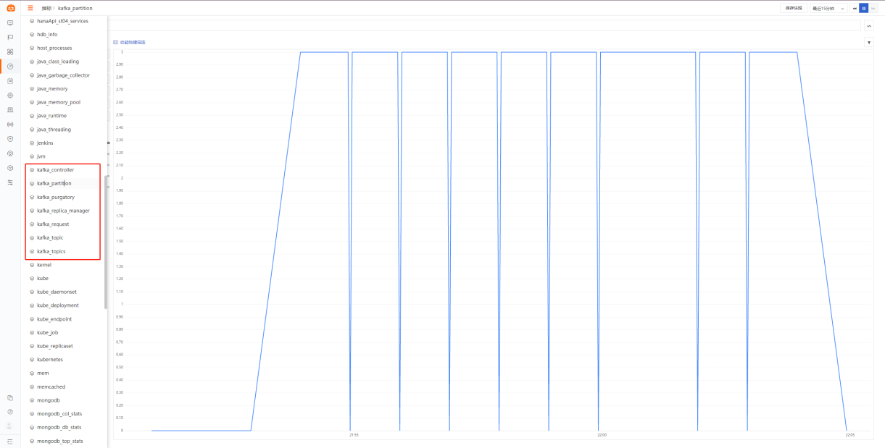

# Kafka
---


操作系统支持：windows/amd64,windows/386,linux/arm,linux/arm64,linux/386,linux/amd64,darwin/amd64

## 视图预览

### 场景视图

Kafka 观测场景主要展示了 Kafka的 基础信息，topic 信息和性能信息。


## 安装部署

说明：示例 Kafka 版本为：Kafka 2.11 (CentOS)，各个不同版本指标可能存在差异

### 前置条件

安装或下载 [Jolokia](https://search.maven.org/remotecontent?filepath=org/jolokia/jolokia-jvm/1.6.2/jolokia-jvm-1.6.2-agent.jar)。DataKit 安装目录下的 `data` 目录中已经有下载好的 Jolokia jar 包。

### 配置实施

#### 指标采集 (必选)

1、 开启 DataKit Kafka 插件，复制 sample 文件

```bash
/usr/local/datakit/conf.d/kafka
cp kafka.conf.sample kafka.conf
```

2、 修改 `kafka.conf` 配置文件

```bash
vi kafka.conf
```

参数说明

- default_tag_prefix：设置默认tag前缀(默认为空)
- default_field_prefix：设置默认field前缀(默认为空)
- default_field_separator：设置默认field分割(默认为".")
- username：要采集的 kafka 的用户名
- password：要采集的 kafka 的密码
- response_timeout：超时时间
- interval：采集指标频率
- urls：jolokia的地址

```yaml
[[inputs.kafka]]
# default_tag_prefix      = ""
# default_field_prefix    = ""
# default_field_separator = "."

# username = ""
# password = ""
# response_timeout = "5s"

## Optional TLS config
# tls_ca   = "/var/private/ca.pem"
# tls_cert = "/var/private/client.pem"
# tls_key  = "/var/private/client-key.pem"
# insecure_skip_verify = false

## Monitor Intreval
# interval   = "60s"

# Add agents URLs to query
urls = ["http://localhost:12346/jolokia/"]

## Add metrics to read
[[inputs.kafka.metric]]
  name         = "kafka_controller"
  mbean        = "kafka.controller:name=*,type=*"
  field_prefix = "#1."

[[inputs.kafka.metric]]
  name         = "kafka_replica_manager"
  mbean        = "kafka.server:name=*,type=ReplicaManager"
  field_prefix = "#1."

[[inputs.kafka.metric]]
  name         = "kafka_purgatory"
  mbean        = "kafka.server:delayedOperation=*,name=*,type=DelayedOperationPurgatory"
  field_prefix = "#1."
  field_name   = "#2"

[[inputs.kafka.metric]]
  name     = "kafka_client"
  mbean    = "kafka.server:client-id=*,type=*"
  tag_keys = ["client-id", "type"]

[[inputs.kafka.metric]]
  name         = "kafka_request"
  mbean        = "kafka.network:name=*,request=*,type=RequestMetrics"
  field_prefix = "#1."
  tag_keys     = ["request"]

[[inputs.kafka.metric]]
  name         = "kafka_topics"
  mbean        = "kafka.server:name=*,type=BrokerTopicMetrics"
  field_prefix = "#1."

[[inputs.kafka.metric]]
  name         = "kafka_topic"
  mbean        = "kafka.server:name=*,topic=*,type=BrokerTopicMetrics"
  field_prefix = "#1."
  tag_keys     = ["topic"]

[[inputs.kafka.metric]]
  name       = "kafka_partition"
  mbean      = "kafka.log:name=*,partition=*,topic=*,type=Log"
  field_name = "#1"
  tag_keys   = ["topic", "partition"]

[[inputs.kafka.metric]]
  name       = "kafka_partition"
  mbean      = "kafka.cluster:name=UnderReplicated,partition=*,topic=*,type=Partition"
  field_name = "UnderReplicatedPartitions"
  tag_keys   = ["topic", "partition"]
```

3、 重启 DataKit (如果需要开启日志，请配置日志采集再重启)

```bash
systemctl restart datakit
```

4、 Kafka 指标采集验证 `/usr/local/datakit/datakit -M |egrep "最近采集|kafka"`


5、 指标预览



#### 日志采集 (非必选)

1、 修改 `kafka.conf` 配置文件

参数说明

- files：日志文件路径 (通常填写访问日志和错误日志)
- pipeline：日志切割文件(内置)，实际文件路径 /usr/local/datakit/pipeline/kafka.p
- 相关文档 <[DataFlux pipeline 文本数据处理](../datakit/pipeline.md)

```
[inputs.kafka.log]
  files = ["/usr/local/kafka/logs/server.log",
    "/usr/local/kafka/logs/controller.log"
  ]
```

2、 重启 DataKit (如果需要开启自定义标签，请配置插件标签再重启)

```
systemctl restart datakit
```

3、 Kafka 日志采集验证  /usr/local/datakit/datakit -M |egrep "最近采集|kafka_log"


4、 日志预览


#### 插件标签 (非必选)

参数说明

- 该配置为自定义标签，可以填写任意 key-value 值
- 以下示例配置完成后，所有 Kafka 指标都会带有 service = "kafka" 的标签，可以进行快速查询
- 相关文档 <[DataFlux Tag 应用最佳实践](../best-practices/insight/tag.md)>
- 
```
# 示例
[inputs.kafka.tags]
		service = "kafka"
    # some_tag = "some_value"
    # more_tag = "some_other_value"
```

重启 DataKit

```
systemctl restart datakit
```

## 场景视图

<场景 - 新建仪表板 - 内置模板库 - Kafka 监控视图>

## 检测库

暂无

## [指标详解](../datakit/kafka#measurements)

## 最佳实践

[<Kafka可观测最佳实践>](../best-practices/monitoring/kafka)

## 故障排查

<[无数据上报排查](../datakit/why-no-data.md)>

