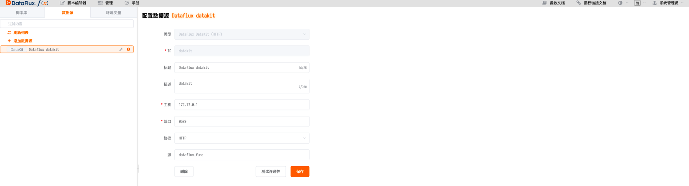

# Logstash
---

## 视图预览


## 安装部署

启动一个 HTTP Server，接收日志文本数据，上报到观测云。<br />HTTP URL 固定为：`/v1/write/logstreaming`，即 `http://Datakit_IP:PORT/v1/write/logstreaming`

> 注：如果 DataKit 以 daemonset 方式部署在 Kubernetes 中，可以使用 Service 方式访问，地址为 `http://datakit-service.datakit:9529`

说明：示例 Logstash 版本为：logstash-7.11.x, 各个不同版本配置可能存在差异。

### 前置条件

- 可以访问外网的主机<[安装 Datakit](../datakit/datakit-install.md)>
- 检查 Logstash 数据是否正常采集

### 配置实施

进入 DataKit 安装目录下的 `conf.d/log` 目录，复制 `logstreaming.conf.sample` 并命名为 `logstreaming.conf`。示例如下：

```yaml

[inputs.logstreaming]
  ignore_url_tags = true
```

重启 Datakit

```yaml
systemctl restart datakit
```

### 支持参数

logstreaming 支持在 HTTP URL 中添加参数，对日志数据进行操作。参数列表如下：

- `type`：数据格式，目前只支持 `influxdb`。 
   - 当 `type` 为 `inflxudb` 时（`/v1/write/logstreaming?type=influxdb`），说明数据本身就是行协议格式（默认 precision 是 `s`），将只添加内置 Tags，不再做其他操作
   - 当此值为空时，会对数据做分行和 pipeline 等处理
- `source`：标识数据来源，即行协议的 measurement。例如 `nginx` 或者 `redis`（`/v1/write/logstreaming?source=nginx`） 
   - 当 `type` 是 `influxdb` 时，此值无效
   - 默认为 `default`
- `service`：添加 service 标签字段，例如（`/v1/write/logstreaming?service=nginx_service`） 
   - 默认为 `source` 参数值。
- `pipeline`：指定数据需要使用的 pipeline 名称，例如 `nginx.p`（`/v1/write/logstreaming?pipeline=nginx.p`）

### 示例

> 注意：本文实例 Logstash 版本为 logstash-7.11.2 ，不同版本可能会存在差异。

#### Logstash 采集 nginx 日志接入 DataKit

以 Logstash 采集 nginx 日志并将日志上报到 ElasticSearch 为例，为了解决后端存储成本选择观测云进行日志分析，将output改为 http output 直接发送给 DataKit 上报至观测云平台进行分析。

```yaml
## Nginx 日志采集
input {
       file {
       path => "/var/log/nginx/access.log"
       codec => json
       start_position => "beginning"
       type => "nginx-log"
    }
       file {
       path => "/var/log/nginx/error.log"
       codec => json
       start_position => "beginning"
       type => "nginx-log"
    }
}

## 将收集到的数据发送给es集群
output {
  elasticsearch {
    hosts => ["172.0.10.2:9200"]
    index => "message_%{+YYYY-MM-dd}"
  }
}
```

对  output 做修改将类型指定成 http 类型并且将 url 指向开启了 logstreaming 的 DataKit 地址即可完成采集

```yaml

## Nginx 日志采集
  
input {
       file {
       path => "/var/log/nginx/access.log"
       codec => json
       start_position => "beginning"
       type => "nginx-log"
    }
       file {
       path => "/var/log/nginx/error.log"
       codec => json
       start_position => "beginning"
       type => "nginx-log"
    }
}

## 将收集到的数据发送给es集群
output {  
    http {
				http_method => "post"
				format => "json"
        url => "http://127.0.0.1:9529/v1/write/logstreaming?source=nginx_logstash"
    }
}

```

修改配置之后重启 logstash ，进行语法检查保证 Logstash 采集脚本编写无误。确认 Configuration 状态为 OK 后进行采集操作。

```python
/opt/logstash/bin/logstash -f nginx_log.conf -t
```


启动 logstash 开始采集数据并上报至观测云分析

```python
/opt/logstash/bin/logstash -f nginx_log.conf &
```



#### 可以通过 [DQL](../dql/define) 验证上报的数据：

```shell
dql > L::nginx_logstash LIMIT 1
-----------------[ r1.nginx_logstash.s1 ]-----------------
    __docid 'L_c70rvj9aahlcf8mp393g'
create_time 1640087501325
    date_ns 800588
       host 'df-solution-ecs-018'
    message '{"ua":"Mozilla/5.0 (X11; Linux x86_64) AppleWebKit/537.36 (KHTML, like Gecko) Chrome/86.0.4 240.111 Safari/537.36","responsetime":0.0,"referer":"-","domain":"114.55.6.167","@version":"1","type":"nginx-log","@timestamp":"2021-12-21T11:51:33.000Z","host":"172.16.0.23","url":"/404.html","path":"/var/log/nginx/access.log","client":"160.116.22.20","status":"404","size":3971}'
     source 'nginx_logstash'
       time 2021-12-21 19:51:34 +0800 CST
---------
1 rows, 1 series, cost 6ms

```

### 链路分析

暂无

## 场景视图

暂无

## 检测库

暂无

## 最佳实践

[观测云日志采集分析最佳实践](../best-practices/cloud-native/logs)

## 常见问题排查

<[无数据上报排查](../datakit/why-no-data.md)>

