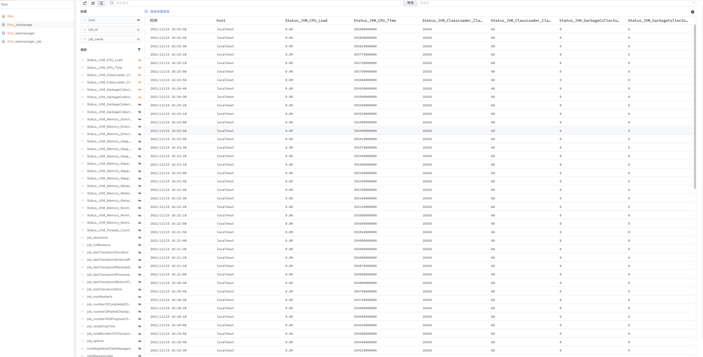

# Flink
---

## 视图预览

Flink 观测场景主要展示了 Flink 的集群状态，任务 Checkpoint 情况、job Buffer、job JVM 资源利用等。


## 版本支持

操作系统支持：Windows/AMD 64, Windows/386, Linux/ARM, Linux/ARM 64, Linux/386, Linux/AMD 64, Darwin/AMD 64

## 安装部署

说明：示例 Flink 版本为 Flink 1.14.2 (CentOS)，各个不同版本指标可能存在差异。

### 前置条件

- 可以访问外网的主机<[安装 DataKit](../../datakit/datakit-install.md)>
- 更改 Flink 配置添加如下内容，开启 Prometheus 采集。

```shell
metrics.reporter.prom.class: org.apache.flink.metrics.prometheus.PrometheusReporter
metrics.reporter.prom.port: 9250-9260
```
> 注意：`metrics.reporter.prom.port` 设置请参考集群 jobmanager 和 taskmanager 数量而定

- 重启 Flink 集群应用配置
- `curl http://{Flink iP}:9250-9260` 返回结果正常即可开始采集


### 配置实施

#### 指标采集 (必选)

1、 开启 DataKit Prom 插件，复制 sample 文件

```bash
/usr/local/datakit/conf.d/prom
cp prom.conf.sample prom.conf
```

2、 修改 `prom.conf` 配置文件

```bash
vi prom.conf
```

配置如下：

```yaml
# {"version": "1.1.9-rc6", "desc": "do NOT edit this line"}

[[inputs.prom]]
  ## Exporter 地址
  url = "http://127.0.0.1:9250"

  ## 采集器别名
  source = "9250"

  ## 采集数据输出源
  # 配置此项，可以将采集到的数据写到本地文件而不将数据打到中心
  # 之后可以直接用 datakit --prom-conf /path/to/this/conf 命令对本地保存的指标集进行调试
  # 如果已经将url配置为本地文件路径，则--prom-conf优先调试output路径的数据
  # output = "/abs/path/to/file"

  ## 采集数据大小上限，单位为字节
  # 将数据输出到本地文件时，可以设置采集数据大小上限
  # 如果采集数据的大小超过了此上限，则采集的数据将被丢弃
  # 采集数据大小上限默认设置为32MB
  # max_file_size = 0

  ## 指标类型过滤, 可选值为 counter, gauge, histogram, summary
  # 默认只采集 counter 和 gauge 类型的指标
  # 如果为空，则不进行过滤
  metric_types = ["counter", "gauge"]

  ## 指标名称过滤
  # 支持正则，可以配置多个，即满足其中之一即可
  # 如果为空，则不进行过滤
  # metric_name_filter = ["cpu"]

  ## 指标集名称前缀
  # 配置此项，可以给指标集名称添加前缀
  measurement_prefix = ""

  ## 指标集名称
  # 默认会将指标名称以下划线"_"进行切割，切割后的第一个字段作为指标集名称，剩下字段作为当前指标名称
  # 如果配置measurement_name, 则不进行指标名称的切割
  # 最终的指标集名称会添加上measurement_prefix前缀
  # measurement_name = "prom"

  ## 采集间隔 "ns", "us" (or "µs"), "ms", "s", "m", "h"
  interval = "10s"

  ## 过滤tags, 可配置多个tag
  # 匹配的tag将被忽略
  # tags_ignore = ["xxxx"]

  ## TLS 配置
  tls_open = false
  # tls_ca = "/tmp/ca.crt"
  # tls_cert = "/tmp/peer.crt"
  # tls_key = "/tmp/peer.key"

  ## 自定义认证方式，目前仅支持 Bearer Token
  # token 和 token_file: 仅需配置其中一项即可
  # [inputs.prom.auth]
  # type = "bearer_token"
  # token = "xxxxxxxx"
  # token_file = "/tmp/token"

  ## 自定义指标集名称
  # 可以将包含前缀prefix的指标归为一类指标集
  # 自定义指标集名称配置优先measurement_name配置项
  [[inputs.prom.measurements]]
    prefix = "flink_jobmanager_"
    name = "flink_jobmanage"

  #[[inputs.prom.measurements]]
   #prefix = "flink_taskmanager_"
   #name = "flink_taskmanager"

  ## 自定义Tags
  [inputs.prom.tags]
  # some_tag = "some_value"
  # more_tag = "some_other_value"


[[inputs.prom]]
  ## Exporter 地址
  url = "http://127.0.0.1:9251"

  ## 采集器别名
  source = "9251"

  ## 采集数据输出源
  # 配置此项，可以将采集到的数据写到本地文件而不将数据打到中心
  # 之后可以直接用 datakit --prom-conf /path/to/this/conf 命令对本地保存的指标集进行调试
  # 如果已经将url配置为本地文件路径，则--prom-conf优先调试output路径的数据
  # output = "/abs/path/to/file"

  ## 采集数据大小上限，单位为字节
  # 将数据输出到本地文件时，可以设置采集数据大小上限
  # 如果采集数据的大小超过了此上限，则采集的数据将被丢弃
  # 采集数据大小上限默认设置为32MB
  # max_file_size = 0

  ## 指标类型过滤, 可选值为 counter, gauge, histogram, summary
  # 默认只采集 counter 和 gauge 类型的指标
  # 如果为空，则不进行过滤
  metric_types = ["counter", "gauge"]

  ## 指标名称过滤
  # 支持正则，可以配置多个，即满足其中之一即可
  # 如果为空，则不进行过滤
  # metric_name_filter = ["cpu"]

  ## 指标集名称前缀
  # 配置此项，可以给指标集名称添加前缀
  measurement_prefix = ""

  ## 指标集名称
  # 默认会将指标名称以下划线"_"进行切割，切割后的第一个字段作为指标集名称，剩下字段作为当前指标名称
  # 如果配置measurement_name, 则不进行指标名称的切割
  # 最终的指标集名称会添加上measurement_prefix前缀
  # measurement_name = "prom"

  ## 采集间隔 "ns", "us" (or "µs"), "ms", "s", "m", "h"
  interval = "10s"

  ## 过滤tags, 可配置多个tag
  # 匹配的tag将被忽略
  # tags_ignore = ["xxxx"]

  ## TLS 配置
  tls_open = false
  # tls_ca = "/tmp/ca.crt"
  # tls_cert = "/tmp/peer.crt"
  # tls_key = "/tmp/peer.key"

  ## 自定义认证方式，目前仅支持 Bearer Token
  # token 和 token_file: 仅需配置其中一项即可
  # [inputs.prom.auth]
  # type = "bearer_token"
  # token = "xxxxxxxx"
  # token_file = "/tmp/token"

  ## 自定义指标集名称
  # 可以将包含前缀prefix的指标归为一类指标集
  # 自定义指标集名称配置优先measurement_name配置项
  #[[inputs.prom.measurements]]
    #prefix = "flink_jobmanager_"
    #name = "flink_jobmanage"

  [[inputs.prom.measurements]]
   prefix = "flink_taskmanager_"
   name = "flink_taskmanager"

  ## 自定义Tags
  [inputs.prom.tags]
  # some_tag = "some_value"
  # more_tag = "some_other_value"

[[inputs.prom]]
  ## Exporter 地址
  url = "http://127.0.0.1:9252"

  ## 采集器别名
  source = "9252"

  ## 采集数据输出源
  # 配置此项，可以将采集到的数据写到本地文件而不将数据打到中心
  # 之后可以直接用 datakit --prom-conf /path/to/this/conf 命令对本地保存的指标集进行调试
  # 如果已经将url配置为本地文件路径，则--prom-conf优先调试output路径的数据
  # output = "/abs/path/to/file"

  ## 采集数据大小上限，单位为字节
  # 将数据输出到本地文件时，可以设置采集数据大小上限
  # 如果采集数据的大小超过了此上限，则采集的数据将被丢弃
  # 采集数据大小上限默认设置为32MB
  # max_file_size = 0

  ## 指标类型过滤, 可选值为 counter, gauge, histogram, summary
  # 默认只采集 counter 和 gauge 类型的指标
  # 如果为空，则不进行过滤
  metric_types = ["counter", "gauge"]

  ## 指标名称过滤
  # 支持正则，可以配置多个，即满足其中之一即可
  # 如果为空，则不进行过滤
  # metric_name_filter = ["cpu"]

  ## 指标集名称前缀
  # 配置此项，可以给指标集名称添加前缀
  measurement_prefix = ""

  ## 指标集名称
  # 默认会将指标名称以下划线"_"进行切割，切割后的第一个字段作为指标集名称，剩下字段作为当前指标名称
  # 如果配置measurement_name, 则不进行指标名称的切割
  # 最终的指标集名称会添加上measurement_prefix前缀
  # measurement_name = "prom"

  ## 采集间隔 "ns", "us" (or "µs"), "ms", "s", "m", "h"
  interval = "10s"

  ## 过滤tags, 可配置多个tag
  # 匹配的tag将被忽略
  # tags_ignore = ["xxxx"]

  ## TLS 配置
  tls_open = false
  # tls_ca = "/tmp/ca.crt"
  # tls_cert = "/tmp/peer.crt"
  # tls_key = "/tmp/peer.key"

  ## 自定义认证方式，目前仅支持 Bearer Token
  # token 和 token_file: 仅需配置其中一项即可
  # [inputs.prom.auth]
  # type = "bearer_token"
  # token = "xxxxxxxx"
  # token_file = "/tmp/token"

  ## 自定义指标集名称
  # 可以将包含前缀prefix的指标归为一类指标集
  # 自定义指标集名称配置优先measurement_name配置项
  #[[inputs.prom.measurements]]
    #prefix = "flink_jobmanager_"
    #name = "flink_jobmanage"

  [[inputs.prom.measurements]]
   prefix = "flink_taskmanager_job_"
   name = "flink_taskmanager_job"

  ## 自定义Tags
  [inputs.prom.tags]
  # some_tag = "some_value"
  # more_tag = "some_other_value"
```
> 注意：具体 url（Flink IP + 配置端口） 配置请根据 Flink 配置文件中开启 Prometheus 配置设置的端口而定，开启多少个 TaskManager 和 JobManager 将该配置复杂粘贴多份即可完成采集建议更改 source 按照采集端口进行区分采集器


3、 重启 DataKit (如果需要开启日志，请配置日志采集再重启)

```bash
systemctl restart datakit
```

4、 Flink 指标采集验证 `/usr/local/datakit/datakit -M |egrep "最近采集|9251"`


5、 DQL 验证

```bash
[root@df-solution-ecs-018 log]# datakit -Q
dql > M::flink_taskmanager LIMIT 1
-----------------[ r1.flink_taskmanager.s1 ]-----------------
                    Status_Flink_Memory_Managed_Total <nil>
                     Status_Flink_Memory_Managed_Used <nil>
                                  Status_JVM_CPU_Load <nil>
                                  Status_JVM_CPU_Time <nil>
                 Status_JVM_ClassLoader_ClassesLoaded <nil>
               Status_JVM_ClassLoader_ClassesUnloaded <nil>
  Status_JVM_GarbageCollector_G1_Old_Generation_Count <nil>
   Status_JVM_GarbageCollector_G1_Old_Generation_Time <nil>
Status_JVM_GarbageCollector_G1_Young_Generation_Count <nil>
 Status_JVM_GarbageCollector_G1_Young_Generation_Time <nil>
                       Status_JVM_Memory_Direct_Count <nil>
                  Status_JVM_Memory_Direct_MemoryUsed <nil>
               Status_JVM_Memory_Direct_TotalCapacity <nil>
                     Status_JVM_Memory_Heap_Committed <nil>
                           Status_JVM_Memory_Heap_Max <nil>
                          Status_JVM_Memory_Heap_Used <nil>
                       Status_JVM_Memory_Mapped_Count <nil>
                  Status_JVM_Memory_Mapped_MemoryUsed <nil>
               Status_JVM_Memory_Mapped_TotalCapacity <nil>
                Status_JVM_Memory_Metaspace_Committed <nil>
                      Status_JVM_Memory_Metaspace_Max <nil>
                     Status_JVM_Memory_Metaspace_Used <nil>
                  Status_JVM_Memory_NonHeap_Committed <nil>
                        Status_JVM_Memory_NonHeap_Max <nil>
                       Status_JVM_Memory_NonHeap_Used <nil>
                             Status_JVM_Threads_Count <nil>
               Status_Network_AvailableMemorySegments <nil>
                   Status_Network_TotalMemorySegments <nil>
                 Status_Shuffle_Netty_AvailableMemory <nil>
         Status_Shuffle_Netty_AvailableMemorySegments <nil>
                     Status_Shuffle_Netty_TotalMemory <nil>
             Status_Shuffle_Netty_TotalMemorySegments <nil>
                      Status_Shuffle_Netty_UsedMemory 0
              Status_Shuffle_Netty_UsedMemorySegments <nil>
                                                 host '172_16_0_23'
                                                 time 2021-12-22 22:33:32 +0800 CST
                                                tm_id '172_16_0_23:35191_3f998a'
---------
1 rows, 1 series, cost 16.053161ms
```

6、 指标预览



#### 插件标签 (非必选)

参数说明

- 该配置为自定义标签，可以填写任意 key-value 值
- 以下示例配置完成后，所有 Flink 指标都会带有 `service = "flink"` 的标签，可以进行快速查询。
- 相关文档 <[TAG 在观测云中的最佳实践](../../best-practices/insight/tag.md)>

```
# 示例
[inputs.prom.tags]
  service = "flink"
```

重启 DataKit

```
systemctl restart datakit
```

## 场景视图

<场景 - 新建仪表板 - 模板库 - 系统视图 -Flink overview>

## 检测库

<监控 - 监控器 - 从模板新建 - Flink 检测库>

| 序号 | 规则名称 | 触发条件 | 级别 | 检测频率 |
| --- | --- | --- | --- | --- |
| 1 | 输出缓冲池中的所有缓冲区已满 | 输出缓冲池中的缓冲区利用率 > 95% | 紧急 | 1m |
| 2 | TaskManager 堆内存不足 |  TaskManager 堆内存使用率 > 95% | 紧急 | 1m |

## [指标详解](/datakit/flinkv1/#measurements)


## 最佳实践

<[利用观测云观测 Apache Flink>](../../best-practices/monitoring/flink.md)>

## 故障排查

<[无数据上报排查](../../datakit/why-no-data.md)>

