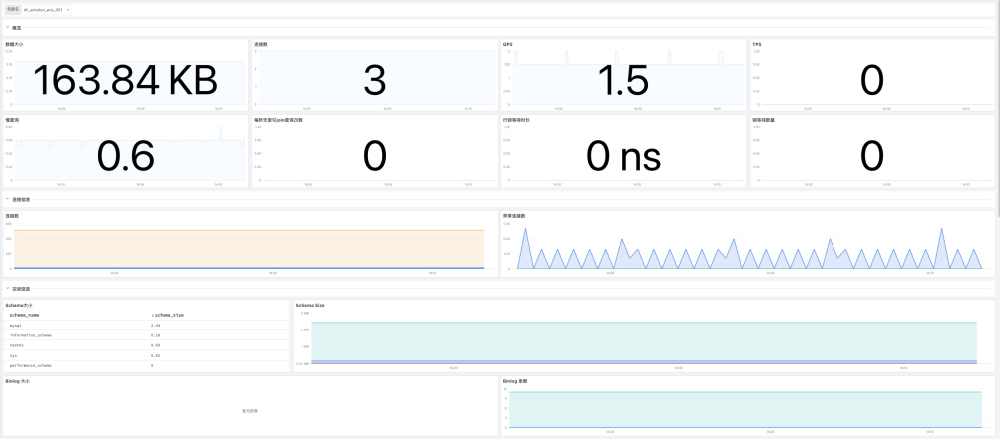
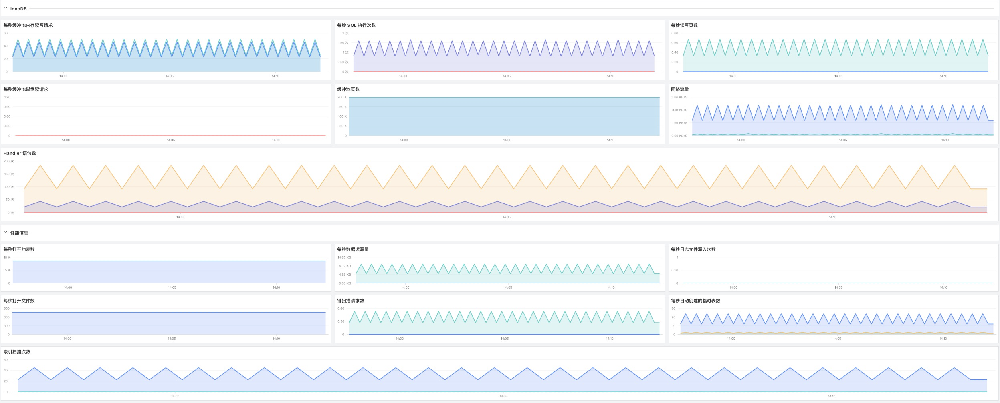
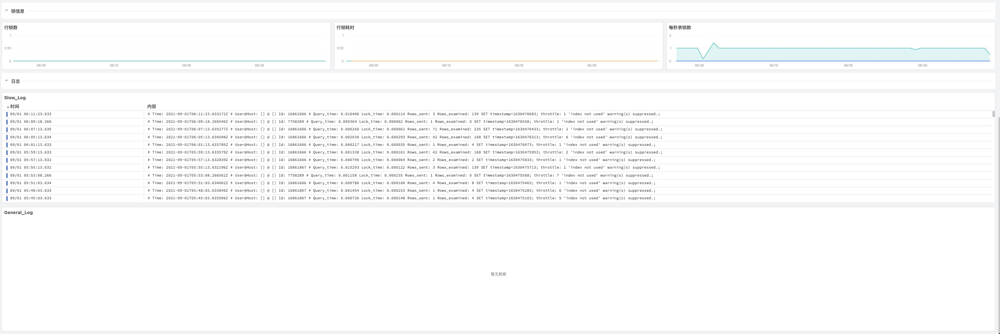
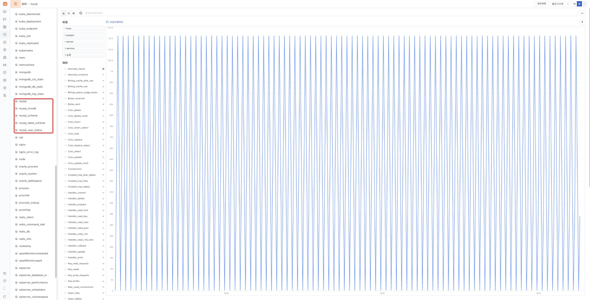
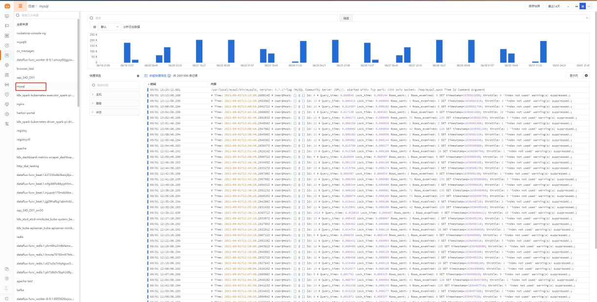

# MySQL
---

- DataKit 版本：1.4.2
- 操作系统支持：`windows/amd64,windows/386,linux/arm,linux/arm64,linux/386,linux/amd64,darwin/amd64`

MySQL 指标采集，收集以下数据：

- MySQL global status 基础数据采集
- Scheam 相关数据
- InnoDB 相关指标
- 支持自定义查询数据采集

## 前置条件

- MySQL 版本 5.7+
- 创建监控账号（一般情况，需用 MySQL `root` 账号登陆才能创建 MySQL 用户）

```sql
CREATE USER 'datakit'@'localhost' IDENTIFIED BY '<UNIQUEPASSWORD>';

-- MySQL 8.0+ create the datakit user with the native password hashing method
CREATE USER 'datakit'@'localhost' IDENTIFIED WITH mysql_native_password by '<UNIQUEPASSWORD>';
```

- 授权

```sql
GRANT PROCESS ON *.* TO 'datakit'@'localhost';
show databases like 'performance_schema';
GRANT SELECT ON performance_schema.* TO 'datakit'@'localhost';
GRANT SELECT ON mysql.user TO 'datakit'@'localhost';
GRANT replication client on *.*  to 'datakit'@'localhost';
```

以上创建、授权操作，均限定了 `datakit` 这个用户的只能在 MySQL 主机上（`localhost`）访问 MySQL，如果对 MySQL 进行远程采集，建议将 `localhost` 替换成 `%`（表示 DataKit 可以在任意机器上访问 MySQL），也可用特定的 DataKit 安装机器地址。

> 注意，如用 `localhost` 时发现采集器有如下报错，需要将上面的 `localhost` 换成 `::1`

```
Error 1045: Access denied for user 'datakit'@'::1' (using password: YES)
```

## 配置

进入 DataKit 安装目录下的 `conf.d/db` 目录，复制 `mysql.conf.sample` 并命名为 `mysql.conf`。示例如下：

```toml

[[inputs.mysql]]
  host = "localhost"
  user = "datakit"
  pass = "<PASS>"
  port = 3306
  # sock = "<SOCK>"
  # charset = "utf8"

  ## @param connect_timeout - number - optional - default: 10s
  # connect_timeout = "10s"

  ## Deprecated
  # service = "<SERVICE>"

  interval = "10s"

  ## @param inno_db
  innodb = true

  ## table_schema
  tables = []

  ## user
  users = []

  ## 开启数据库性能指标采集
  # dbm = false

  # [inputs.mysql.log]
  # #required, glob logfiles
  # files = ["/var/log/mysql/*.log"]

  ## glob filteer
  #ignore = [""]

  ## optional encodings:
  ##    "utf-8", "utf-16le", "utf-16le", "gbk", "gb18030" or ""
  #character_encoding = ""

  ## The pattern should be a regexp. Note the use of '''this regexp'''
  ## regexp link: https://golang.org/pkg/regexp/syntax/#hdr-Syntax
  #multiline_match = '''^(# Time|\d{4}-\d{2}-\d{2}|\d{6}\s+\d{2}:\d{2}:\d{2}).*'''

  ## grok pipeline script path
  #pipeline = "mysql.p"

  # [[inputs.mysql.custom_queries]]
  #   sql = "SELECT foo, COUNT(*) FROM table.events GROUP BY foo"
  #   metric = "xxxx"
  #   tagKeys = ["column1", "column1"]
  #   fieldKeys = ["column3", "column1"]
  
  ## 监控指标配置
  [inputs.mysql.dbm_metric]
    enabled = true
  
  ## 监控采样配置
  [inputs.mysql.dbm_sample]
    enabled = true  

  [inputs.mysql.tags]
    # some_tag = "some_value"
    # more_tag = "some_other_value"

```

配置好后，重启 DataKit 即可。

以下所有数据采集，默认会追加名为 `host` 的全局 tag（tag 值为 DataKit 所在主机名），也可以在配置中通过 `[inputs.mysql.tags]` 指定其它标签：

```toml
 [inputs.mysql.tags]
  # some_tag = "some_value"
  # more_tag = "some_other_value"
  # ...
```

### Binlog 开启

默认情况下，MySQL binlog 是不开启的。如果要统计 binlog 大小，需要开启 MySQL 对应 binlog 功能：

```sql
-- ON:开启, OFF:关闭
SHOW VARIABLES LIKE 'log_bin';
```

binlog 开启，参见[这个问答](https://stackoverflow.com/questions/40682381/how-do-i-enable-mysql-binary-logging){:target="_blank"}，或者[这个问答](https://serverfault.com/questions/706699/enable-binlog-in-mysql-on-ubuntu){:target="_blank"}

### 数据库性能指标采集

数据库性能指标来源于 MySQL 的内置数据库 `performance_schema`, 该数据库提供了一个能够在运行时获取服务器内部执行情况的方法。通过该数据库，DataKit 能够采集历史查询语句的各种指标统计和查询语句的执行计划，以及其他相关性能指标。

**配置**

如需开启，需要执行以下步骤。

- 修改配置文件，开启监控采集

```toml
[[inputs.mysql]]

## 开启数据库性能指标采集
dbm = true

...

## 监控指标配置
[inputs.mysql.dbm_metric]
  enabled = true
  
## 监控采样配置
[inputs.mysql.dbm_sample]
  enabled = true  
...

```

- MySQL配置

修改配置文件(如`mysql.conf`)，开启 `MySQL Performance Schema`， 并配置相关参数：

```
[mysqld]
performance_schema = on
max_digest_length = 4096
performance_schema_max_digest_length = 4096
performance_schema_max_sql_text_length = 4096
performance-schema-consumer-events-statements-current = on
performance-schema-consumer-events-statements-history-long = on
performance-schema-consumer-events-statements-history = on

```

- 账号配置

账号授权

```
GRANT REPLICATION CLIENT ON *.* TO datakit@'%' WITH MAX_USER_CONNECTIONS 5;
GRANT PROCESS ON *.* TO datakit@'%';
```

创建数据库

```
CREATE SCHEMA IF NOT EXISTS datakit;
GRANT EXECUTE ON datakit.* to datakit@'%';
GRANT CREATE TEMPORARY TABLES ON datakit.* TO datakit@'%';
```

创建存储过程 `explain_statement`，用于获取 sql 执行计划

```
DELIMITER $$
CREATE PROCEDURE datakit.explain_statement(IN query TEXT)
    SQL SECURITY DEFINER
BEGIN
    SET @explain := CONCAT('EXPLAIN FORMAT=json ', query);
    PREPARE stmt FROM @explain;
    EXECUTE stmt;
    DEALLOCATE PREPARE stmt;
END $$
DELIMITER ;
```

为需要采集执行计划的数据库单独创建存储过程（可选）

```
DELIMITER $$
CREATE PROCEDURE <数据库名称>.explain_statement(IN query TEXT)
    SQL SECURITY DEFINER
BEGIN
    SET @explain := CONCAT('EXPLAIN FORMAT=json ', query);
    PREPARE stmt FROM @explain;
    EXECUTE stmt;
    DEALLOCATE PREPARE stmt;
END $$
DELIMITER ;
GRANT EXECUTE ON PROCEDURE <数据库名称>.explain_statement TO datakit@'%';
```

- `consumers`配置

方法一（推荐）：通过 `DataKit` 动态配置 `performance_schema.events_statements_*`，需要创建以下存储过程：

```
DELIMITER $$
CREATE PROCEDURE datakit.enable_events_statements_consumers()
    SQL SECURITY DEFINER
BEGIN
    UPDATE performance_schema.setup_consumers SET enabled='YES' WHERE name LIKE 'events_statements_%';
END $$
DELIMITER ;

GRANT EXECUTE ON PROCEDURE datakit.enable_events_statements_consumers TO datakit@'%';
```

方法二：手动配置 `consumers`

```
UPDATE performance_schema.setup_consumers SET enabled='YES' WHERE name LIKE 'events_statements_%';
```

**采集的指标**

性能指标根据`service`划分为两类，即`mysql_dbm_metric`和`mysql_dbm_sample`，存储在【日志】中，具体介绍见后续指标列表部分。

## 视图预览

MySQL 观测场景主要展示了 MySQL 的基础信息、链接信息、存储空间信息、innoDB 信息、性能信息、锁信息以及日志信息。







## 安装部署

MySQL 指标采集，收集以下数据：

- MySQL global status 基础数据采集
- Scheam 相关数据
- InnoDB 相关指标
- 支持自定义查询数据采集

说明：示例 MySQL 版本为：MySQL 5.7(CentOS)，各个不同版本指标可能存在差异

### 前置条件

- MySQL 版本 5.7+ <[安装 Datakit](../datakit/datakit-install.md)>
- 创建监控账号（一般情况，需用 MySQL `root` 账号登陆才能创建 MySQL 用户）
```sql
CREATE USER 'datakit'@'localhost' IDENTIFIED BY '<UNIQUEPASSWORD>';
FLUSH PRIVILEGES;

-- MySQL 8.0+ create the datakit user with the native password hashing method
CREATE USER 'datakit'@'localhost' IDENTIFIED WITH mysql_native_password by '<UNIQUEPASSWORD>';
```

- 授权

```sql
GRANT PROCESS ON *.* TO 'datakit'@'localhost';
show databases like 'performance_schema';
GRANT SELECT ON performance_schema.* TO 'datakit'@'localhost';
GRANT SELECT ON mysql.user TO 'datakit'@'localhost';
GRANT replication client on *.*  to 'datakit'@'localhost';
FLUSH PRIVILEGES;
```

以上创建、授权操作，均限定了 `datakit` 这个用户的只能在 MySQL 主机上（`localhost`）访问 MySQL，如果对 MySQL 进行远程采集，建议将 `localhost` 替换成 `%`（表示 DataKit 可以在任意机器上访问 MySQL），也可用特定的 DataKit 安装机器地址。

> 注意，如用 `localhost` 时发现采集器有如下报错，需要将上面的 `localhost` 换成 `::1`


```
Error 1045: Access denied for user 'datakit'@'::1' (using password: YES)
```

### 配置实施

#### 指标采集 (必选)

1、开启 Datakit MySQL 插件，复制 sample 文件

```bash
cd /usr/local/datakit/conf.d/db/
cp mysql.conf.sample mysql.conf
```

2、修改 `mysql.conf` 配置文件

```bash
vi mysql.conf
```

参数说明

- host：要采集的 MySQL 所在的服务器
- user：MySQL 数据库用户名(填写前置条件中创建的用户名)
- pass：MySQL 数据库密码 (填写前置条件中创建的用户密码)
- port：MySQL 数据库链接端口
- sock：MySQL 数据库安全认证文件
- charset：MySQL 数据字符集(默认 utf8 可以不做修改)
- connect_timeout：链接超时时间
- interval：指标采集频率
- innodb：开启 innodb 采集
- tables：想要采集 table 的名称(默认不填写全部采集)
- users：想要采集的用户名称(默认不填写全部采集)

```yaml
[[inputs.mysql]]
    host = "localhost"
    user = "datakit"
    pass = "<PASS>"
    port = 3306
    # sock = "<SOCK>"
    # charset = "utf8"

    ## @param connect_timeout - number - optional - default: 10s
    # connect_timeout = "10s"

    ## Deprecated
    # service = "<SERVICE>"

    interval = "10s"

    ## @param inno_db
    innodb = true

    ## table_schema
    tables = []

    ## user
    users = []
```

-  Binlog 开启

默认情况下，MySQL binlog 是不开启的。如果要统计 binlog 大小，需要开启 MySQL 对应 binlog 功能：

```sql
-- ON:开启, OFF:关闭
SHOW VARIABLES LIKE 'log_bin';
```

3、重启 Datakit (如果需要开启日志，请配置日志采集再重启)

```bash
systemctl restart datakit
```

4、MySQL 指标采集验证 `/usr/local/datakit/datakit -M |egrep "最近采集|mysql"`


5、指标预览



#### 日志采集 (非必选)

1、如需采集 MySQL 的日志，将配置中 log 相关的配置打开，如需要开启 MySQL 慢查询日志，需要开启慢查询日志，在 MySQL 中执行以下语句：

```sql
SET GLOBAL slow_query_log = 'ON';

-- 未使用索引的查询也认为是一个可能的慢查询
set global log_queries_not_using_indexes = 'ON';
```

> 注意：在使用日志采集时，需要将 DataKit 安装在 MySQL 服务同一台主机中，或使用其它方式将日志挂载到 DataKit 所在机器

2、修改 `mysql.conf` 配置文件

参数说明

- files：日志文件路径 (通常填写访问日志和错误日志)
- ignore：过滤 *.log 中不想被采集的日志(默认全采)
- character_encoding：日志文件的字符集(默认 utf-8)
- match：该配置为多行日志采集规则配置，开启 MySQL 慢查询日志请打开注释
- pipeline：日志切割文件(内置)，实际文件路径 /usr/local/datakit/pipeline/mysql.p
- 相关文档 <[DataFlux pipeline 文本数据处理](/datakit/pipeline.md)>

```
[inputs.mysql.log]
    ## required, glob logfiles
    files = ["/var/log/mysql/*.log"]

    ## glob filteer
    #ignore = [""]

    ## optional encodings:
    ##    "utf-8", "utf-16le", "utf-16le", "gbk", "gb18030" or ""
    #character_encoding = ""

    ## The pattern should be a regexp. Note the use of '''this regexp'''
    ## regexp link: https://golang.org/pkg/regexp/syntax/#hdr-Syntax
    match = '''^(# Time|\d{4}-\d{2}-\d{2}|\d{6}\s+\d{2}:\d{2}:\d{2}).*'''

    ## grok pipeline script path
    pipeline = "mysql.p"

```

3、重启 Datakit (如果需要开启自定义标签，请配置插件标签再重启)

```
systemctl restart datakit
```

4、MySQL 日志采集验证  /usr/local/datakit/datakit -M |egrep "最近采集|mysql_log"


5、日志预览



#### 插件标签 (非必选)
参数说明

- 该配置为自定义标签，可以填写任意 key-value 值
- 以下示例配置完成后，所有 MySQL 指标都会带有 service = "MySQL" 的标签，可以进行快速查询
- 相关文档 <[DataFlux Tag 应用最佳实践](../best-practices/guance-skill/tag.m)>
```
# 示例
[inputs.mysql.tags]
        service = "MySQL"
        some_tag = "some_value"
        more_tag = "some_other_value"
```

重启 Datakit

```
systemctl restart datakit
```

## 场景视图

场景 - 新建场景 - MySQL 监控场景 


## 异常检测

异常检测库 - 新建检测库 - MySQL 检测库

| 序号 | 规则名称 | 触发条件 | 级别 | 检测频率 |
| --- | --- | --- | --- | --- |
|  |  |  |  |  |

## 指标详解


### `mysql`


- 标签


| 标签名 | 描述    |
|  ----  | --------|
|`server`|Server addr|

- 指标列表


| 指标 | 描述| 数据类型 | 单位   |
| ---- |---- | :---:    | :----: |
|`Aborted_clients`|The number of connections that were aborted because the client died without closing the connection properly.|int|count|
|`Aborted_connects`|The number of failed attempts to connect to the MySQL server.|int|count|
|`Binlog_cache_disk_use`|The number of transactions that used the temporary binary log cache but that exceeded the value of binlog_cache_size and used a temporary file to store statements from the transaction.|int|B|
|`Binlog_cache_use`|The number of transactions that used the binary log cache.|int|B|
|`Binlog_space_usage_bytes`|-|int|B|
|`Bytes_received`|The number of bytes received from all clients.|int|B|
|`Bytes_sent`|The number of bytes sent to all clients.|int|B|
|`Com_delete`|The rate of delete statements.|int|count|
|`Com_delete_multi`|The rate of delete-multi statements.|int|count|
|`Com_insert`|The rate of insert statements.|int|count|
|`Com_insert_select`|The rate of insert-select statements.|int|count|
|`Com_load`|The rate of load statements.|int|count|
|`Com_replace`|The rate of replace statements.|int|count|
|`Com_replace_select`|The rate of replace-select statements.|int|count|
|`Com_select`|The rate of select statements.|int|count|
|`Com_update`|The rate of update statements.|int|count|
|`Com_update_multi`|The rate of update-multi.|int|count|
|`Connections`|The rate of connections to the server.|int|count|
|`Created_tmp_disk_tables`|The rate of internal on-disk temporary tables created by second by the server while executing statements.|int|count|
|`Created_tmp_files`|The rate of temporary files created by second.|int|count|
|`Created_tmp_tables`|The rate of internal temporary tables created by second by the server while executing statements.|int|count|
|`Handler_commit`|The number of internal COMMIT statements.|int|count|
|`Handler_delete`|The number of internal DELETE statements.|int|count|
|`Handler_prepare`|The number of internal PREPARE statements.|int|count|
|`Handler_read_first`|The number of internal READ_FIRST statements.|int|count|
|`Handler_read_key`|The number of internal READ_KEY statements.|int|count|
|`Handler_read_next`|The number of internal READ_NEXT statements.|int|count|
|`Handler_read_prev`|The number of internal READ_PREV statements.|int|count|
|`Handler_read_rnd`|The number of internal READ_RND statements.|int|count|
|`Handler_read_rnd_next`|The number of internal READ_RND_NEXT statements.|int|count|
|`Handler_rollback`|The number of internal ROLLBACK statements.|int|count|
|`Handler_update`|The number of internal UPDATE statements.|int|count|
|`Handler_write`|The number of internal WRITE statements.|int|count|
|`Key_buffer_bytes_unflushed`|MyISAM key buffer bytes unflushed.|int|count|
|`Key_buffer_bytes_used`|MyISAM key buffer bytes used.|int|count|
|`Key_buffer_size`|Size of the buffer used for index blocks.|int|B|
|`Key_cache_utilization`|The key cache utilization ratio.|int|percent|
|`Key_read_requests`|The number of requests to read a key block from the MyISAM key cache.|int|count|
|`Key_reads`|The number of physical reads of a key block from disk into the MyISAM key cache. If Key_reads is large, then your key_buffer_size value is probably too small. The cache miss rate can be calculated as Key_reads/Key_read_requests.|int|count|
|`Key_write_requests`|The number of requests to write a key block to the MyISAM key cache.|int|count|
|`Key_writes`|The number of physical writes of a key block from the MyISAM key cache to disk.|int|count|
|`Max_used_connections`|The maximum number of connections that have been in use simultaneously since the server started.|int|count|
|`Open_files`|The number of open files.|int|count|
|`Open_tables`|The number of of tables that are open.|int|count|
|`Opened_tables`|The number of tables that have been opened. If Opened_tables is big, your table_open_cache value is probably too small.|int|count|
|`Qcache_free_blocks`|The number of free memory blocks in the query cache.|int|B|
|`Qcache_free_memory`|The amount of free memory for the query cache.|int|B|
|`Qcache_hits`|The rate of query cache hits.|int|count|
|`Qcache_inserts`|The number of queries added to the query cache.|int|count|
|`Qcache_lowmem_prunes`|The number of queries that were deleted from the query cache because of low memory.|int|count|
|`Qcache_not_cached`|The number of noncached queries (not cacheable, or not cached due to the query_cache_type setting).|int|count|
|`Qcache_queries_in_cache`|The number of queries registered in the query cache.|int|count|
|`Qcache_total_blocks`|The total number of blocks in the query cache.|int|count|
|`Queries`|The rate of queries.|int|count|
|`Questions`|The rate of statements executed by the server.|int|count|
|`Select_full_join`|The number of joins that perform table scans because they do not use indexes. If this value is not 0, you should carefully check the indexes of your tables.|int|count|
|`Select_full_range_join`|The number of joins that used a range search on a reference table.|int|count|
|`Select_range`|The number of joins that used ranges on the first table. This is normally not a critical issue even if the value is quite large.|int|count|
|`Select_range_check`|The number of joins without keys that check for key usage after each row. If this is not 0, you should carefully check the indexes of your tables.|int|count|
|`Select_scan`|The number of joins that did a full scan of the first table.|int|count|
|`Slow_queries`|The rate of slow queries.|int|count|
|`Sort_merge_passes`|The number of merge passes that the sort algorithm has had to do. If this value is large, you should consider increasing the value of the sort_buffer_size system variable.|int|count|
|`Sort_range`|The number of sorts that were done using ranges.|int|count|
|`Sort_rows`|The number of sorted rows.|int|count|
|`Sort_scan`|The number of sorts that were done by scanning the table.|int|count|
|`Table_locks_immediate`|The number of times that a request for a table lock could be granted immediately.|int|count|
|`Table_locks_waited`|The total number of times that a request for a table lock could not be granted immediately and a wait was needed.|int|count|
|`Threads_cached`|The number of threads in the thread cache.|int|count|
|`Threads_connected`|The number of currently open connections.|int|count|
|`Threads_created`|The number of threads created to handle connections. If Threads_created is big, you may want to increase the thread_cache_size value.|int|count|
|`Threads_running`|The number of threads that are not sleeping.|int|count|
|`max_connections`|The maximum number of connections that have been in use simultaneously since the server started.|int|count|
|`query_cache_size`|The amount of memory allocated for caching query results.|int|B|
|`table_open_cache`|The number of open tables for all threads. Increasing this value increases the number of file descriptors that mysqld requires.|int|count|
|`thread_cache_size`|How many threads the server should cache for reuse. When a client disconnects, the client's threads are put in the cache if there are fewer than thread_cache_size threads there.|int|B|


### `mysql_schema`

具体字段，以实际采集上来的数据为准，部分字段，会因 MySQL 配置、已有数据等原因，采集不到

- 标签


| 标签名 | 描述    |
|  ----  | --------|
|`schema_name`|Schema name|
|`server`|Server addr|

- 指标列表


| 指标 | 描述| 数据类型 | 单位   |
| ---- |---- | :---:    | :----: |
|`query_run_time_avg`|Avg query response time per schema.|float|ns|
|`schema_size`|Size of schemas(MiB)|float|MB|


### `mysql_innodb`


- 标签


| 标签名 | 描述    |
|  ----  | --------|
|`server`|Server addr|

- 指标列表


| 指标 | 描述| 数据类型 | 单位   |
| ---- |---- | :---:    | :----: |
|`adaptive_hash_searches`|Number of successful searches using Adaptive Hash Index|int|count|
|`adaptive_hash_searches_btree`|Number of searches using B-tree on an index search|int|count|
|`buffer_data_reads`|Amount of data read in bytes (innodb_data_reads)|int|count|
|`buffer_data_written`|Amount of data written in bytes (innodb_data_written)|int|count|
|`buffer_pages_created`|Number of pages created (innodb_pages_created)|int|count|
|`buffer_pages_read`|Number of pages read (innodb_pages_read)|int|count|
|`buffer_pages_written`|Number of pages written (innodb_pages_written)|int|count|
|`buffer_pool_bytes_dirty`|Buffer bytes containing data (innodb_buffer_pool_bytes_data)|int|count|
|`buffer_pool_pages_data`|Buffer pages containing data (innodb_buffer_pool_pages_data)|int|count|
|`buffer_pool_pages_dirty`|Buffer pages currently dirty (innodb_buffer_pool_pages_dirty)|int|count|
|`buffer_pool_pages_free`|Buffer pages currently free (innodb_buffer_pool_pages_free)|int|count|
|`buffer_pool_pages_misc`|Buffer pages for misc use such as row locks or the adaptive hash index (innodb_buffer_pool_pages_misc)|int|count|
|`buffer_pool_pages_total`|Total buffer pool size in pages (innodb_buffer_pool_pages_total)|int|count|
|`buffer_pool_read_ahead`|Number of pages read as read ahead (innodb_buffer_pool_read_ahead)|int|count|
|`buffer_pool_read_ahead_evicted`|Read-ahead pages evicted without being accessed (innodb_buffer_pool_read_ahead_evicted)|int|count|
|`buffer_pool_read_requests`|Number of logical read requests (innodb_buffer_pool_read_requests)|int|count|
|`buffer_pool_reads`|Number of reads directly from disk (innodb_buffer_pool_reads)|int|count|
|`buffer_pool_size`|Server buffer pool size (all buffer pools) in bytes|int|count|
|`buffer_pool_wait_free`|Number of times waited for free buffer (innodb_buffer_pool_wait_free)|int|count|
|`buffer_pool_write_requests`|Number of write requests (innodb_buffer_pool_write_requests)|int|count|
|`dml_deletes`|Number of rows deleted|int|count|
|`dml_inserts`|Number of rows inserted|int|count|
|`dml_updates`|Number of rows updated|int|count|
|`file_num_open_files`|Number of files currently open (innodb_num_open_files)|int|count|
|`ibuf_merges`|Number of change buffer merges|int|count|
|`ibuf_merges_delete`|Number of purge records merged by change buffering|int|count|
|`ibuf_merges_delete_mark`|Number of deleted records merged by change buffering|int|count|
|`ibuf_merges_discard_delete`|Number of purge merged  operations discarded|int|count|
|`ibuf_merges_discard_delete_mark`|Number of deleted merged operations discarded|int|count|
|`ibuf_merges_discard_insert`|Number of insert merged operations discarded|int|count|
|`ibuf_merges_insert`|Number of inserted records merged by change buffering|int|count|
|`ibuf_size`|Change buffer size in pages|int|count|
|`innodb_activity_count`|Current server activity count|int|count|
|`innodb_dblwr_pages_written`|Number of pages that have been written for doublewrite operations (innodb_dblwr_pages_written)|int|count|
|`innodb_dblwr_writes`|Number of doublewrite operations that have been performed (innodb_dblwr_writes)|int|count|
|`innodb_page_size`|InnoDB page size in bytes (innodb_page_size)|int|count|
|`innodb_rwlock_s_os_waits`|Number of OS waits due to shared latch request|int|count|
|`innodb_rwlock_s_spin_rounds`|Number of rwlock spin loop rounds due to shared latch request|int|count|
|`innodb_rwlock_s_spin_waits`|Number of rwlock spin waits due to shared latch request|int|count|
|`innodb_rwlock_sx_os_waits`|Number of OS waits due to sx latch request|int|count|
|`innodb_rwlock_sx_spin_rounds`|Number of rwlock spin loop rounds due to sx latch request|int|count|
|`innodb_rwlock_sx_spin_waits`|Number of rwlock spin waits due to sx latch request|int|count|
|`innodb_rwlock_x_os_waits`|Number of OS waits due to exclusive latch request|int|count|
|`innodb_rwlock_x_spin_rounds`|Number of rwlock spin loop rounds due to exclusive latch request|int|count|
|`innodb_rwlock_x_spin_waits`|Number of rwlock spin waits due to exclusive latch request|int|count|
|`lock_deadlocks`|Number of deadlocks|int|count|
|`lock_row_lock_current_waits`|Number of row locks currently being waited for (innodb_row_lock_current_waits)|int|count|
|`lock_row_lock_time`|Time spent in acquiring row locks, in milliseconds (innodb_row_lock_time)|int|count|
|`lock_row_lock_time_avg`|The average time to acquire a row lock, in milliseconds (innodb_row_lock_time_avg)|int|count|
|`lock_row_lock_time_max`|The maximum time to acquire a row lock, in milliseconds (innodb_row_lock_time_max)|int|count|
|`lock_row_lock_waits`|Number of times a row lock had to be waited for (innodb_row_lock_waits)|int|ms|
|`lock_timeouts`|Number of lock timeouts|int|count|
|`log_padded`|Bytes of log padded for log write ahead|int|count|
|`log_waits`|Number of log waits due to small log buffer (innodb_log_waits)|int|count|
|`log_write_requests`|Number of log write requests (innodb_log_write_requests)|int|count|
|`log_writes`|Number of log writes (innodb_log_writes)|int|count|
|`os_data_fsyncs`|Number of fsync() calls (innodb_data_fsyncs)|int|count|
|`os_data_reads`|Number of reads initiated (innodb_data_reads)|int|count|
|`os_data_writes`|Number of writes initiated (innodb_data_writes)|int|count|
|`os_log_bytes_written`|Bytes of log written (innodb_os_log_written)|int|count|
|`os_log_fsyncs`|Number of fsync log writes (innodb_os_log_fsyncs)|int|count|
|`os_log_pending_fsyncs`|Number of pending fsync write (innodb_os_log_pending_fsyncs)|int|count|
|`os_log_pending_writes`|Number of pending log file writes (innodb_os_log_pending_writes)|int|count|
|`trx_rseg_history_len`|Length of the TRX_RSEG_HISTORY list|int|count|


### `mysql_table_schema`

MySQL 表指标

- 标签


| 标签名 | 描述    |
|  ----  | --------|
|`engine`|The storage engine for the table. See The InnoDB Storage Engine, and Alternative Storage Engines.|
|`server`|Server addr|
|`table_name`|The name of the table.|
|`table_schema`|The name of the schema (database) to which the table belongs.|
|`table_type`|BASE TABLE for a table, VIEW for a view, or SYSTEM VIEW for an INFORMATION_SCHEMA table.|
|`version`|The version number of the table's .frm file.|

- 指标列表


| 指标 | 描述| 数据类型 | 单位   |
| ---- |---- | :---:    | :----: |
|`data_free`|The number of rows. Some storage engines, such as MyISAM, store the exact count. For other storage engines, such as InnoDB, this value is an approximation, and may vary from the actual value by as much as 40% to 50%. In such cases, use SELECT COUNT(*) to obtain an accurate count.|int|count|
|`data_length`|For InnoDB, DATA_LENGTH is the approximate amount of space allocated for the clustered index, in bytes. Specifically, it is the clustered index size, in pages, multiplied by the InnoDB page size|int|count|
|`index_length`|For InnoDB, INDEX_LENGTH is the approximate amount of space allocated for non-clustered indexes, in bytes. Specifically, it is the sum of non-clustered index sizes, in pages, multiplied by the InnoDB page size|int|count|
|`table_rows`|The number of rows. Some storage engines, such as MyISAM, store the exact count. For other storage engines, such as InnoDB, this value is an approximation, and may vary from the actual value by as much as 40% to 50%. In such cases, use SELECT COUNT(*) to obtain an accurate count.|int|count|


### `mysql_user_status`

MySQL 用户指标

- 标签


| 标签名 | 描述    |
|  ----  | --------|
|`user`|user|

- 指标列表


| 指标 | 描述| 数据类型 | 单位   |
| ---- |---- | :---:    | :----: |
|`bytes_received`|The number of bytes received this user|int|count|
|`bytes_sent`|The number of bytes sent this user|int|count|
|`current_connect`|The number of current connect|int|count|
|`max_execution_time_exceeded`|The number of SELECT statements for which the execution timeout was exceeded.|int|count|
|`max_execution_time_set`|The number of SELECT statements for which a nonzero execution timeout was set. This includes statements that include a nonzero MAX_EXECUTION_TIME optimizer hint, and statements that include no such hint but execute while the timeout indicated by the max_execution_time system variable is nonzero.|int|count|
|`max_execution_time_set_failed`|The number of SELECT statements for which the attempt to set an execution timeout failed.|int|count|
|`slow_queries`|The number of queries that have taken more than long_query_time seconds. This counter increments regardless of whether the slow query log is enabled|int|count|
|`sort_rows`|The number of sorted rows.|int|count|
|`sort_scan`|The number of sorts that were done by scanning the table.|int|count|
|`table_open_cache_hits`|The number of hits for open tables cache lookups.|int|count|
|`table_open_cache_misses`|The number of misses for open tables cache lookups.|int|count|
|`table_open_cache_overflows`|The number of overflows for the open tables cache. This is the number of times, after a table is opened or closed, a cache instance has an unused entry and the size of the instance is larger than table_open_cache / table_open_cache_instances.|int|count|
|`total_connect`|The number of total connect|int|count|


### `mysql_dbm_metric`

记录查询语句的执行次数、等待耗时、锁定时间和查询的记录行数等。

- 标签


| 标签名 | 描述    |
|  ----  | --------|
|`digest`| The digest hash value computed from the original normalized statement. |
|`query_signature`| The hash value computed from digest_text|
|`schema_name`|The schema name|
|`server`| The server address|

- 指标列表


| 指标 | 描述| 数据类型 | 单位   |
| ---- |---- | :---:    | :----: |
|`count_star`|The total count of executed queries per normalized query and schema.|int|count|
|`message`|The text of the normalized statement digest.|string|-|
|`sum_errors`|The total count of queries run with an error per normalized query and schema.|int|count|
|`sum_lock_time`|The total time(nanosecond) spent waiting on locks per normalized query and schema.|int|count|
|`sum_no_good_index_used`|The total count of queries which used a sub-optimal index per normalized query and schema.|int|count|
|`sum_no_index_used`|The total count of queries which do not use an index per normalized query and schema.|int|count|
|`sum_rows_affected`|The number of rows mutated per normalized query and schema.|int|count|
|`sum_rows_examined`|The number of rows examined per normalized query and schema.|int|count|
|`sum_rows_sent`|The number of rows sent per normalized query and schema.|int|count|
|`sum_select_full_join`|The total count of full table scans on a joined table per normalized query and schema.|int|count|
|`sum_select_scan`|The total count of full table scans on the first table per normalized query and schema.|int|count|
|`sum_timer_wait`|The total query execution time(nanosecond) per normalized query and schema.|int|count|


### `mysql_dbm_sample`

选取部分执行耗时较高的 SQL 语句，获取其执行计划，并采集实际执行过程中的各种性能指标。

- 标签


| 标签名 | 描述    |
|  ----  | --------|
|`current_schema`|The name of the current schema.|
|`digest`|The digest hash value computed from the original normalized statement. |
|`network_client_ip`|The ip address of the client|
|`plan_definition`|The plan definition of JSON format.|
|`plan_signature`|The hash value computed from plan definition.|
|`processlist_db`|The name of the database.|
|`processlist_user`|The user name of the client.|
|`query_signature`|The hash value computed from digest_text.|
|`query_truncated`|It indicates whether the query is truncated.|
|`resource_hash`|The hash value computed from sql text.|

- 指标列表


| 指标 | 描述| 数据类型 | 单位   |
| ---- |---- | :---:    | :----: |
|`duration`|Value in nanoseconds of the event's duration.|int|count|
|`lock_time_ns`|Time in nanoseconds spent waiting for locks. |int|count|
|`message`|The text of the normalized statement digest.|string|-|
|`no_good_index_used`|0 if a good index was found for the statement, 1 if no good index was found.|int|-|
|`no_index_used`|0 if the statement performed a table scan with an index, 1 if without an index.|int|-|
|`rows_affected`|Number of rows the statement affected.|int|count|
|`rows_examined`|Number of rows read during the statement's execution.|int|count|
|`rows_sent`|Number of rows returned. |int|count|
|`select_full_join`|Number of joins performed by the statement which did not use an index.|int|count|
|`select_full_range_join`|Number of joins performed by the statement which used a range search of the int first table. |int|count|
|`select_range`|Number of joins performed by the statement which used a range of the first table. |int|count|
|`select_range_check`|Number of joins without keys performed by the statement that check for key usage after int each row. |int|count|
|`select_scan`|Number of joins performed by the statement which used a full scan of the first table.|int|count|
|`sort_merge_passes`|Number of merge passes by the sort algorithm performed by the statement. |int|count|
|`sort_range`|Number of sorts performed by the statement which used a range.|int|count|
|`sort_rows`|Number of rows sorted by the statement. |int|count|
|`sort_scan`|Number of sorts performed by the statement which used a full table scan.|int|count|
|`timer_wait_ns`|Value in nanoseconds of the event's duration |int|ns|
|`timestamp`|The timestamp(millisecond) when then the event ends.|int|msec|


## 日志

如需采集 MySQL 的日志，将配置中 log 相关的配置打开，如需要开启 MySQL 慢查询日志，需要开启慢查询日志，在 MySQL 中执行以下语句

```sql
SET GLOBAL slow_query_log = 'ON';

-- 未使用索引的查询也认为是一个可能的慢查询
set global log_queries_not_using_indexes = 'ON';
```

```python
[inputs.mysql.log]
    # 填入绝对路径
    files = ["/var/log/mysql/*.log"]
```

> 注意：在使用日志采集时，需要将 DataKit 安装在 MySQL 服务同一台主机中，或使用其它方式将日志挂载到 DataKit 所在机器

MySQL 日志分为普通日志和慢日志两种。

### MySQL 普通日志

日志原文：

```
2017-12-29T12:33:33.095243Z         2 Query     SELECT TABLE_SCHEMA, TABLE_NAME FROM INFORMATION_SCHEMA.TABLES WHERE CREATE_OPTIONS LIKE '%partitioned%';
```

切割后的字段列表如下：

| 字段名   | 字段值                                                   | 说明                         |
| -------- | -------------------------------------------------------- | ---------------------------- |
| `status` | `Warning`                                                | 日志级别                     |
| `msg`    | `System table 'plugin' is expected to be transactional.` | 日志内容                     |
| `time`   | `1514520249954078000`                                    | 纳秒时间戳（作为行协议时间） |

### MySQL 慢查询日志

日志原文：

```
# Time: 2019-11-27T10:43:13.460744Z
# User@Host: root[root] @ localhost [1.2.3.4]  Id:    35
# Query_time: 0.214922  Lock_time: 0.000184 Rows_sent: 248832  Rows_examined: 72
# Thread_id: 55   Killed: 0  Errno: 0
# Bytes_sent: 123456   Bytes_received: 0
SET timestamp=1574851393;
SELECT * FROM fruit f1, fruit f2, fruit f3, fruit f4, fruit f5
```

切割后的字段列表如下：

| 字段名              | 字段值                                                                                      | 说明                           |
| ------------------- | ------------------------------------------------------------------------------------------- | ------------------------------ |
| `bytes_sent`        | `123456`                                                                                    | 发送字节数                     |
| `db_host`           | `localhost`                                                                                 | hostname                       |
| `db_ip`             | `1.2.3.4`                                                                                   | ip                             |
| `db_slow_statement` | `SET timestamp=1574851393;\nSELECT * FROM fruit f1, fruit f2, fruit f3, fruit f4, fruit f5` | 慢查询 sql                     |
| `db_user`           | `root[root]`                                                                                | 用户                           |
| `lock_time`         | `0.000184`                                                                                  | 锁时间                         |
| `query_id`          | `35`                                                                                        | 查询 id                        |
| `query_time`        | `0.2l4922`                                                                                  | SQL 执行所消耗的时间           |
| `rows_examined`     | `72`                                                                                        | 为了返回查询的数据所读取的行数 |
| `rows_sent`         | `248832`                                                                                    | 查询返回的行数                 |
| `thread_id`         | `55`                                                                                        | 线程 id                        |
| `time`              | `1514520249954078000`                                                                       | 纳秒时间戳（作为行协议时间）   |


## 故障排查
<[无数据上报排查](why-no-data.md)>
