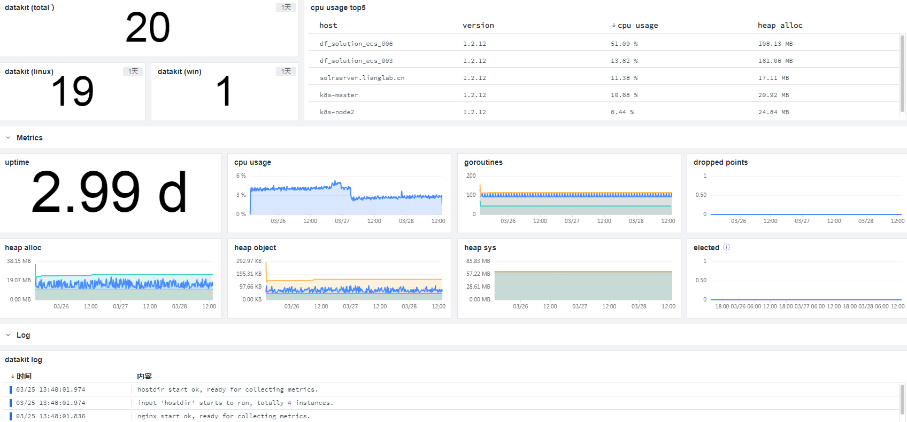
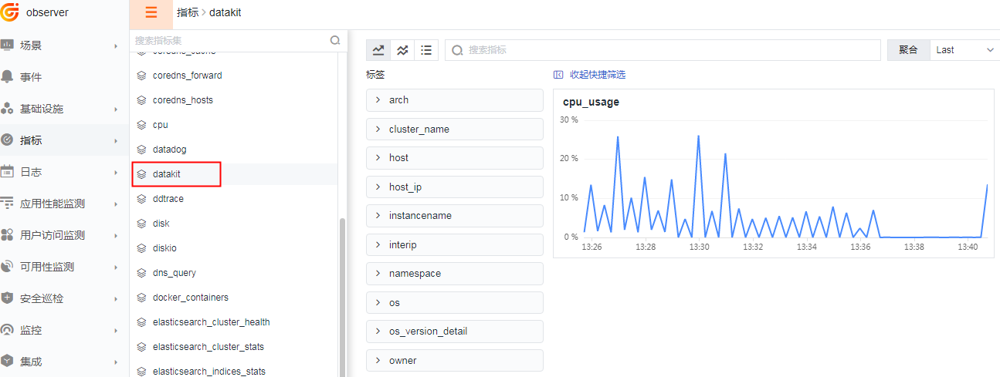

# DataKit 自身指标
---

- DataKit 版本：1.4.6
- 操作系统支持：:fontawesome-brands-linux: :fontawesome-brands-windows: :fontawesome-brands-apple:

self 采集器用于 DataKit 自身基本信息的采集，包括运行环境信息、CPU、内存占用情况等。

## 前置条件

暂无

## 配置

self 采集器会自动运行，无需配置，且无法关闭。

## 指标

### `datakit`

- 标签

| 标签名 | 描述    |
|  ----  | --------|
|`arch`|Architecture of the DataKit|
|`host`|Hostname of the DataKit|
|`namespace`|Election namespace(datakit.conf/namespace) of DataKit, may be not set|
|`os`|Operation System of the DataKit, such as linux/mac/windows|
|`os_version_detail`|Operation System release of the DataKit, such as Ubuntu 20.04.2 LTS, macOS 10.15 Catalina|
|`uuid`|**Deprecated**, currently use `hostname` as DataKit's UUID|
|`version`|DataKit version|

- 字段列表

| 指标 | 描述| 数据类型 | 单位   |
| ---- |---- | :---:    | :----: |
|`cpu_usage`|CPU usage of the datakit|float|percent|
|`dropped_point_total`|Total dropped points due to cache clean|int|count|
|`dropped_points`|Current dropped points due to cache clean|int|count|
|`elected`|Elected duration, if not elected, the value is 0|int|s|
|`heap_alloc`|Bytes of allocated heap objects|int|B|
|`heap_objects`|Number of allocated heap objects|int|count|
|`heap_sys`|Bytes of heap memory obtained from OS(Estimates the largest size of the heap has had)|int|B|
|`incumbency`|**Deprecated**. same as `elected`|int|s|
|`max_heap_alloc`|Max bytes of allocated heap objects since DataKit start|int|B|
|`max_heap_objects`|Max number of allocated heap objects since DataKit start|int|count|
|`max_heap_sys`|Max bytes of heap memory obtained from OS since DataKit start|int|B|
|`max_num_goroutines`|Max number of goroutines since DataKit start|int|count|
|`min_heap_alloc`|Minimal bytes of allocated heap objects since DataKit start|int|B|
|`min_heap_objects`|Minimal number of allocated heap objects since DataKit start|int|count|
|`min_heap_sys`|Minimal bytes of heap memory obtained from OS since DataKit start|int|B|
|`min_num_goroutines`|Minimal number of goroutines since DataKit start|int|count|
|`num_goroutines`|Number of goroutines that currently exitst|int|count|
|`open_files`|open files of DataKit(Only Linux support, others are -1)|int|count|
|`pid`|DataKit process ID|int|-|
|`uptime`|Uptime of DataKit|int|s|

## 指标预览

## 场景视图

<场景 - 新建仪表板 - 内置模板库 - Datakit>

## 异常检测

<监控 - 模板新建 - 主机检测库>

## 延申阅读

- [主机采集器](hostobject.md)
