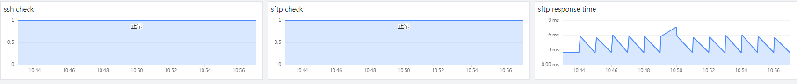
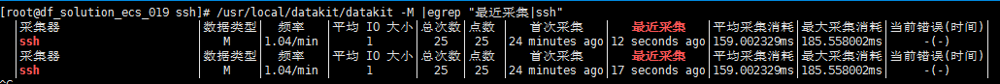
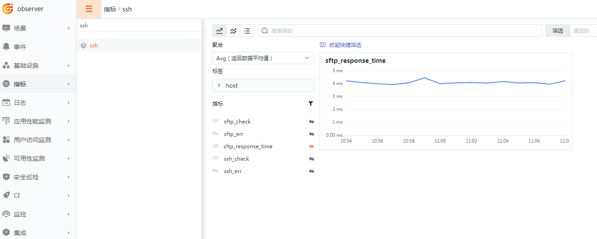

{{.CSS}}
# SSH
---

- DataKit 版本：{{.Version}}
- 操作系统支持：`{{.AvailableArchs}}`

监控 SSH/SFTP 服务，并把数据上报到观测云。

## 视图预览
SSH 性能指标展示：包括 ssh 服务状态、sftp 服务状态、sftp 服务响应时间等



## 前置条件

- 服务器 <[安装 Datakit](datakit-install)>

## 安装配置
说明：示例 Linux 版本为：CentOS Linux release 7.8.2003 (Core)，Windows 版本请修改对应的配置文件

### 部署实施

#### 指标采集 (必选)

1. 开启 ssh 插件，复制 sample 文件
```
cd /usr/local/datakit/conf.d/ssh
cp ssh.conf.sample ssh.conf
```

2. 修改 ssh.conf 配置文件

主要参数说明

- interval：采集频率
- host：远程主机
- username：用户名
- password：密码
- sftpCheck：是否开启 sftp 检测 (默认为 false)
- privateKeyFile：私钥文件路径 (默认为空)
```
[[inputs.ssh]]
  interval = "60s"
  host     = "127.0.0.1:22"
  username = "username"
  password = "password"
  sftpCheck      = false
  privateKeyFile = ""
```

3. 重启datakit (如果需要开启自定义标签，请配置插件标签再重启)
```
systemctl restart datakit
```

4. ssh 指标采集验证，使用命令
` /usr/local/datakit/datakit -M |egrep "最近采集|ssh" `



指标预览


#### 插件标签 (非必选）
参数说明

- 该配置为自定义标签，可以填写任意 key-value 值
- 以下示例配置完成后，所有 ssh 指标都会带有 app = oa 的标签，可以进行快速查询
- 相关文档 <[DataFlux Tag 应用最佳实践](best-practices/guance-skill/tag/)>
```
# 示例
[inputs.ssh.tags]
   app = "oa"
```
重启datakit
```
systemctl restart datakit
```

## 场景视图
<场景 - 新建仪表板 - 内置模板库 - SSH 监控视图>

## 异常检测
<监控 - 模板新建 - SSH 检测库>

## 指标集

以下所有数据采集，默认会追加名为 `host` 的全局 tag（tag 值为 DataKit 所在主机名），也可以在配置中通过 `[inputs.{{.InputName}}.tags]` 指定其它标签：

``` toml
 [inputs.{{.InputName}}.tags]
  # some_tag = "some_value"
  # more_tag = "some_other_value"
  # ...
```

{{ range $i, $m := .Measurements }}

### `{{$m.Name}}`

-  标签

{{$m.TagsMarkdownTable}}

- 指标列表

{{$m.FieldsMarkdownTable}}

{{ end }}


## 常见问题排查
<[无数据上报排查](why-no-data)>
