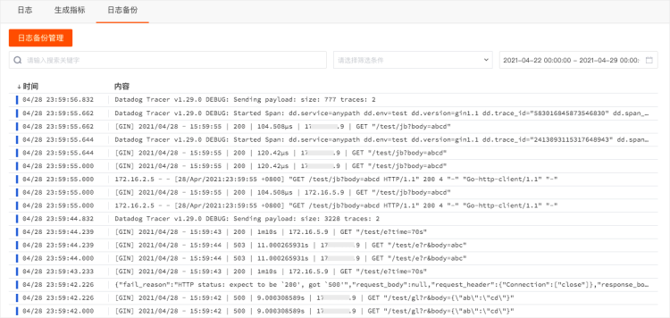

# 日志备份
---

## 简介

观测云基础日志最多存储60天，如果需要更长时间的存储和查看需要对基础日志进行备份。日志备份支持两种方式：

- 备份到 “观测云”：支持备份日志最多存储长达720天。
- 备份到外部存储：支持备份日志到阿里云 OSS，具体可参考文档 [日志数据备份到 OSS 最佳实践](../best-practices/guance-skill/log-backup-to-oss-by-func.md) 。
## 日志备份到观测云

### 新建规则

在「备份日志」页面，点击「日志备份管理」-「新建规则」，输入「规则名称」即可添加一条新的规则，支持通过筛选条件和搜索关键字更精准定位需要备份的日志，节省备份日志存储费用。

**注意：**

- 备份周期：按天进行备份，每天 `00:00:00` 开始备份前一天 `00:00:00—23:59:59` 的日志数据
- 数据预览：预览最近15分钟日志
- 筛选：可通过筛选条件过滤日志
- 搜索关键字：关键字颜色突出显示
- 规则名称： 限制最多输入30个字符
- 免费版用户：无法备份日志数据

### 查看规则

备份规则创建以后，统一存储在日志备份管理。规则一旦创建，不可编辑，只能查看。

### 删除规则

若创建的规则不再需要或者需要修改，可删除规则后再创建新的备份规则。规则删除后已备份的数据不会被删除，但不再产生新的日志备份数据。

## 查看备份日志

进入「日志」-「备份日志」页面，默认数据为空，需要先选择时间范围。

观测云支持通过选择时间范围、搜索关键字，筛选等方式查询和分析日志。点击日志可查看该条日志详情包括日志产生的时间和内容等。

