# 日志查看器
---

## 简介

日志数据采集到观测云后，您可以在观测云控制台，通过「日志」查看工作空间内全部的日志内容。

## 日志查看器模式

观测云日志查看器支持三种查看模式，包括默认、近似文本和分组。

=== "默认"

    默认查看器支持基于采集的原始日志数据进行查看和分析。在观测云工作空间「日志」-「查看器」中，左上角选择「默认」，即可基于采集的原始日志数据进行查询和分析。
    
    

=== "近似文本"

    近似文本查看器支持对原始日志数据的`message`字段进行相似度计算分析，根据右上方选择的时间范围固定当前时间段，并获取该时间段内10000条数据进行近似文本分析，将近似度高的日志进行聚合，提取并统计共同的 Pattern 聚类，帮助快速发现异常日志和定位问题。
    
    点击 Pattern 聚类列表，即可划出当前所有的 Pattern 聚类列表，返回数据列表按照时间倒序排列，支持显示最近50条日志数据，可选择 1行、3行、10行的方式显示。点击“关联日志”列表，可查看对应的日志详情。
    
    

=== "分组"

    分组查看器支持对原始日志数据基于**1-3个标签**进行分组统计，以反映出日志数据在不同的分组下，不同时间的分布特征与趋势。观测云支持三种分组数据浏览方式：折线图，面积图、柱状图。
    
    - 您可以通过折线图、面积图，查看日志数据量在一定时间内的变化趋势。
    - 您可以通过柱状图，比较每组日志数据在一定时间内的数据量大小。
    
    **数据显示说明**
    
    - 数据点：数据点是指数据值所在的坐标点。折线图和面积图将依据所您所选择的时间范围自动聚合为数据点，数据点数量不超过360个点；柱状图的数据点数量不超过60个。
    - 数据范围：数据范围指每一个数据点的取值范围，即以当前数据点的坐标点向前推送至上一个数据点的坐标点为间隔范围，取该范围内数据的值。
    
    

## 日志详情

点击日志列表，即可划出当前日志的详情页查看日志的详细信息，包括日志产生的时间、主机、来源、服务、内容、扩展字段、查看上下文等。支持通过键盘 ECS 按钮直接关闭详情页弹窗；支持通过键盘上下切换键（↑ ↓ ），切换查看上下日志详情。

### 查看上下文 {#up-down}

在日志详情页，点击右上角「查看上下文」，即可打开新页跳转到日志查看器。

在日志详情页查看上下文打开新的日志查看器时，会以 “host”、“source”、“service”、“filename” 为筛选条件，查看当前日志时间前后的数据。

### 属性字段

当鼠标点击属性字段如「主机」、「来源」，支持“筛选字段值”、“反向筛选字段值”、“添加到显示列”和“复制”进行快速筛选查看，支持查看与日志相关的主机、进程、链路、容器数据。

- “筛选字段值”，即添加该字段至日志查看器，查看与该字段相关的全部日志数据
- “反向筛选字段值”，即添加该字段至日志查看器，查看除了该字段以外其他的相关日志数据
- “添加到显示列”，即添加该字段到查看器列表进行查看
- “复制”，即复制该字段至剪贴板 
- “查看相关容器”，即查看与该主机相关全部容器
- “查看相关进程”，即查看与该主机相关全部进程
- “查看相关链路”，即查看与该主机相关全部链路
- “查看相关巡检”，即查看与该主机相关全部巡检数据

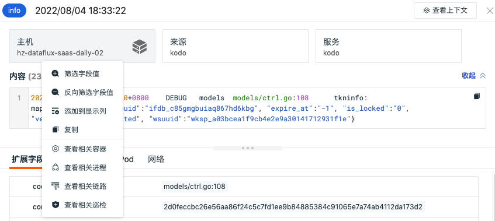

### 日志内容

日志内容根据 message 类型自动显示 Json 和文本两种查看模式。若日志没有 message 字段，则不显示日志内容部分，日志内容支持展开收起，默认为展开状态，收起后仅显示1行的高度。

### 扩展字段

当鼠标选中扩展字段，点击前面的下拉图标，显示“筛选字段值”、“反向筛选字段值”、“添加到显示列”和“复制”的小图标进行快速筛选查看。

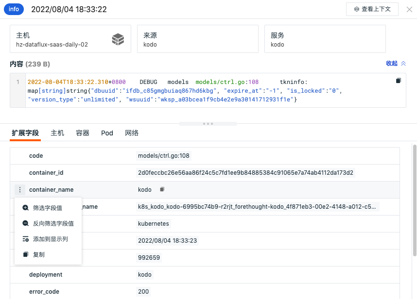

### 关联分析

=== "主机"

    观测云支持您通过详情页下方的「主机」，查看相关主机（关联字段：host）的指标视图和属性视图。
    
    - 指标视图：可查看相关主机**在该日志结束前30分钟到日志结束后30分钟内**的性能指标状态，包括相关主机的CPU、内存等性能指标视图。
    
    
    
    - 属性视图：帮助您回溯日志产生时主机对象的真实情况，支持查看相关主机**在对应时间内产生的最新一条对象数据**，包括主机的基本信息、集成运行情况。若开启云主机的采集，还可查看云厂商的信息。
    
    注意：观测云默认保存主机对象最近 48 小时的历史数据。未找到当前日志时间对应的主机历史数据时，你将无法查看关联主机的属性视图。
    
    

=== "链路"

    通过详情页下方的「链路」，您可以查看当前日志相关的链路（关联字段：trace_id）火焰图和Span列表，点击右上角的「跳转按钮」可直接对应的链路详情。更多关于链路火焰图和Span列表的介绍，可查看文档 [链路分析](../application-performance-monitoring/explorer.md) 。
    
    - 火焰图
    
    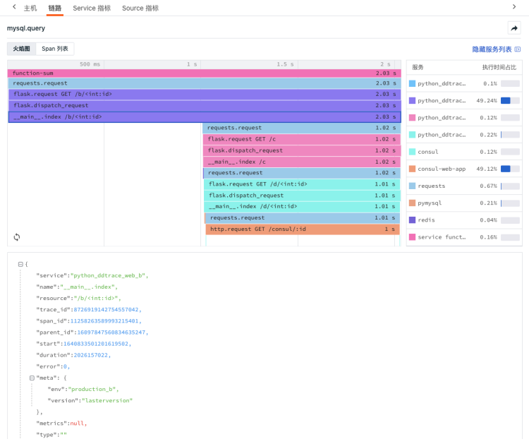
    
    - Span列表
    
    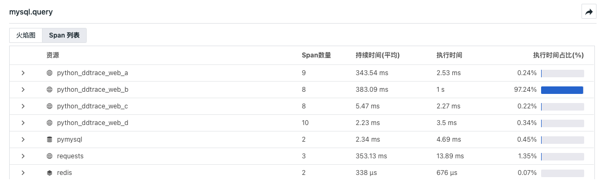

=== "容器"

    观测云支持您通过详情页下方的「容器」，查看相关容器（关联字段：container_name）的基本信息和**在选定时间组件范围内**的性能指标状态。
    
    - 属性视图：帮助您回溯日志产生时容器对象的真实情况，支持查看相关容器**在对应时间内产生最新的一条对象数据**，包括容器的基本信息、属性信息。
    
    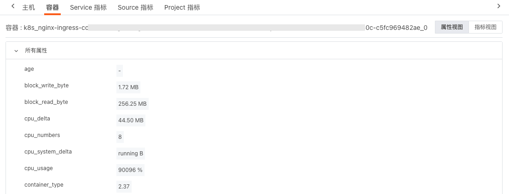
    
    - 指标视图：支持查看相关容器**在该日志结束前30分钟到日志结束后30分钟**的性能指标状态，包括容器CPU、内存等性能指标视图。
    
    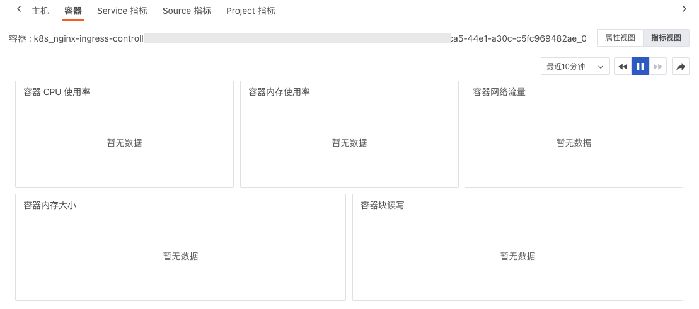

=== "Pod"

    观测云支持您通过详情页下方的「Pod」，查看相关 Pod（关联字段：pod_name）的属性视图和指标视图。
    
    - 属性视图：帮助您回溯日志产生时容器 pod 对象的真实情况，支持查看相关容器pod **在对应时间内最新的一条对象数据**，包括 pod 的基本信息、属性信息。
    
    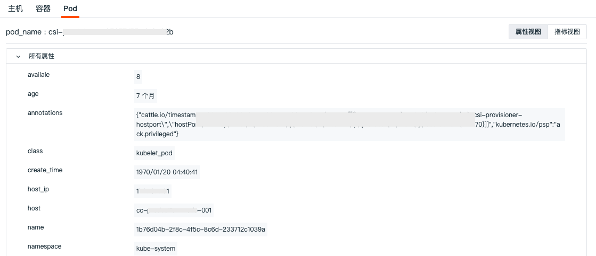
    
    - 指标视图：支持查看相关容器 pod **在该日志结束前30分钟到日志结束后30分钟**的性能指标状态，包括 Pod CPU、内存等性能指标视图。
    
    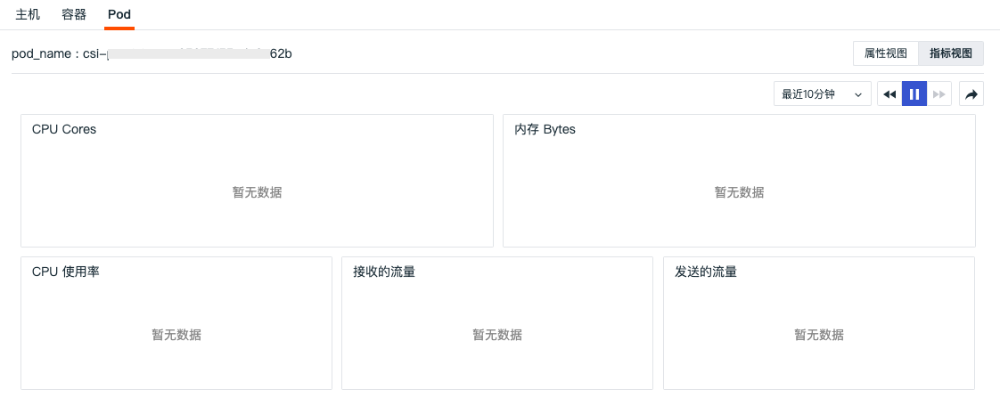

=== "指标"

    日志关联的指标按照关联的字段分成三个视图，分别为“service”、“project”、“source”。
    
    - Service指标
    
    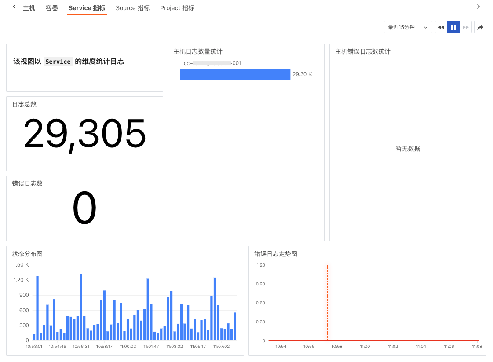
    
    - Project指标
    
    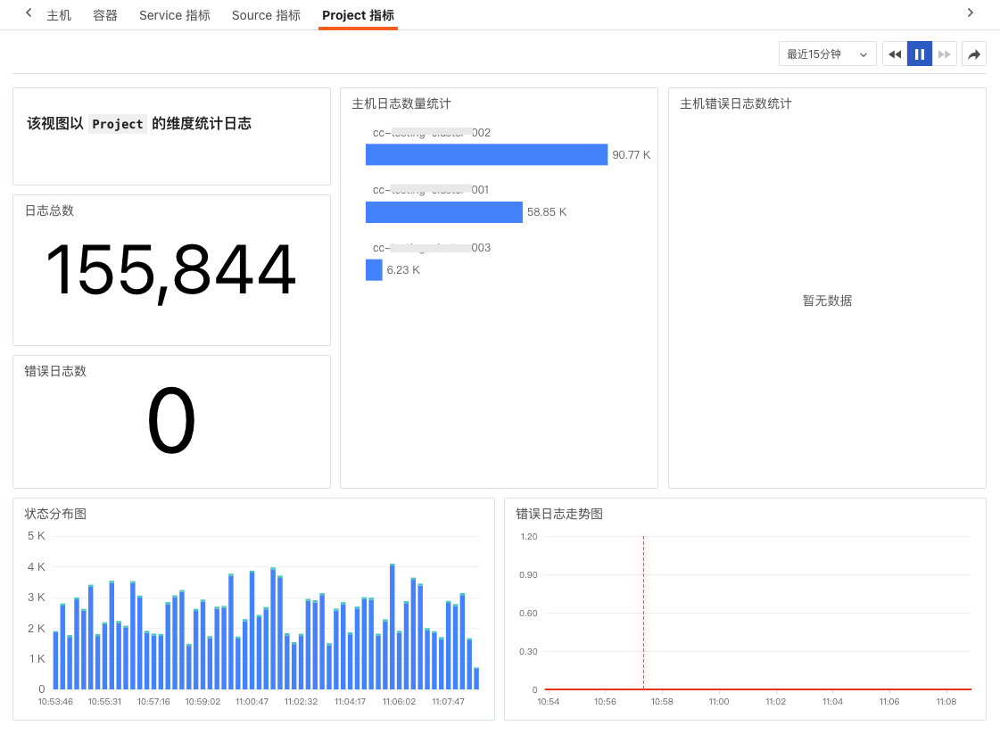
    
    - Source指标
    
    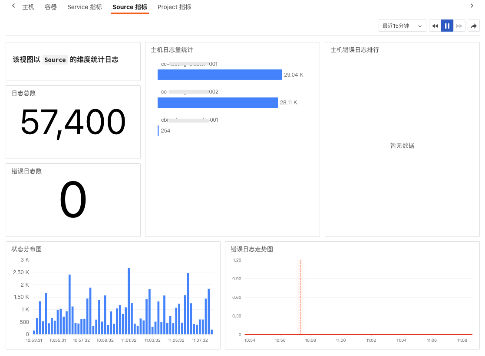

=== "网络"

    观测云支持您通过详情页下方的「网络」，查看相关视图（包括主机、Pod 和 Deployment）的数据连接情况。 
    
    
    
    **匹配字段**
    
    在详情页中查看相关网络，需要匹配对应的关联字段，即在数据采集的时候需要配置对应的字段标签，否则无法在详情页中查看到相关的网络页面。
    
    - 主机：匹配字段“host”，鼠标选中“主机”，支持点击「复制」按钮复制关联字段及其值
    - Pod：匹配字段”pod_name“，鼠标选中“Pod”，支持点击「复制」按钮复制关联字段及其值
    - Deployment：匹配字段”deployment_name“，鼠标选中“Deployment”，支持点击「复制」按钮复制关联字段及其值
    
    注意：
    
    - 若同时配置了主机、Pod、Deployment 的关联字段，进入详情页时优先显示 Pod 网络的数据，其次是 Deplyment 网络的数据；
    - 若未配置 Pod、Deployment 的关联字段，则不显示该网络数据。
    
    **网络 48 小时回放**
    
    在日志网络，支持点击时间控件选择查看 48 小时网络数据回放。
    
    - 时间范围：默认查看该日志前后 30 分钟的数据，若是当前发生的日志，默认查看最近 1 小时的数据；
    - 支持任意拖动时间范围查看对应的网络流量；
    - 拖动后，查询的是历史网络数据；
    - 拖动后，点击「播放」按钮或刷新页面，回到查看「最近 1 小时」的网络数据。
    
    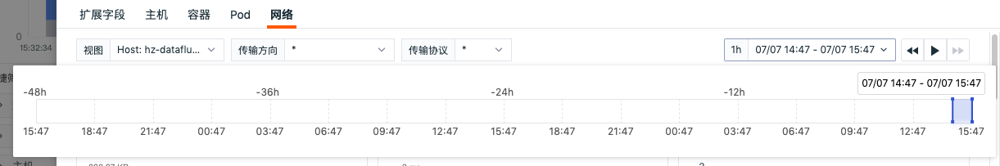

## 日志查询与分析

观测云支持多种方式对日志数据进行查询和分析，包括搜索与筛选、快捷筛选、日志统计、多行浏览、颜色高亮、格式化配置、日志数据导出等。

### 日志统计

观测云会根据选择的时间范围自动划分若干时间点，通过堆积柱状图展示不同日志状态的数量，帮助进行统计分析。若对日志进行了筛选过滤，柱状图同步展示筛选后结果。

- 日志统计图支持通过鼠标悬浮至图表，点击导出按钮，即可导出到仪表板、笔记或粘贴板；
- 日志统计图支持自定义选择时间间隔。

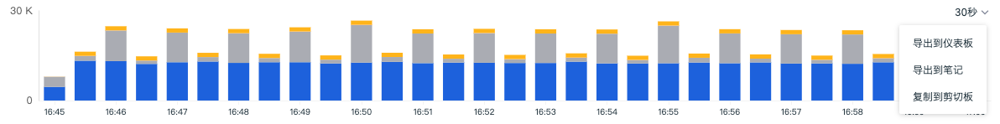

### 时间控件

观测云查看器默认展示最近 15 分钟的日志数据，通过右上角的「时间控件」，您可以选择日志数据展示的时间范围。更多详情可参考文档 [时间控件说明](../getting-started/necessary-for-beginners/explorer-search.md#time) 。

### 搜索与筛选
在日志查看器搜索栏，支持关键字搜索、通配符搜索、关联搜索、JSON 搜索等多种搜索方式，支持通过 `标签/属性` 进行值的筛选，包括正向筛选、反向筛选、模糊匹配、反向模糊匹配、存在和不存在等多种筛选方式。更多搜索与筛选可参考文档 [查看器的搜索和筛选](../getting-started/necessary-for-beginners/explorer-search.md) 。

### 快捷筛选

在日志查看器快捷筛选，支持编辑“快捷筛选”，添加新的筛选字段。添加完成后，可以选择其字段值进行快捷筛选。更多快捷筛选可参考文档 [快捷筛选](../getting-started/necessary-for-beginners/explorer-search.md#quick-filter) 。

### 自定义显示列

日志查看器默认显示“time”和“message”字段，其中“time”字段为固定字段无法删除。当鼠标放在查看器显示列上时，点击「设置」按钮，支持对显示列进行升序、降序、向左移动列、向右移动列、向左添加列、向右添加列、替换列、添加到快捷筛选、添加到分组、移除列等操作。更多自定义显示列可参考文档 [显示列说明](../getting-started/necessary-for-beginners/explorer-search.md#columns) 。

### 格式化配置

格式化配置可以让您隐藏敏感日志数据内容或者突出需要查看的日志数据内容，还可以通过替换原有日志内容进行快速筛选。

点击查看器列表右上角的「设置」，点击「格式化配置」，即可添加映射，输入以下内容，点击保存，即可把含“DEGUB”的原日志内容替换成您想显示的格式。

- 字段：如内容
- 匹配方式：如 match（目前支持`=`、`!=`、`match`、`not match`）
- 匹配内容：如 DEBUG
- 显示为内容：如 `******`

注意：仅管理员及以上可进行查看器格式化配置。

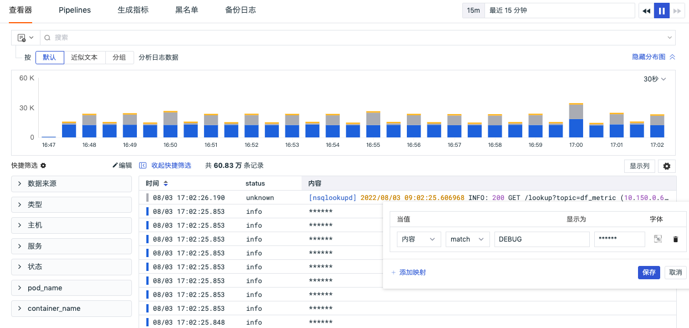

### 日志颜色高亮

为了让您能更快的的获取日志的重点数据信息，观测云采用不同的颜色高亮日志的不同内容，分成浅色和深色两种主题颜色。

注意：如果在搜索栏对日志进行搜索时，返回的列表仅保留匹配到的关键词的高亮显示。

| 日志内容 | 浅色主题 | 深色主题 |
| --- | --- | --- |
| 日期（日志发生的时间） | 黄色 | 浅黄色 |
| 关键字（HTTP协议相关，如GET） | 绿色 | 浅绿色 |
| 文本（带引号的字符串） | 蓝色 | 浅蓝色 |
| 默认（无任何标示的文本） | 黑色 | 灰色 |
| 数字（日志状态码等，如404） | 紫色 | 浅紫色 |

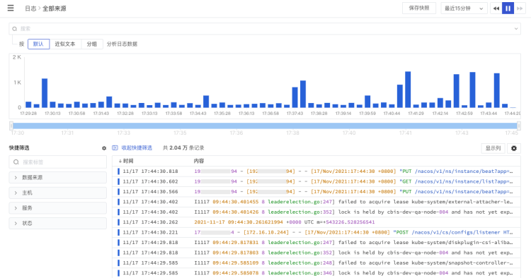

### 日志单行展开复制

在观测云日志数据列表，您可以使用“鼠标悬停”至日志内容，展开查看日志的全部内容，点击“复制”按钮可把整条日志内容复制到粘贴板。日志内容展开时，若支持 JSON 展示，会将该条日志以 JSON 格式展示，若不支持则正常展示该日志内容。

### 日志多行浏览

观测云的日志数据列表默认为您展示日志的触发「时间」和日志的「内容」。您可以在查看器「显示列」中选择日志显示 “1行”、“3行” 或 “10行” 来查看完整的日志内容。

### 日志数据导出

- 在「日志」中，你可以先筛选出想要的日志数据，再通过「设置」导出后进行查看和分析，支持导出到 CSV 文件或者仪表板和笔记。

