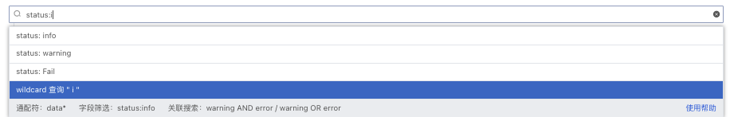

# 日志查看器
---

## 简介

日志数据采集到观测云后，您可以在观测云控制台，通过「日志」查看工作空间内全部的日志内容。

观测云日志查看器支持三种查看模式：

- 默认：支持基于采集的原始日志数据进行查看和分析。
- 近似文本：支持根据右上方选择的时间范围固定当前时间段，并获取该时间段内10000条数据进行近似文本分析，将近似度高的日志进行聚合，并提取共同的 pattern 聚类，有利于发现异常日志和快速定位问题。
- 分组：支持对原始日志数据基于**1-3个标签**进行分组统计，以反映出日志数据在不同的分组下，不同时间的分布特征与趋势。

## 默认查看器

在观测云工作空间「日志」-「查看器」中，左上角选择「默认」，即可基于采集的原始日志数据进行查询和分析，支持隐藏分布图。

### 日志统计

观测云会根据选择的时间范围自动划分若干时间点，通过堆积柱状图展示不同日志状态的数量，帮助进行统计分析。若对日志进行了筛选过滤，柱状图同步展示筛选后结果。

同时，“观测云”空间查看器中的任意图表导出到仪表板、笔记或粘贴板。日志统计图支持通过鼠标悬浮至图表，点击导出按钮进行导出。

### 日志详情

点击日志列表，即可划出当前日志的详情页查看日志的详细信息，包括日志产生的时间、主机、、来源、服务、内容、扩展字段等。另外，在详情页，您还可以查看与日志相关的主机、进程、链路、容器数据，以及相关数据量的统计提示。

- **日志内容**

日志内容根据 message 类型自动显示 Json 和文本两种查看模式。若日志没有 message 字段，则不显示日志内容部分，日志内容支持展开收起，默认为展开状态，收起后仅显示1行的高度。

- **扩展字段**

扩展字段支持“复制”和“添加到筛选”进行快速筛选查看。

#### 关联主机

观测云支持您通过详情页下方的「主机」，查看相关主机（关联字段：host）的基本信息和**在选定时间组件范围内**的性能指标状态。
注意：在日志详情中查看相关主机，需要匹配字段“host”，否则无法在日志详情查看到相关主机的页面。

- 属性视图：包括主机的基本信息、集成运行情况，若开启云主机的采集，还可查看云厂商的信息。

- 指标视图：可查看默认15分种内，相关主机的CPU、内存等性能指标视图。点击「打开该视图」至内置视图，可通过克隆的方式对主机视图进行自定义修改，并作为用户视图保存，用户视图可通过绑定在日志详情页查看，更多配置详情，可参考[绑定内置视图](https://www.yuque.com/dataflux/doc/dns233/)。

另外，通过点击日志详情页的标签「主机」，您可以进行以下操作：

- “添加到筛选”，即添加该标签至日志查看器，查看与该主机相关的全部日志数据
- “复制”，即复制该标签内容至剪贴板 
- “查看相关进程”，即查看与该主机相关全部进程
- “查看相关链路”，即查看与该主机相关全部链路
- “查看相关巡检”，即查看与该主机相关全部巡检数据

#### 关联链路

通过详情页下方的「链路」，您可以查看当前日志相关的链路（关联字段：trace_id）火焰图和Span列表，更多关于链路火焰图和Span列表的介绍，可查看文档 [链路分析](https://www.yuque.com/dataflux/doc/qp1efz#709bc06a) 。

- 火焰图

- Span列表

注意：在日志中详情中查看相关链路，需要匹配字段“trace_id”，否则无法在日志详情查看到相关链路的页面。

#### 关联容器

观测云支持您通过详情页下方的「容器」，查看相关容器（关联字段：container_name）的基本信息和**在选定时间组件范围内**的性能指标状态。

注意：在日志中详情中查看相关容器，需要匹配字段“container_name”，否则无法在日志详情查看到相关容器的页面。

- 属性视图：包括容器的所有属性。

- 指标视图：容器CPU、内存等性能指标视图，点击「打开该视图」至内置视图，可通过克隆的方式对容器视图进行自定义修改，并作为用户视图保存，用户视图可通过绑定在日志详情页查看，更多配置详情，可参考[绑定内置视图](../management/built-in-view/bind-view.md)。

#### 关联 Pod

观测云支持您通过详情页下方的「Pod」，查看相关 Pod（关联字段：pod_name）的基本信息和**在选定时间组件范围内**的性能指标状态。

注意：在日志中详情中查看相关容器，需要匹配字段“pod_name”，否则无法在日志详情查看到相关 Pod 的页面。

- 属性视图：包括 Pod 的所有属性。

- 指标视图：Pod CPU、内存等性能指标视图，点击「打开该视图」至内置视图，可通过克隆的方式对容器视图进行自定义修改，并作为用户视图保存，用户视图可通过绑定在日志详情页查看，更多配置详情，可参考[绑定内置视图](../management/built-in-view/bind-view.md)。

#### 关联指标

日志关联的指标按照关联的字段分成三个视图，分别为“service”、“project”、“source”。

注意：在日志中详情中查看相关指标，需要匹配字段“service”、“project”、“source”，否则无法在日志详情查看到相关指标的页面。

- Service指标

- Project指标

- Source指标

#### 关联网络
观测云支持您通过详情页下方的「网路」，查看相关主机网路（关联字段：host）的数据连接情况。
注意：在日志详情中查看相关主机网络，需要匹配字段“host”，否则无法在日志详情查看到相关主机网络的页面。 

## 近似文本查看器

观测云支持对原始日志数据的`message`字段进行相似度计算分析，根据右上方选择的时间范围固定当前时间段，并获取该时间段内 10000 条日志数据做近似分析，将近似度高的日志进行聚合，提取并统计共同的 Pattern 聚类，帮助快速发现异常日志和定位问题。

### Pattern 聚类详情

点击 Pattern 聚类列表，即可划出当前所有的 Pattern 聚类列表，返回数据列表按照时间倒序排列，支持显示最近50条日志数据，可选择 1行、3行、10行的方式显示。点击“关联日志”列表，可查看对应的日志详情。

## 分组查看器

为了便于您的数据分析，您可以通过“观测云” 提供的分组功能，对庞大的原始数据基于**1-3个标签**进行分组处理，以反映出分组数据在不同时间的分布特征与趋势。“观测云” 支持三种分组数据浏览方式：折线图，面积图、柱状图。

- 您可以通过折线图，查看日志数据量在一定时间内的变化趋势。

- 您可以通过面积图，查看日志数据量在一定时间内的变化程度。

- 您可以通过柱状图，比较每组日志数据在一定时间内的数据量大小。

**数据显示说明**

- 数据点：数据点是指数据值所在的坐标点。折线图和面积图将依据所您所选择的时间范围自动聚合为数据点，数据点数量不超过360个点；柱状图的数据点数量不超过60个。
- 数据范围：数据范围指每一个数据点的取值范围，即以当前数据点的坐标点 向前推送 至上一个数据点的坐标点为间隔范围，取该范围内数据的值。

## 日志查询与分析

观测云支持多种方式对日志数据进行查询和分析，包括选择数据来源、搜索、筛选、统计、多行浏览、导出等。

注意：观测云支持通过选择查看器时间范围筛选日志列表。如在 “观测云” 工作空间「日志查看器」右上角时间范围选择 15 分钟，左侧日志列表仅显示 15 分钟内有数据的日志来源。

### 搜索与筛选
在日志查看器中，观测云支持您通过搜索、筛选、排序等方式查询和分析主机数据。

- 时间范围：观测云默认展示最近15分钟的日志数据，通过右上角的「时间组件」，您可以选择日志数据展示的时间范围。
- 排序：观测云支持依据时间排序，通过点击列表菜单，您可以基于选中的标签进行升降排序
- 搜索与筛选：通过列表上方的搜索和筛选栏，您可以基于字段、日志文本进行关键词搜索、字段筛选、关联搜索
   - 输入框支持模糊匹配相关字段
   - “abc：123”形式，回车后支持字段的精确查询，在筛选栏中选择wildcard查询支持基于变量进行模糊查询

   - 输入框输入文本后，支持基于关键字的模糊匹配
   - " abc AND cba / abc OR cba" 形式，回车后支持关联搜索

注意：

- 观测云支持基于当前列表内的全部数据内容进行模糊匹配，如*abc、 abc* 、*abc* 。基于搜索的关键词，观测云将匹配相关内容，并高亮展示出您搜索的关键字。
- 观测云支持多个关键词搜索，只需要输入对应的关键词，并使用空格或者逗号隔开即可。另外，搜索多个关键词时，支持采用AND/OR逻辑，以获取更精确的数据范围。输入的关键词越多，数据匹配的范围将越精准。

### 快捷筛选

- **自定义快捷筛选字段**

在日志查看器，支持编辑“快捷筛选”，添加新的筛选字段。

添加完成后，可以选择其字段值进行快捷筛选。

- **反选与重置**

在日志查看器“快捷筛选”，支持在选择字段筛选内容时进行“反选”或者“重置”，“反选”表示选中的字段筛选内容不展示（再次点击“反选”可返回字段选中状态），“重置”可清空筛选条件。

**示例说明：**

在日志查看器“快捷筛选”，选择字段“status:warning”，日志内容显示`status`为`warning`的数据。

点击快捷筛选“反选”，日志内容显示`status`为`非 warning`的数据。

### 日志颜色高亮

为了让您能更快的的获取日志的重点数据信息，观测云采用不同的颜色高亮日志的不同内容，分成浅色和深色两种主题颜色。

注意：如果在搜索栏对日志进行搜索时，返回的列表仅保留匹配到的关键词的高亮显示。

| 日志内容 | 浅色主题 | 深色主题 |
| --- | --- | --- |
| 日期（日志发生的时间） | 黄色 | 浅黄色 |
| 关键字（HTTP协议相关，如GET） | 绿色 | 浅绿色 |
| 文本（带引号的字符串） | 蓝色 | 浅蓝色 |
| 默认（无任何标示的文本） | 黑色 | 灰色 |
| 数字（日志状态码等，如404） | 紫色 | 浅紫色 |

### 日志单行展开复制

在观测云日志数据列表，您可以使用“鼠标悬停”至日志内容，展开查看日志的全部内容，点击“复制”按钮可把整条日志内容复制到粘贴板。展开时若可以系统会将该条日志JSON格式化，若不可以则正常展示该日志内容。

### 格式化配置

格式化配置可以让您隐藏敏感日志数据内容或者突出需要查看的日志数据内容，还可以通过替换原有日志内容进行快速筛选。

在查看器的格式化配置，添加映射，输入以下内容，点击保存，即可把含“48043”的原日志内容替换成您想显示的格式。

- 字段：如内容
- 匹配方式：如match（目前支持`=`、`!=`、`match`、`not match`）
- 匹配内容：如48043
- 显示为内容：如xxxxxx

注意：仅管理员及以上可进行查看器格式化配置。

### 自定义显示列

日志查看器默认显示“time”和“message”字段，其中“time”字段为固定字段无法删除。自定义显示列支持您根据自己的需求添加或删除日志字段来进行查看和分析日志数据，支持通过关键字搜索显示列，支持自定义显示列作为预设字段，后续通过Pipeline切割字段并上报数据后可直接显示上报的数据。

### 日志多行浏览

观测云的日志数据列表默认为您展示日志的触发「时间」和日志的「内容」。您可以在“设置”中选择日志显示“3行”或“10行”来查看完整的日志内容。

同时，您也可以向日志列表添加、删除显示列，便捷您的数据查看和访问。

### 日志数据导出

- 在「日志」中，你可以先筛选出想要的日志数据，再通过「设置」导出后进行查看和分析，支持导出到CSV文件或者视图。点击「导出到视图」，在弹出的对话框中选择「场景」和「节点」，点击「确定」。导出的日志以视图的方式添加到对应的场景中进行查看和分析。

- 同时，观测云空间查看器中的任意图表导出到仪表板、笔记或粘贴板。通过鼠标悬浮至图表，点击导出按钮进行导出

