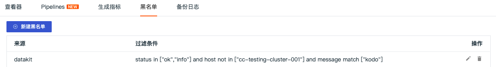
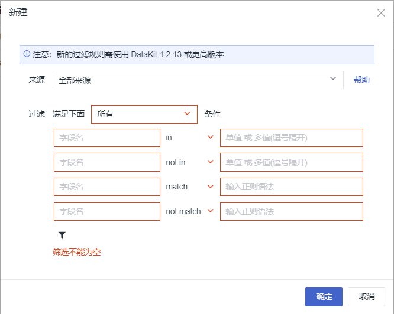
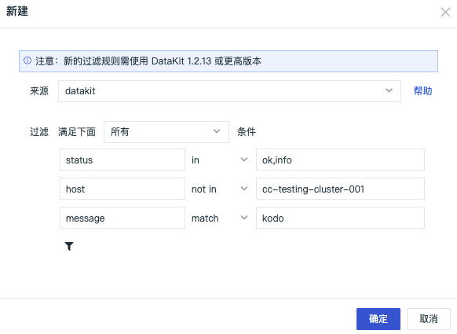
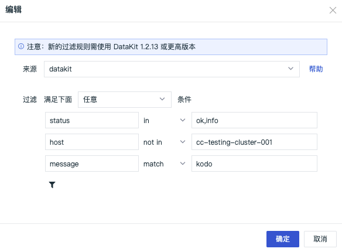
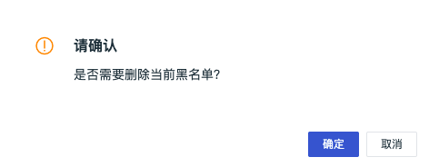

# 日志索引
---

观测云支持通过设置日志黑名单的方式过滤掉符合条件的日志，即配置日志黑名单以后，符合条件的日志数据不再上报到“观测云” 工作空间，帮助用户节约日志数据存储费用。

## 新建黑名单

在 “观测云” 工作空间，点击「日志」-「黑名单」-「新建黑名单」。

选择「来源」，添加一条或多条日志筛选过滤规则，点击"确定"即默认开启该日志过滤规则。您可以通过「日志黑名单」，查看全部日志过滤规则。

- 来源：支持选择日志全部来源或者单一日志来源
- 过滤：支持两种条件选择，“任意”和“所有”。“任意”为 “或（OR）”条件，“所有”为“且（AND）”条件。
- 字段名：支持手动输入字段名，必须是精准值，可以在日志查看器“显示列”查看需要匹配的字段名。
- 字段值：支持手动输入字段值，支持输入单值、多值；支持正则匹配，如abc*，*abc*，*abc，.*等
- 匹配选项：支持`in / not in / match / not match` 4种模式，`in / not in` 为精准匹配，`match / not match` 为模糊匹配（正则匹配）

### 示例

以下示例中，黑名单设置后，datakit 的日志，满足`status`为`ok 或 info`，且`host`不为`cc-testing-cluster-001`，且`message`中包含`kodo`字样，即同时满足这三个匹配规则的数据将被过滤，不再上报工作空间。

## 编辑黑名单

在日志黑名单右侧，点击「编辑」图标，即可编辑已经创建的日志过滤规则。以下示例中，黑名单设置后，datakit 的日志，满足`status`为`ok 或 info`，或者`host`不为`cc-testing-cluster-001`，或者`message`中包含`kodo`字样，即满足这三个匹配规则中任意一个规则的数据将被过滤，不再上报工作空间。

## 删除黑名单

在日志黑名单右侧，点击「删除」图标，即可对已有的日志过滤规则进行删除。过滤规则删除后，日志数据将正常上报到工作空间。

