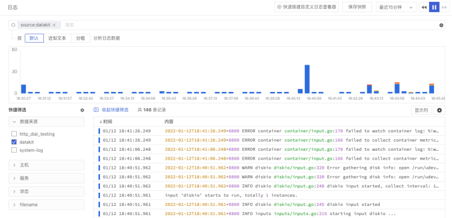
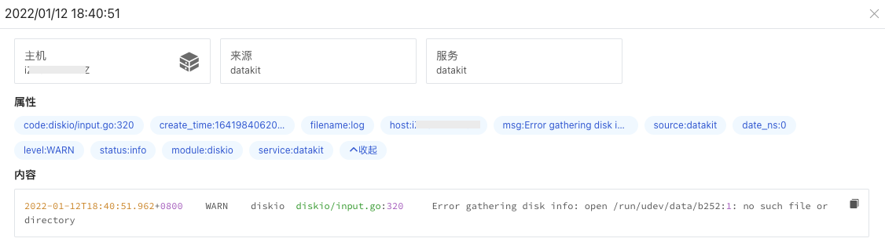

# DataKit Pipeline使用手册
---

Pipeline 支持多种格式的日志数据切割，通过编写 Pipeline 脚本，可以自定义切割出符合要求的结构化日志，并把切割出来的字段作为标签使用，通过标签字段，我们可以快速筛选相关日志、进行关联分析，帮助我们快速去定位问题并解决问题。

观测云在 DataKit 中内置了简单的调试工具，用来辅助编写 Pipeline 脚本。下面以 DataKit 自身的日志切割为例，介绍如何使用 Pipeline。

## 前置条件

您需要先创建一个[观测云账号](https://www.guance.com/)，并在您的主机上[安装 DataKit](https://www.yuque.com/dataflux/datakit/datakit-install) ，开启 DataKit [日志采集](https://www.yuque.com/dataflux/datakit/logging)。

## 步骤一：根据采集的日志，确定切割字段

以下是一条采集的 DataKit 日志，从中可以看到几个部分，包括日志产生的时间、日志等级、日志模块、模块内容以及日志的内容。

```
2022-01-12T18:40:51.962+0800 WARN diskio diskio/input.go:320 Error gathering disk info: open /run/udev/data/b252:1: no such file or directory
```

## 步骤二：编写并保存 Pipeline 文件

### 自定义pattern，编写 Grok

确定日志包括几个部分以后，就可以编写 Grok，对日志进行切割。我们可以通过 `add_pattern()`的方式先自定义 pattern。

```
add_pattern('_dklog_date', '%{YEAR}-%{MONTHNUM}-%{MONTHDAY}T%{HOUR}:%{MINUTE}:%{SECOND}%{INT}')
add_pattern('_dklog_level', '(DEBUG|INFO|WARN|ERROR|FATAL)')
add_pattern('_dklog_mod', '%{WORD}')
add_pattern('_dklog_source_file', '(/?[\\w_%!$@:.,-]?/?)(\\S+)?')
add_pattern('_dklog_msg', '%{GREEDYDATA}')
```

自定义 pattern 以后，我们可以在 Grok 中引用自定义的 pattern ，其中`rename`和`default_time`是优化切割出来的字段。

```
grok(_, '%{_dklog_date:log_time}%{SPACE}%{_dklog_level:level}%{SPACE}%{_dklog_mod:module}%{SPACE}%{_dklog_source_file:code}%{SPACE}%{_dklog_msg:msg}')
rename("time", log_time) # 将 log_time 重名命名为 time
default_time(time)       # 将 time 字段作为输出数据的时间戳
```

更多 pipeline 编写规则可参考文档 [文本数据处理（Pipeline）](https://www.yuque.com/dataflux/datakit/pipeline) 。
### 保存pipeline文件

Pipeline 文件编写好以后，需要保存为以`.p`为结尾的文件，存在 `/usr/local/datakit/pipeline` 目录下，如`datakit.p`。

## 步骤三：使用 Pipeline 调试切割字段

在上一步中，我们已经自定义了 pattern、编写了 grok，并在 datakit 目录下保存了pipeline文件，这个时候我们就可以使用 DataKit 内置的 Pipeline 调试工具查看日志切割的效果。
脚本格式如：`datakit --pl xxxxxx.p --txt '日志内容'`，即

```
# 调试脚本示例
datakit --pl datakit.p --txt '2022-01-12T18:40:51.962+0800 WARN diskio diskio/input.go:320 Error gathering disk info: open /run/udev/data/b252:1: no such file or directory'

# 提取成功示例
Extracted data(drop: false, cost: 3.108038ms):
{
  "code": "diskio/input.go:320",
  "level": "WARN",
  "message": "2022-01-12T18:40:51.962+0800 WARN diskio diskio/input.go:320 Error gathering disk info: open /run/udev/data/b252:1: no such file or directory",
  "module": "diskio",
  "msg": "Error gathering disk info: open /run/udev/data/b252:1: no such file or directory",
  "time": 1641984051962000000
}

```

另外在 DataKit 内置的调试工具中，还可以通过 `datakit --grokq`的方式查看自定义 pattern 值的建议格式，如在 grokq 模式下输入日志的时间，即可返回对应值的建议格式。

```
datakit --grokq
grokq > 2022-01-12T18:40:51.962+0800
	4 %{TIMESTAMP_ISO8601: ?}
	0 %{SYSLOGPROG: ?}
	0 %{GREEDYDATA: ?}
	0 %{NOTSPACE: ?}
	0 %{PROG: ?}
```

## 步骤四：在观测云查看切割后的字段

在上一步中，pipeline调试日志切割成功后，我们可以配置日志采集器的对应参数，就可以在观测云工作空间查看切割后的字段，并进行快速筛选和关联查询分析。

### 配置日志采集器

在 `/usr/local/datakit/conf.d/log`目录下的日志采集器 `logging.conf`中，配置存放日志的地址和 Pipeline 文件。如：

- `logfiles = ["/var/log/datakit/log"]`
- `pipeline = "datakit.p"`

```
[[inputs.logging]]
  ## required
  logfiles = [
    "/var/log/datakit/log"
  ]
  # only two protocols are supported:TCP and UDP
  # sockets = [
  #      "tcp://0.0.0.0:9530",
  #      "udp://0.0.0.0:9531",
  # ]
  ## glob filteer
  ignore = [""]

  ## your logging source, if it's empty, use 'default'
  source = "datakit"

  ## add service tag, if it's empty, use $source.
  service = ""

  ## grok pipeline script path
  pipeline = "datakit.p"
```

### 查看切割字段

在观测云工作空间的日志下，选择 datakit 的日志。


在日志详情页，可以看到“属性”下的字段和字段值，这个就是我们日志切割后显示的字段和字段值。如

- `code: diskio/input.go:320`
- `level: WARN`
- `module: diskio`



以上就是 DataKit 日志为例的 Pipeline 使用手册，更多关于 pipeline 和 日志采集切割的内容，可参考如下文档。

- [文本数据处理（Pipeline）](https://www.yuque.com/dataflux/datakit/pipeline#d29b7088)
- [调试 Pipeline](https://www.yuque.com/dataflux/datakit/datakit-pl-how-to)
- [日志](https://www.yuque.com/dataflux/datakit/logging)
- [第三方日志接入](https://www.yuque.com/dataflux/datakit/logstreaming)


---

观测云是一款面向开发、运维、测试及业务团队的实时数据监测平台，能够统一满足云、云原生、应用及业务上的监测需求，快速实现系统可观测。**立即前往观测云，开启一站式可观测之旅：**[www.guance.com](https://www.guance.com)

