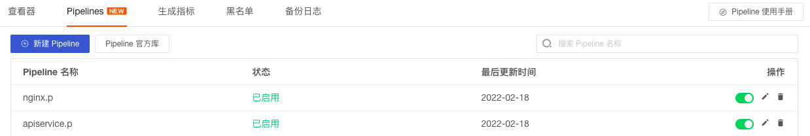
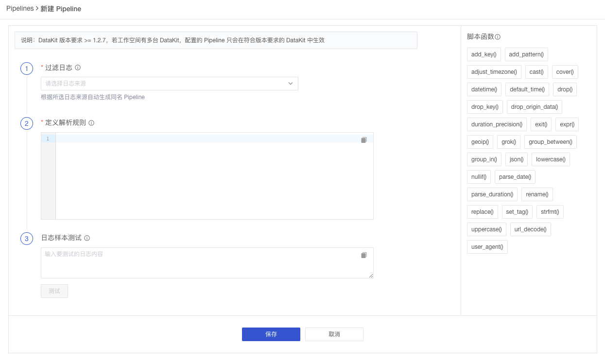
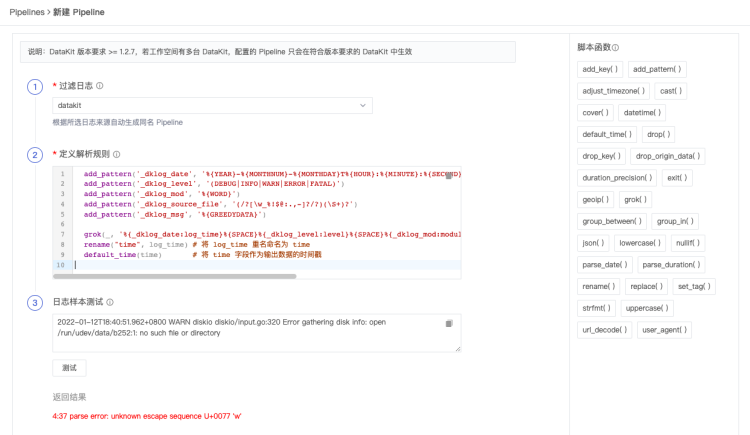
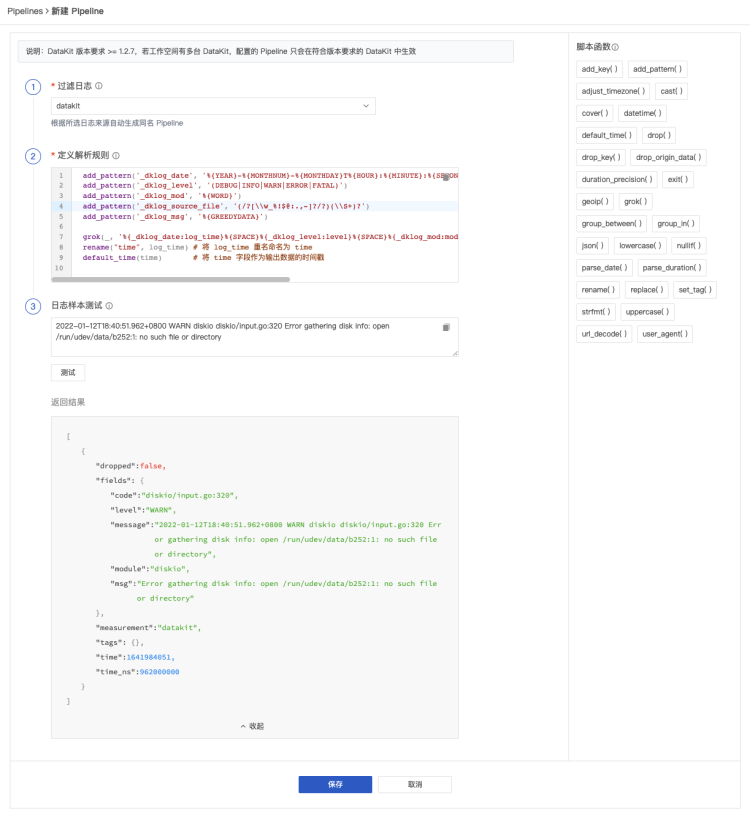
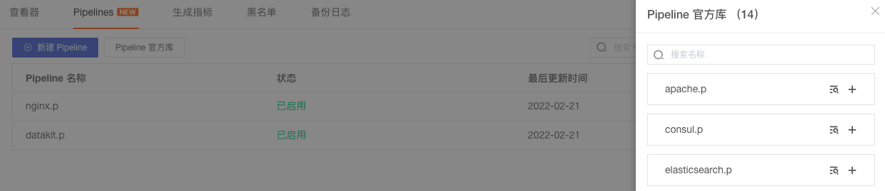
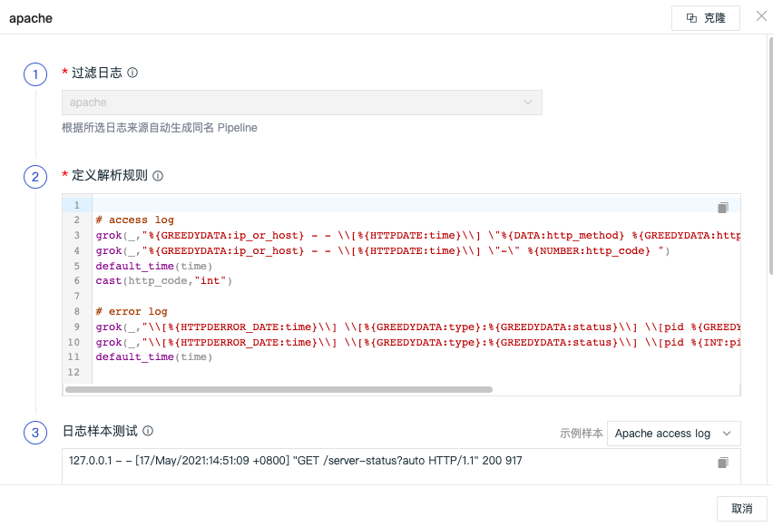
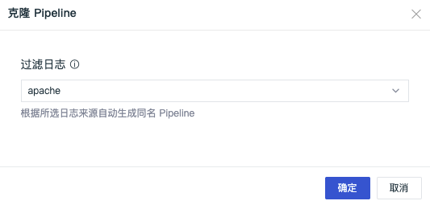
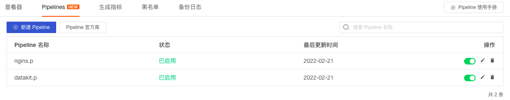

# Pipelines

---


Pipeline 用于日志数据解析，通过定义解析规则，将格式各异的日志切割成符合我们要求的结构化数据。观测云提供三种日志 Pipeline 文本处理方式：

- [Pipelines](manual.md)：支持在观测云前端手动配置和查看日志 pipeline 文件，无需登录 DataKit 服务器进行操作，帮助您方便的使用Pipelines来切割您的日志；
- [DataKit](datakit-manual.md)：在服务器安装DataKit以后，在终端工具中配置DataKit的日志采集器及其对应的 pipeline 文件，对文本数据进行处理；
- DCA：DataKit Control APP，是DataKit的桌面客户端应用，需要先安装，安装完成后可在客户端查看和编辑 DataKit 默认自带的日志 pipeline 文件和自定义手动添加 pipeline 文件；

本文档主要介绍如何使用观测云前端 Pipelines 功能来快速查看和配置日志 pipeline 文件。

## 新建 Pipeline

1.在观测云工作空间「日志」-「Pipelines」，点击「新建Pipeline」即可创建一个新的 pipeline 文件。



注意：pipeline 文件创建以后，需要安装 DataKit 才会生效，DataKit 会定时从工作空间获取配置的 pipeline 文件，默认时间为 1分钟，可在 `conf.d/datakit.conf`中修改。

```
[pipeline]
  remote_pull_interval = "1m"
```

2.在新建 Pipeline 页面，选择“过滤日志”，填入“定义解析规则”，然后在“日志样本测试”输入日志数据进行测试，测试通过后点击“保存”即可创建 pipeline 文件。

- 过滤日志：根据所选日志来源自动生成同名 Pipeline，也可以直接输入自定义的 pipeline 文件名；
- 定义解析规则：定义日志的解析规则，支持多种脚本函数，可通过观测云提供的脚本函数列表直接查看其语法格式，如`add_pattern()`等；
- 日志样本测试：输入日志数据，根据配置的解析规则进行测试；

注意：自定义 pipeline 文件不能同名，但可以和官方 pipeline 同名，此时 DataKit 会优先自动获取自定义 pipeline 文件配置。若在日志采集器`.conf`中手动配置 pipeline 文件，此时 DataKit 会优先获取手动配置的 pipeline 文件。



### 调试 Pipeline

在新建 Pipeline 页面，选择“过滤日志”，填入“定义解析规则”，然后在“日志样本测试”输入日志数据进行测试，若解析规则不符合，则返回错误提示的结果，如下图中提示第4行的"w"转译有问题。
注意：

- 日志样本测试为非必填项
- 自定义 Pipeline 保存后， 日志样本测试数据同步保存。



按照错误提示修改后，返回文本通过解析处理后日志展示结果。更多关于 pipeline 在 DataKit 的配置，可参考文档 [Pipeline使用手册](datakit-manual.md) 。



## 编辑/删除/启用/禁用 Pipeline

在观测云工作空间「日志」-「Pipelines」，点击右侧操作下的按钮即可对 pipeline 文件编辑/删除/启用/禁用。
注意：

- 编辑 pipeline 文件后，默认生效时间为 1 分钟；
- 删除 pipeline 文件后，无法恢复，需要重新创建；若存在同名的官方库 pipeline 文件，DataKit 会自动匹配官方库 pipeline 文件进行文本处理；
- 禁用 pipeline 文件后，可通过启用重新恢复；若存在同名的官方库 pipeline 文件，DataKit 会自动匹配官方库 pipeline 文件进行文本处理；


## Pipeline 官方库

在观测云工作空间「日志」-「Pipelines」，点击「Pipeline 官方库」即可查看内置标准的 pipeline 官网文件库，包括如 nginx、apache、redis、elasticsearch、mysql 等。



选择打开任意一个 pipeline 文件，如 nginx.p ，可以看到内置的解析规则，如果需要自定义修改，可以点击右上角的“克隆”。
注意：

- pipeline 官方库文件不支持修改。
- Pipeline 官方库自带多个日志样本测试数据，在“克隆”前可选择符合自身需求的日志样本测试数据。
- 克隆的 Pipeline 修改保存后， 日志样本测试数据同步保存。



根据所选日志来源自动生成同名 pipeline 文件名称，点击“确定”后，即可创建一个自定义 pipeline 文件。

注意：DataKit 会自动获取官方库 pipeline 文件，若克隆的自定义 pipeline 文件与官方 pipeline 同名，此时 DataKit 会优先自动获取新建的自定义 pipeline 文件配置；若克隆的自定义 pipeline 文件与官方 pipeline 不同名，则需要在对应采集器的 pipeline 修改对应的 pipeline 的`.p`文件名称。



创建完成后，可以在「日志」-「Pipelines」查看所有已经创建的自定义 pipeline 文件，支持对 pipeline 编辑/删除/启用 /禁用。



## 注意事项

若您从未通过 DataKit 配置过日志采集器，在观测云工作空间创建了pipeline文件以后，您需要在您的主机上[安装 DataKit](../datakit/datakit-install.md) ，且开启 pipeline 文件对应采集器的日志采集和pipeline功能。以 Nginx 为例，在 [Nginx 采集器](../integrations/nginx.md)中开启日志采集并开启 `pipeline = "nginx.p"`，开启完成后重启 DataKit 即可生效。
注意：`pipeline = "nginx.p"`中`nginx.p`可以不填，DataKit会根据您选择的日志来源自动匹配您创建的日志pipeline文件。若日志来源和pipeline文件名称不一致，则需要在`pipeline = "..."`填入对应的pipeline文件名称。

```
    [[inputs.nginx]]
      ...
      [inputs.nginx.log]
		files = ["/var/log/nginx/access.log","/var/log/nginx/error.log"]
	  pipeline = "nginx.p"
```
