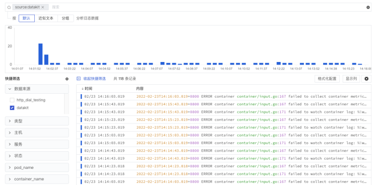
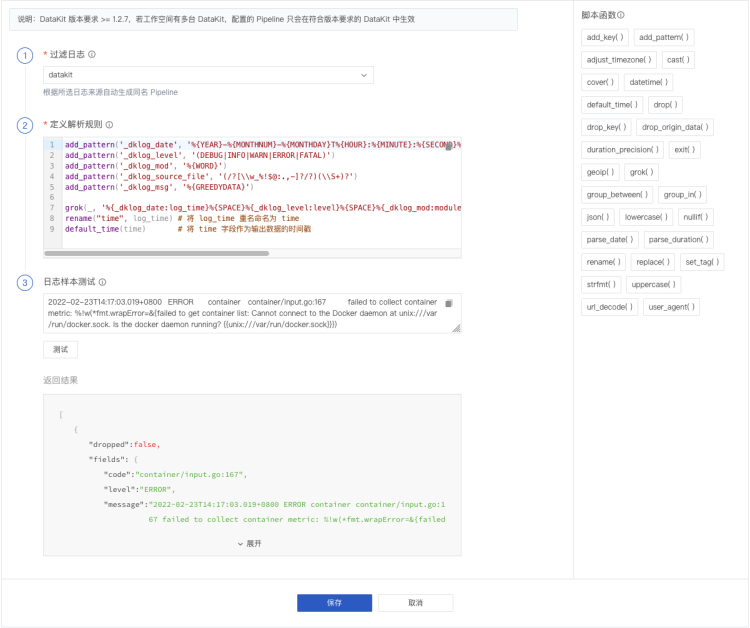
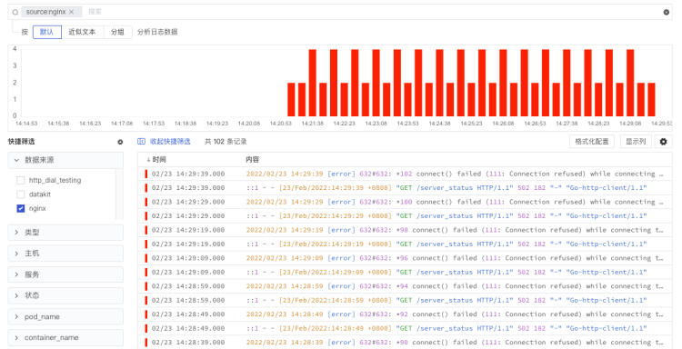
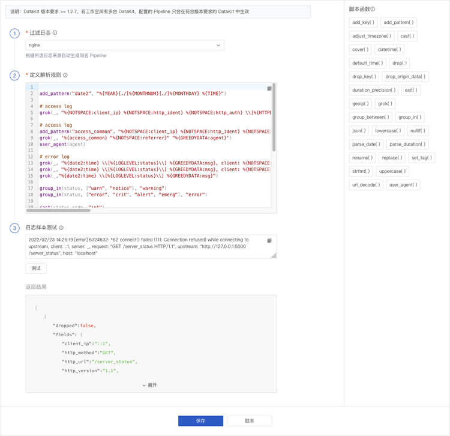

# 日志Pipeline使用手册
---

Pipeline 支持对不同格式的日志数据进行文本解析，通过编写 Pipeline 脚本，可以自定义切割出符合要求的结构化日志，并把切割出来的字段作为属性使用。通过属性字段，我们可以快速筛选相关日志、进行数据关联分析，帮助我们快速去定位问题并解决问题。

观测云提供 Pipeline 官方脚本库，内置多种日志解析 Pipeline 。同时支持用户创建自定义 Pipeline 脚本。接下来为您介绍如何使用自定义 Pipeline 功能。

## 前置条件

1. 您需要先创建一个[观测云账号](https://www.guance.com/)，并在您的主机上[安装 DataKit](../datakit/datakit-install.md) ；
1. 开启日志采集器，并在配置文件中打开 Pipeline 功能；

## 自定义 Pipeline 脚本文件

### 步骤一：开启日志采集器（以 DataKit 日志为例）

主机安装 Datakit 以后，在`/usr/local/datakit/conf.d/log`目录下，复制 `logging.conf.sample` 并命名为 `logging.conf`，编辑 `logging.conf`，配置存放 DataKit 日志的路径和日志来源。如：

- `logfiles = ["/var/log/datakit/log"]`
- `source = "datakit"`

注意：在日志采集器中，Pipeline 功能默认开启，其中 `Pipeline = ""`中可以不填写具体的 Pipeline 脚本名称，我们会自动匹配跟 source 同名的脚本文件。若日志来源和 Pipeline 文件名称不一致，则需要在日志采集器配置`Pipeline = "xxxxxx.p"`。

```
[[inputs.logging]]
  ## required
  logfiles = [
    "/var/log/datakit/log",
  ]
  # only two protocols are supported:TCP and UDP
  # sockets = [
  #      "tcp://0.0.0.0:9530",
  #      "udp://0.0.0.0:9531",
  # ]
  ## glob filteer
  ignore = [""]

  ## your logging source, if it's empty, use 'default'
  source = "datakit"

  ## add service tag, if it's empty, use $source.
  service = ""

  ## grok pipeline script name
  ## 如果 pipeline 未指定具体，则会自动寻找跟 source 同名的脚本
  pipeline = ""
```

配置完成后，使用命令行`datakit --restart`重启 DataKit 使配置生效。

### 步骤二：根据采集的日志，确定切割字段

开启日志采集器后，即可在观测云工作空间查看采集到的 DataKit 日志。观察和分析 DataKit 日志，确定日志切割的字段，如日志产生的时间、日志等级、日志模块、模块内容以及日志的内容等。



### 步骤三：创建自定义 Pipeline

在观测云工作空间「日志」-「Pipelines」，点击「新建Pipeline」创建一个新的 Pipeline 文件。
#### 过滤日志
日志来源选择 “datakit”，根据你所选日志来源自动生成同名 Pipeline。

#### 定义解析规则
定义日志的解析规则，支持多种脚本函数，可通过观测云提供的脚本函数列表直接查看其语法格式。

本示例中基于对日志的观察结果，就可以编写 Pipeline 脚本文件。我们可以通过 `add_pattern()`脚本函数先自定义 pattern， 并在 Grok 中引用自定义的 pattern，对日志进行切割。示例如下，其中`rename`和`default_time`是优化切割出来的字段。

```
add_pattern('_dklog_date', '%{YEAR}-%{MONTHNUM}-%{MONTHDAY}T%{HOUR}:%{MINUTE}:%{SECOND}%{INT}')
add_pattern('_dklog_level', '(DEBUG|INFO|WARN|ERROR|FATAL)')
add_pattern('_dklog_mod', '%{WORD}')
add_pattern('_dklog_source_file', '(/?[\\w_%!$@:.,-]?/?)(\\S+)?')
add_pattern('_dklog_msg', '%{GREEDYDATA}')

grok(_, '%{_dklog_date:log_time}%{SPACE}%{_dklog_level:level}%{SPACE}%{_dklog_mod:module}%{SPACE}%{_dklog_source_file:code}%{SPACE}%{_dklog_msg:msg}')
rename("time", log_time) # 将 log_time 重名命名为 time
default_time(time)       # 将 time 字段作为输出数据的时间戳
```

更多 pipeline 解析规则可参考文档 [文本数据处理（Pipeline）](../../datakit/pipeline.md) 。

#### 日志样本测试
脚本规则编写完成后，可以输入日志样本数据进行测试，来验证你配置的解析规则是否正确。
注意：

- 日志样本测试为非必填项
- 自定义 Pipeline 保存后， 日志样本测试数据同步保存。



### 步骤四：保存Pipeline文件

所有必填项配置完成后，保存 Pipeline 文件。即可在日志 Pipelines 列表查看到自定义的 Pipeline 文件。


在观测云工作空间创建的 Pipeline 文件统一保存在`/usr/local/datakit/Pipeline_remote`目录下。


注意：DataKit 有两个 Pipeline 目录，DataKit 会自动匹配该目录下的 Pipeline 文件。

- `Pipeline`：官方库的 Pipeline 文件目录
- `Pipeline_remote`：观测云工作空间自定义 Pipeline 文件目录
- 若两个目录下存在同名 Pipeline 文件，DataKit 会优先匹配`Pipeline_remote`下的 Pipeline 文件

### 步骤五：在观测云查看切割后的字段

在观测云工作空间的日志下，选择 datakit 的日志，在日志详情页，可以看到“属性”下的字段和字段值，这个就是我们日志切割后显示的字段和字段值。如

- `code: container/input.go:167`
- `level: ERROR`
- `module: container`


## 克隆官方库 Pipeline 脚本文件

### 步骤一：开启 Nginx 采集器

主机安装 Datakit 以后，在`/usr/local/datakit/conf.d/nginx`目录下，复制 `nginx.conf.sample` 并命名为 `nginx.conf`，编辑 `nginx.conf`，开启存放 Nginx 日志的地址和Pipeline。如：

- `files = ["/var/log/nginx/access.log","/var/log/nginx/error.log"]`
- `Pipeline = "nginx.p"`（其中 `""`中可以不填写具体的 Pipeline 脚本名称，DataKit 会自动匹配跟 source 同名的脚本文件）

注意：Pipeline 开启后，DataKit 会自动根据日志来源来匹配 Pipeline 脚本文件。若日志来源和 Pipeline 文件名称不一致，则需要在采集器配置，如日志来源`nginx`，Pipeline 文件名`nginx1.p`，则需要配置`Pipeline = "nginx1.p"`。

```
[[inputs.nginx]]
        url = "http://localhost/server_status"
        # ##(optional) collection interval, default is 30s
        # interval = "30s"
        use_vts = false
        ## Optional TLS Config
        # tls_ca = "/xxx/ca.pem"
        # tls_cert = "/xxx/cert.cer"
        # tls_key = "/xxx/key.key"
        ## Use TLS but skip chain & host verification
        insecure_skip_verify = false
        # HTTP response timeout (default: 5s)
        response_timeout = "20s"

        [inputs.nginx.log]
                files = ["/var/log/nginx/access.log","/var/log/nginx/error.log"]
        #       # grok pipeline script path
                pipeline = "nginx.p"
        [inputs.nginx.tags]
        # some_tag = "some_value"
        # more_tag = "some_other_value"
        # ...
```

配置完成后，使用命令行`datakit --restart`重启 DataKit 使配置生效。更多 Nginx 采集器配置可参考文档 [Nginx](../integrations/nginx.md) 。
### 步骤二：根据采集的日志，确定切割字段

开启 Nginx 采集器，配置日志文件路径，开启 Pipeline 以后，即可在观测云工作空间查看采集到的 Nginx 日志，在日志详情中，可查看按照 Pipeline 文件切割的字段属性。观察和分析日志，确定是否需要优化切割的字段。



### 步骤三：克隆并自定义官方库 Pipeline

在观测云工作空间「日志」-「Pipelines」，点击「Pipeline 官方库」，选择查看并克隆「nginx.p」的 Pipeline 文件。

- 在「过滤日志」选择 “nginx”；
- 在「定义解析规则」优化解析规则，更多解析规则可参考文档 [文本数据处理（Pipeline）](../../datakit/pipeline.md)；
- 在「日志样本测试」输入 nginx 日志数据，根据配置的解析规则进行测试。

注意：

- Pipeline 官方库自带多个日志样本测试数据，在“克隆”前可选择符合自身需求的日志样本测试数据。
- 克隆的 Pipeline 修改保存后， 日志样本测试数据同步保存。


```
2022/02/23 14:26:19 [error] 632#632: *62 connect() failed (111: Connection refused) while connecting to upstream, client: ::1, server: _, request: "GET /server_status HTTP/1.1", upstream: "http://127.0.0.1:5000/server_status", host: "localhost"
```



### 步骤四：保存Pipeline文件

所有必填项配置完成后，保存 Pipeline 文件，即可在日志 Pipelines 列表查看自定义的 Pipeline 文件。


在观测云工作空间创建的 Pipeline 文件统一保存在`/usr/local/datakit/Pipeline_remote`目录下。


注意：DataKit 有两个 Pipeline 目录，DataKit 会自动匹配该目录下的 Pipeline 文件。

- `Pipeline`：官方库的 Pipeline 文件目录
- `Pipeline_remote`：观测云工作空间自定义 Pipeline 文件目录
- 若两个目录下存在同名 Pipeline 文件，DataKit 会优先匹配`Pipeline_remote`下的 Pipeline 文件

### 步骤五：在观测云查看切割后的字段

在观测云工作空间的日志下，选择 nginx 的日志，在日志详情页，可以看到“属性”下的字段和字段值，这个就是我们日志切割后显示的字段和字段值。如

- `http_method: GET`
- `http_url: /server_status`
- `http_version: 1.1`


以上观测云工作空间日志 Pipeline 使用手册，更多关于 Pipeline 和 日志采集切割的内容，可参考如下文档。

- [文本数据处理（Pipeline）](../../datakit/pipeline.md)
- [如何编写 Pipeline 脚本](../../datakit/datakit-pl-how-to.md)
- [日志](../integrations/logging.md)
- [第三方日志接入](../integrations/logstreaming.md)
