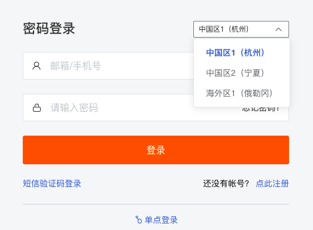
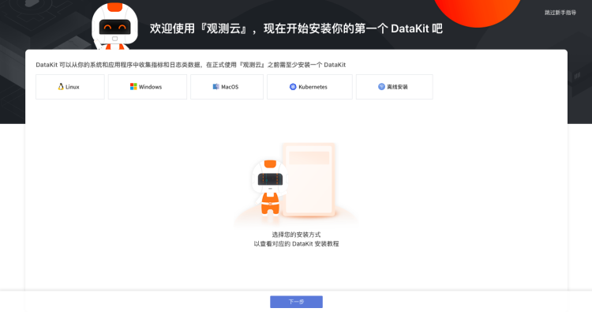

# 账号管理
---

观测云支持注册用户通过多站点的登录进入工作空间并享受相关服务。如需对当前账号进行管理和设置，可通过「账号」-「个人设置」-「基础设置」。

## 注册账号

1. 您可以在 [观测云官网](https://www.guance.com/) ，「[立即注册](https://auth.guance.com/register)」为观测云用户，观测云注册时，提供免费版和商业版注册选项，您可以按照实际需求注册观测云账号。

2. 观测云为您提供了多站点注册账号的功能，即依据使用资源的类别，您可以选择注册适合的[站点](../getting-started/necessary-for-beginners/select-site.md)账号。**不同站点的账号和数据相互独立，一经确认，数据将无法迁移**。

3. 注册成为观测云用户需填写邮箱、姓名、手机号等个人信息，完善企业团队信息，阅读并同意《[服务协议](../agreements/service-agreement.md)》和《[隐私协议](../agreements/app-privacy-policy.md)》。

## 登录账号

现有用户可以通过 [观测云官网](https://www.guance.com/) 或者 [观测云控制台](https://auth.guance.com/loginpsw) 登录。

1. 首先，您需要选择账号对应的站点登录

2. 观测云支持账号密码登录，也支持手机验证码登录，通过“使用验证码登录“ 或 “密码登录”即切换登录方式。

**注意：**

- 单个观测云站点下，仅支持绑定一个手机号码、一个邮箱，暂不支持港澳台和国外手机号码
- 不同站点的账号独立不互通
- 支持选择[单点登录](../management/sso/index.md)到观测云

## 修改账号

账号注册完成后，可在工作空间，点击左侧「账号」-「设置」-「基础设置」进行账号修改。支持修改账号姓名、邮箱、手机和密码。 

## 新手引导

观测云为新用户提供了一系列引导服务。在用户首次登录时，可通过“30分钟构建全面的系统可观测性”小视频快速了解观测云，还能够扫码进入观测云微信和钉钉服务群，及时获取观测云的相关服务信息，与志同道合之人沟通数据观测小技巧。 

通过点击“立刻开始”，您可以快速查看观测云使用引导，完成使用指导即可开启观测云的数据观测之旅了。

---

