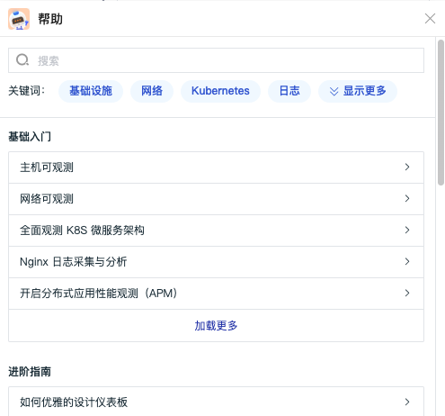
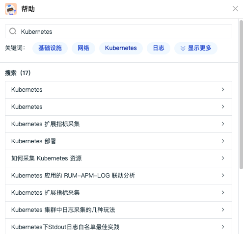
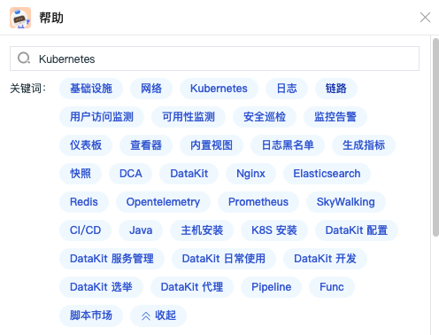

# 帮助
---

观测云帮助支持您快速查看基础入门、进阶指南、最佳实践、DataKit、Func等文档，通过点击提供的关键词或者在搜索栏直接输入关键字进行搜素，帮助您快速获取相关的文档说明。

在观测云工作空间，点击左侧菜单「帮助」，即可打开帮助对话框。  点击“关键字”即可进行搜索。  点击“显示更多”可查看更多关键字。  鼠标悬停在帮助菜单，可选择直接进入观测云帮助中心和更新日志。 

---

观测云是一款面向开发、运维、测试及业务团队的实时数据监测平台，能够统一满足云、云原生、应用及业务上的监测需求，快速实现系统可观测。**立即前往观测云，开启一站式可观测之旅：**[www.guance.com](https://www.guance.com) 
