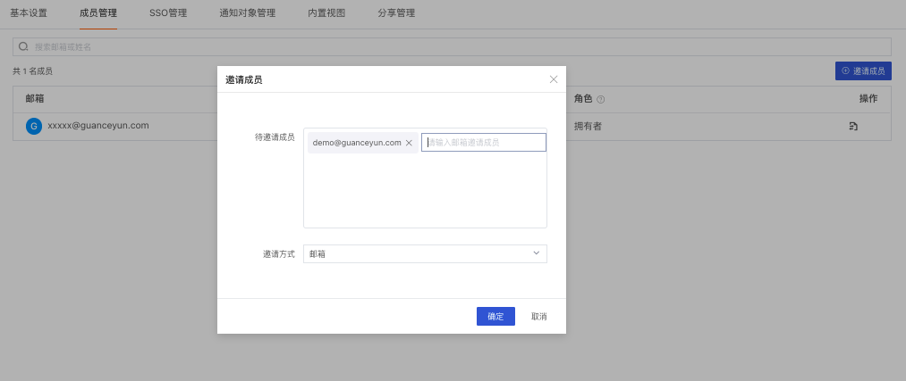
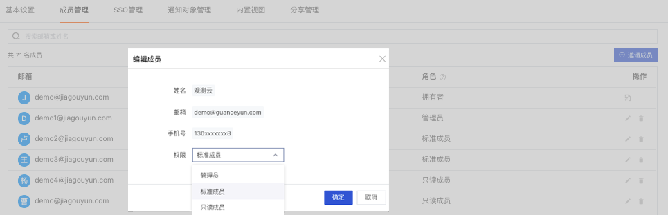
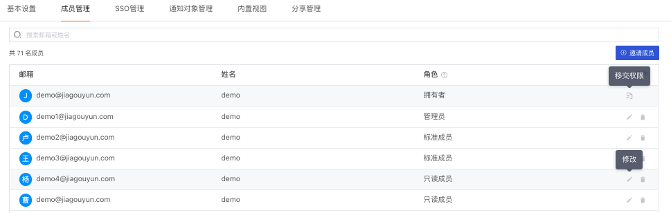

# 成员管理
---

“观测云” 支持当前空间管理员通过「管理」-「成员管理」，对当前空间的全部成员进行统一管理，包括添加/编辑/删除空间成员和修改成员权限等。非“空间管理员”仅支持查看当前工作空间内的成员信息。

## 邀请成员

在当前空间内，空间「拥有者」和「管理员」可以邀请“观测云” 的注册用户成为空间内的新成员。

- 通过「管理」-「成员管理」-「邀请成员」，输入被邀请成员的名称/手机号/邮箱地址后，点击「确定」即可向被邀请成员发送空间邀请通知。待成员完成认证后，即可进入空间。

- 添加新成员时，“观测云”默认成员权限为 可查看全部场景和视图的“只读成员”，您可以通过「权限」对新成员的权限进行设置，详情可参考[权限管理](../management/access-management.md)。

## 成员搜索

通过「成员管理」的检索功能，您可以通过成员邮箱或姓名快速匹配相关成员.

## 修改/删除成员

在当前空间内，"拥有者”和“管理员”可在「管理」-「成员管理」页面中，对已添加的成员进行权限修改及删除。

- 当前工作空间“拥有者”可设定任意成员身份，或转移‘拥有者“身份至其他工作成员
- 当前工作空间“管理者”可定义“只读成员“和”标准成员“身份，无法修改其他管理员身份
- 当前工作空间“只读成员“和”标准成员“支持提升权限至“管理员”，详情可参考 [权限管理](../management/access-management.md) 
- 当前工作空间“SSO成员”支持被修改或者删除，支持提升权限至“管理员”

---
