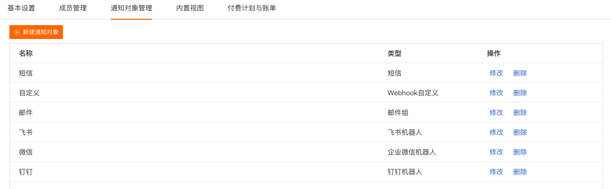
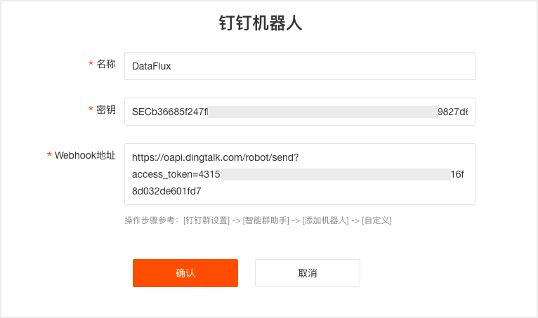
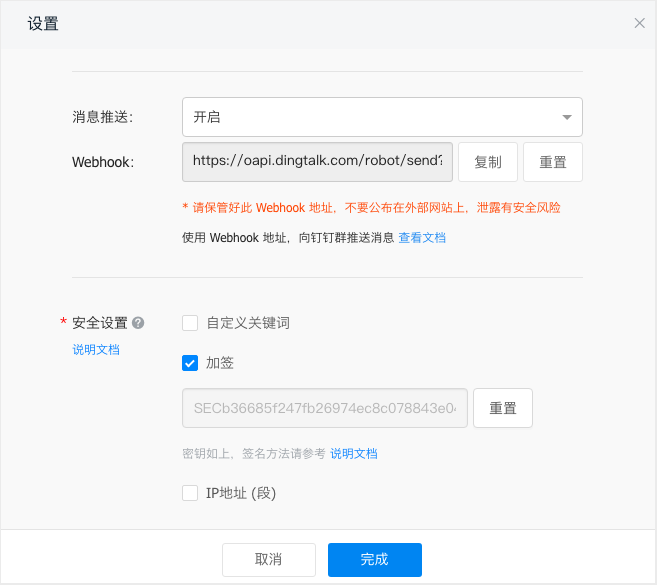
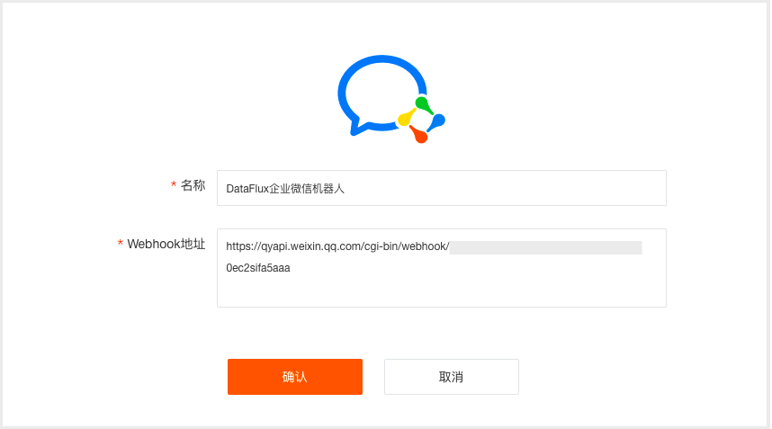
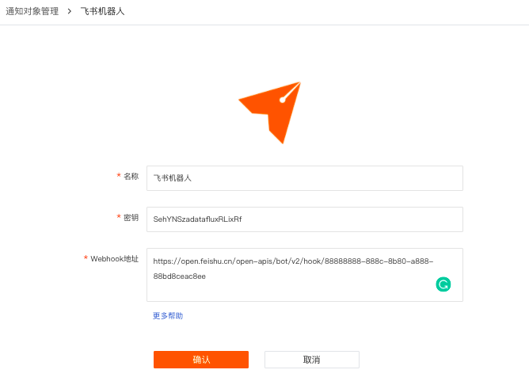
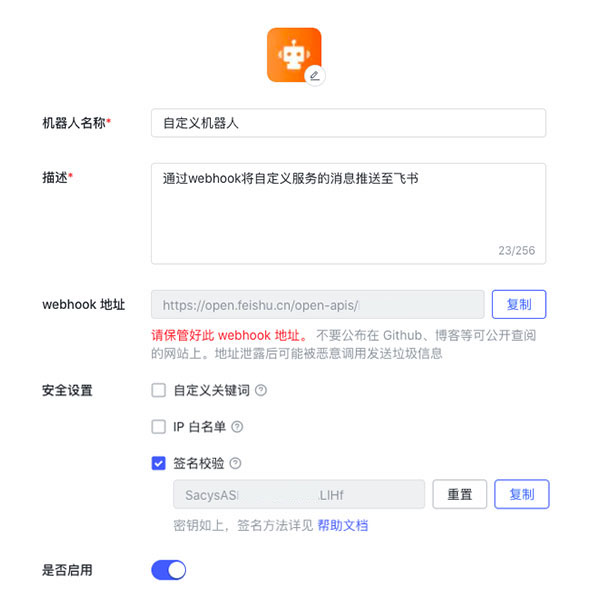
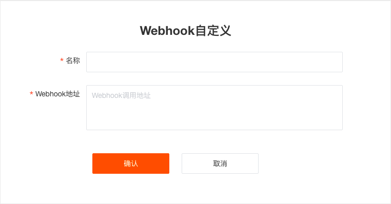
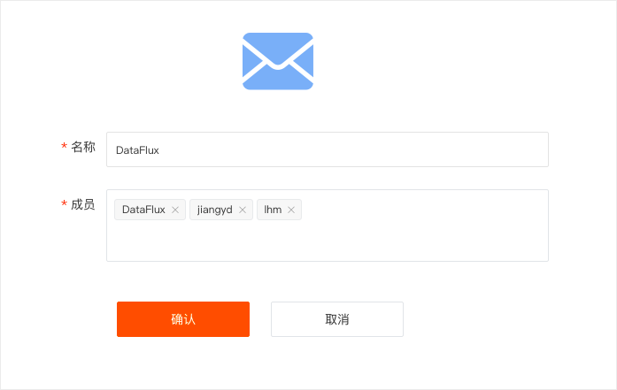
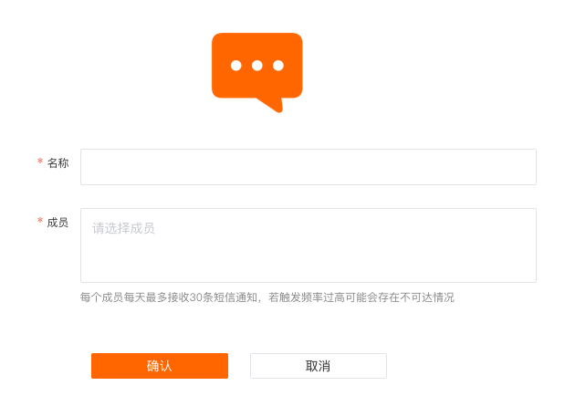

# 通知对象管理
---

“观测云”支持您通过「管理」-「通知对象管理」，设置告警事件的通知对象，包括钉钉机器人、企业微信机器人、飞书机器人、Webhook自定义、邮件组和短信组。如何设置告警通知可参考文档 [告警设置](./15-监控/03-告警设置.md) 。


## 新建通知对象

进入「管理」 - 「通知对象管理」，点击「新建通知对象」，选择「钉钉机器人」/「企业微信机器人」/「飞书机器人」/「Webhook自定义」／「邮件组」/「短信组」后，输入对应配置信息后，点击「确认」即可完成新建通知对象。<br />

### 1. 新建钉钉机器人

进入「管理」 - 「通知对象管理」，点击「新建通知对象」，选择「钉钉机器人」，输入配置信息，包括自定义的通知对象名称、密钥和Webhook地址。

**注意：钉钉机器人告警通知是每分钟合并了发送，并不是产生后立刻发送，会存在约一分钟的延迟。**<br />

钉钉机器人的配置信息支持您通过在**钉钉群组**添加机器人之后，在机器人配置详情中查询该机器人**「加签」密钥和「Webhook」地址。**




### 2. 新建企业微信机器人

进入「管理」 - 「通知对象管理」，点击「新建通知对象」，选择「企业微信机器人」，输入配置信息，包括自定义的通知对象名称、Webhook地址。

**注意：企业微信机器人告警通知是每分钟合并了发送，并不是产生后立刻发送，会存在约一分钟的延迟。**<br /><br />企业微信机器人的配置信息支持您通过在**企业微信群组**添加机器人之后，在机器人配置详情中查询该机器人特有的 **Webhook 地址**。


### 3. 新建飞书机器人

进入「管理」 - 「通知对象管理」，点击「新建通知对象」，选择「飞书机器人」，输入配置信息，包括自定义的通知对象名称、密钥和Webhook地址。

**注意：飞书机器人告警通知是每分钟合并了发送，并不是产生后立刻发送，会存在约一分钟的延迟。**<br />

飞书机器人的配置信息支持您通过在**飞书群组**添加机器人之后，在机器人配置详情中查询该机器人**「签名校验」和「Webhook地址」。**<br />


### 4. 新建Webhook自定义

进入「管理」 - 「通知对象管理」，点击「新建通知对象」，选择「Webhook自定义」，输入所需信息。<br /><br />Webhook自定义通知类型为 `HTTPRequest` ，会向指定的地址发送纯文本POST请求。 

假设用户配置的地址为 `[http://my-system/accept-webhook](http://my-system/accept-webhook)` ，产生的告警标题和内容分别为: 

标题：

```
您的ECS存在问题
```

内容：

```
您的ECS 存在以下问题: 
- CPU使用率过高(92%) 
- 内存使用率过高(81%)
```

发送的请求会根据所配置的请求类型不同而不同 ：

1）当`bodyType`不指定或为`text`时，请求详情如下：

```http
POST http://my-system/accept-webhook
Content-Type: text/plain

您的ECS存在问题

您的ECS 存在以下问题：
- CPU使用率过高（92%）
- 内存使用率过高（81%）
```

其中，第1行为事件标题`df_title`，第2行为空行，之后所有内容为事件内容`df_message`。

2）当`bodyType`为`json`时，请求详情如下：

```http
POST http://my-system/accept-webhook
Content-Type: application/json

{
    "timestamp"               : 1625638440,
    "df_status"               : "warning",
    "df_event_id"             : "event-xxxxxxxxxx",
    "df_title"                : "web001存在问题",
    "df_message"              : "web001存在问题\nCPU使用率大于90\n内存使用率大于90",
    "df_dimension_tags"       : "{\"host\":\"web001\"}",
    "df_monitor_id"           : "monitor_xxxxxxxxxx",
    "df_monitor_name"         : "异常检测名",
    "df_monitor_checker_id"   : "rul_xxxxxxxxxx",
    "df_monitor_checker_name" : "异常检测项目名",
    "df_monitor_checker_value": "99",
    "df_event_link"           : "https://console.guance.com/keyevents/monitorChart?xxxxxxxxxx"
    "df_workspace_uuid"       : "wksp_xxxxxxxxxx",
    "df_workspace_name"       : "我的工作空间",
    "Result"                  : 99,
    "...其他更多字段": "略",

    // 以下为旧版字段
    "date"          : 1625638440,
    "workspace_uuid": "wksp_xxxxxxxxxx",
    "workspace_name": "我的工作空间",
}
```

注意：Webhook自定义通知发送内容的类型仅支持使用 json 格式，各字段的详情见文档 [事件产生](.06-/事件/01-事件产生.md) 。

有关Webhook自定义更详细的实践文档，请参考《[观测云Webhook自定义告警通知集成](外链到./02-实践/06-观测云Webhook自定义告警通知集成.md)》

### 5. 新建邮件组

进入「管理」 - 「通知对象管理」，点击「新建通知对象」，选择「邮件组」，输入所需信息。邮件组可同时添加多个成员。

**注意：**

- **成员需要先在「管理」 - 「成员管理」中邀请加入到工作空间后才可选择。**
- **邮件组告警通知是每分钟合并了发送，并不是产生后立刻发送，会存在约一分钟的延迟。**



### 6. 新建短信组

进入「管理」 - 「通知对象管理」，点击「新建通知对象」，选择「短信」，输入所需信息。短信组可同时添加多个成员。

**注意：**

- **成员需要先在「管理」 - 「成员管理」中邀请加入到工作空间后才可选择。**
- **短信组告警通知是每分钟合并了发送，并不是产生后立刻发送，会存在约一分钟的延迟。**



## 修改/删除通知对象

成功添加通知对象后，可在「管理」 - 「通知对象管理」页面中进行查看。同时可针对每一个列表里的通知对象做修改或删除操作。


---

观测云是一款面向开发、运维、测试及业务团队的实时数据监测平台，能够统一满足云、云原生、应用及业务上的监测需求，快速实现系统可观测。**立即前往观测云，开启一站式可观测之旅：**[www.guance.com](https://www.guance.com)<br />
