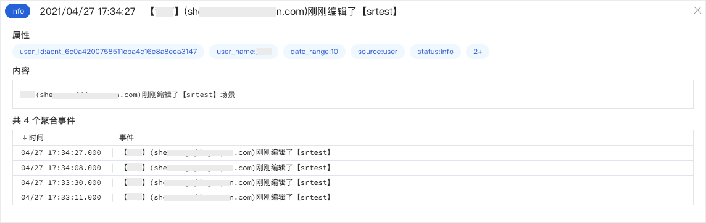

# 操作审计
---

## 简介

观测云支持查看工作空间用户行为产生的操作审计事件，实时记录工作空间内的项目使用情况、用户行为操作和资源变更，主要包括：

- 工作空间管理的事件：如基本设置的修改，成员权限的修改，删除通知对象，Lisence过期等
- 功能和服务使用的事件：如新建/修改/删除视图，新建应用检测，禁用某个检测库，设置主机沉默，生成指标等
- 计费项目事件：如项目的使用量已接近免费额度等

## 事件列表

在「管理」-「基本设置」-「操作审计」可查看所有工作空间产生的用户操作行为事件。支持搜索、分组聚合、查看详情等操作。通过页面上方的时间组件，你可以查看不同时间范围内的操作事件。

## 事件详情页

在操作事件列表中点击事件，你就可以侧滑出事件的详情页面，可查看事件的触发时间、标签属性、操作人、事件内容等。

## 事件分组聚合

通过分组功能，“观测云”支持快速依据分组标签聚合和统计相关事件。通过“操作人”分组聚合，即可查看时间范围内用户在“观测云”平台上的触发的所有聚合事件数量。

## 事件聚合详情页

点击「聚合事件」，你可以在详情页查看某一用户触发的所有事件列表。

## 事件数据存储策略

操作审计的数据按照事件的存储策略进行保存，您可以在「管理」-「基本设置」-「变更数据存储策略」查看和调整事件存储策略。

