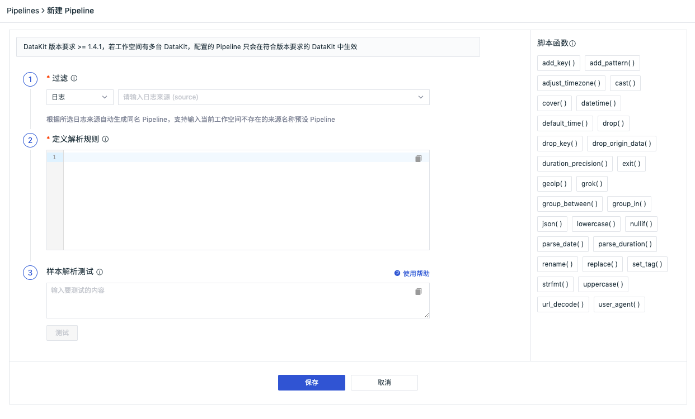
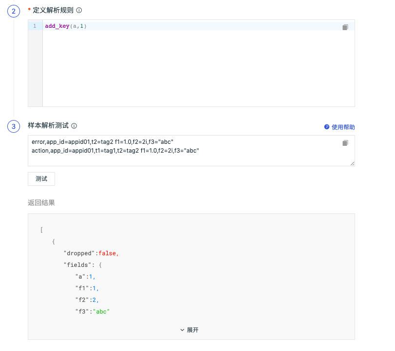
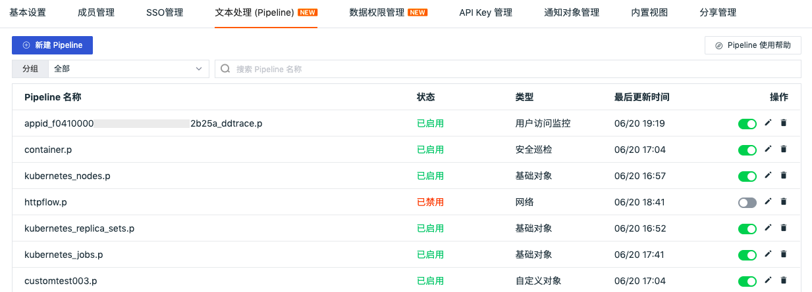

# 文本处理（Pipeline）

---

文本处理（Pipeline）用于数据解析，通过定义解析规则，将各种数据类型切割成符合我们要求的结构化数据。

## 前提条件

- [安装 DataKit](../datakit/datakit-install.md)
- DataKit 版本要求 >= 1.4.0

## 新建 Pipeline

1.在观测云工作空间「管理」-「文本处理（Pipeline）」，点击「新建Pipeline」即可创建一个新的 pipeline 文件。


注意：pipeline 文件创建以后，需要安装 DataKit 才会生效，DataKit 会定时从工作空间获取配置的 pipeline 文件，默认时间为 1分钟，可在 `conf.d/datakit.conf` 中修改。

```
[pipeline]
  remote_pull_interval = "1m"
```

2.在新建 Pipeline 页面，选择 “过滤” 数据类型，填入“定义解析规则”，然后在“样本解析测试”输入对应的数据进行测试，测试通过后点击“保存”即可创建 pipeline 文件。

- 过滤：数据类型包括日志、指标、用户访问监测、应用性能监测、基础对象、自定义对象、网络、安全巡检，根据所选数据类型对应的字段值自动生成同名 Pipeline；

注意：在观测云工作空间创建的 Pipeline 统一保存在 `<datakit 安装目录>/pipeline_remote 目录下` ，日志 Pipeline 文件保存在一级目录，其他数据类型保存在对应的二级目录下，如指标 `cpu.p` 保存在 `<datakit 安装目录>/pipeline_remote/metric/cpu.p 目录下` 。

| **数据类型** | **字段**               | **pipeline 文件名示例**          |
| ------------ | ---------------------- | -------------------------------- |
| 日志         | 日志来源（source）     | nginx.p                          |
| 指标         | 指标集                 | cpu.p                            |
| 用户访问监测 | 应用 appid+measurement | appid_f0410xxxxxx2b25a_ddtrace.p |
| 应用性能监测 | 服务（service）        | mysql.p                          |
| 基础对象     | 类别（class）          | HOST.p                           |
| 自定义对象   | 类别（class）          | HOST.p                           |
| 网络         | 指标集                 | httpflow.p                       |
| 安全巡检     | 类别（category）       | system.p                         |

- 定义解析规则：定义解析规则，支持多种脚本函数，可通过观测云提供的脚本函数列表直接查看其语法格式，如`add_pattern()`等；
- 样本解析测试：输入数据，根据配置的解析规则进行测试；

注意：日志数据支持自定义 pipeline 文件名，自定义 pipeline 文件不能同名，但可以和官方 pipeline 同名，此时 DataKit 会优先自动获取自定义 pipeline 文件配置。若在日志采集器`.conf`中手动配置 pipeline 文件，此时 DataKit 会优先获取手动配置的 pipeline 文件。更多日志 Pipeline 配置可参考文档 [日志 Pipeline 使用手册](../logs/pipelines/manual.md) ；



### 调试 Pipeline {#test}

在新建 Pipeline 页面，选择“过滤”数据类型，填入“定义解析规则”，然后在“样本解析测试”输入数据进行测试，若解析规则不符合，则返回错误提示的结果。样本解析测试为非必填项，样本解析测试后，测试的数据同步保存。

注意：

- 日志数据可在样本解析测试输入 message 内容进行测试，更多详情可参考文档 [日志 Pipeline 使用手册](../logs/pipelines/manual.md) ；
- 其他数据类型定义解析规则后，需要在样本解析测试输入“[行协议](../datakit/apis.md)”内容进行测试，见下图。关于如何编写和调试解析规则，可参考文档 [如何编写 Pipeline 脚本](../datakit/datakit-pl-how-to.md) 。



## 编辑/删除/启用/禁用 Pipeline

在观测云工作空间「管理」-「文本处理（Pipeline）」，点击右侧操作下的按钮即可对 pipeline 文件编辑/删除/启用/禁用。
注意：

- 编辑 pipeline 文件后，默认生效时间为 1 分钟；
- 删除 pipeline 文件后，无法恢复，需要重新创建；若存在同名的官方库 pipeline 文件，DataKit 会自动匹配官方库 pipeline 文件进行文本处理；
- 禁用 pipeline 文件后，可通过启用重新恢复；若存在同名的官方库 pipeline 文件，DataKit 会自动匹配官方库 pipeline 文件进行文本处理；




## 注意事项

Pipeline 可以对 DataKit 采集的数据执行如下操作：

- 新增、删除、修改 field 和 tag 的值或数据类型

- 将 field 变更为 tag

- 修改指标集名字

- 丢弃当前数据（`drop()`）

- 终止 Pipeline 脚本的运行（`exit()`）

在用 Pipeline 对不同数据类型进行处理时，会对原有的数据结构产生影响，建议通过 [调试](#test) 确认数据处理结果符合预期后再进行使用。
