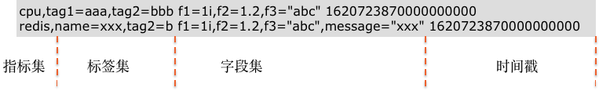

# 文本处理（Pipeline）

---

文本处理（Pipeline）用于数据解析，通过定义解析规则，将各种数据类型切割成符合我们要求的结构化数据。

## 前提条件

- [安装 DataKit](../datakit/datakit-install.md)
- DataKit 版本要求 >= 1.4.0

## 新建 Pipeline

在观测云工作空间「管理」-「文本处理（Pipeline）」，点击「新建Pipeline」即可创建一个新的 pipeline 文件。或者您可以在指标、日志、用户访问、应用性能、基础设施、安全巡检功能目录快捷入口，点击「Pipelines」进行创建。


注意：pipeline 文件创建以后，需要安装 DataKit 才会生效，DataKit 会定时从工作空间获取配置的 pipeline 文件，默认时间为 1分钟，可在 `conf.d/datakit.conf` 中修改。

```
[pipeline]
  remote_pull_interval = "1m"
```

### 配置说明

在新建 Pipeline 页面，选择 “过滤” 数据类型，填入“定义解析规则”，然后在“样本解析测试”输入对应的数据进行测试，测试通过后点击“保存”即可创建 pipeline 文件。

- 过滤：数据类型包括日志、指标、用户访问监测、应用性能监测、基础对象、自定义对象、网络、安全巡检，根据所选数据类型对应的字段值自动生成同名 Pipeline；

注意：在观测云工作空间创建的 Pipeline 统一保存在 `<datakit 安装目录>/pipeline_remote 目录下` ，日志 Pipeline 文件保存在一级目录，其他数据类型保存在对应的二级目录下，如指标 `cpu.p` 保存在 `<datakit 安装目录>/pipeline_remote/metric/cpu.p 目录下` ，详情可参考文档 [Pipeline 各类别数据处理](../developers/datakit-pl-global/) 。

| **数据类型** | **字段**                   | **pipeline 文件名示例**          |
| ------------ | -------------------------- | -------------------------------- |
| 日志         | 日志来源（source）         | nginx.p                          |
| 指标         | 指标集                     | cpu.p                            |
| 用户访问监测 | 应用 （appid+measurement） | appid_f0410xxxxxx2b25a_ddtrace.p |
| 应用性能监测 | 服务（service）            | mysql.p                          |
| 基础对象     | 类别（class）              | HOST.p                           |
| 自定义对象   | 类别（class）              | HOST.p                           |
| 网络         | 指标集                     | httpflow.p                       |
| 安全巡检     | 类别（category）           | system.p                         |

- 定义解析规则：定义解析规则，支持多种脚本函数，可通过观测云提供的脚本函数列表直接查看其语法格式，如 `add_pattern()` 等；
- 样本解析测试：输入数据，根据配置的解析规则进行测试；支持一键获取样本数据，支持添加多条样本数据（最多 3 条），点击“开始测试”后，返回多条测试结果；若您在同一个测试文本框中输入多条样本数据进行测试，只返回一条测试结果。

**注意**：配置 Pipeline 以后，若采集器没有特别说明，DataKit 会根据规则自动匹配同名 Pipeline 对相关数据进行处理；若采集器支持用户手动配置 Pipeline ，此时 DataKit 会优先获取手动配置的 Pipeline 文件，如日志相关的采集器，更多详情可参考文档 [日志 Pipeline 使用手册](../logs/pipelines/manual.md) 。


### 调试 Pipeline {#test}

在新建 Pipeline 页面，选择“过滤”数据类型，填入“定义解析规则”，然后在“样本解析测试”输入数据进行测试，若解析规则不符合，则返回错误提示的结果。样本解析测试为非必填项，样本解析测试后，测试的数据同步保存。

注意：

- 日志数据可在样本解析测试输入 message 内容进行测试，更多详情可参考文档 [日志 Pipeline 使用手册](../logs/pipelines/manual.md) ；

- 其他数据类型定义解析规则后，需要在样本解析测试输入转换成“[行协议](../datakit/apis.md)”的内容进行测试，支持「一键获取」样本解析测试样列；

  - 关于如何编写和调试解析规则，可参考文档 [如何编写 Pipeline 脚本](../developers/datakit-pl-how-to.md) 
  - 更多行协议数据的获取方式，可在`conf.d/datakit.conf` 中配置 `output_file` 的输出文件，并在该文件中查看行协议

  ```
  [io]
    output_file = "/path/to/file"
  ```

  

**行协议示例：**



**调试示例：**


## 编辑/删除/启用/禁用 Pipeline

在观测云工作空间「管理」-「文本处理（Pipeline）」，点击右侧操作下的按钮即可对 pipeline 文件编辑/删除/启用/禁用。
注意：

- 编辑 pipeline 文件后，默认生效时间为 1 分钟；
- 删除 pipeline 文件后，无法恢复，需要重新创建；若存在同名的官方库 pipeline 文件，DataKit 会自动匹配官方库 pipeline 文件进行文本处理；
- 禁用 pipeline 文件后，可通过启用重新恢复；若存在同名的官方库 pipeline 文件，DataKit 会自动匹配官方库 pipeline 文件进行文本处理；


支持「批量操作」和「导入」功能。点击「批量导出」或「批量删除」，表格左侧出现复选框，出现【确认导出/删除】和【取消】按钮


**注意**：该功能仅对工作空间拥有者、管理员、普通成员显示，只读成员不显示。


## 注意事项

Pipeline 可以对 DataKit 采集的数据执行如下操作：

- 新增、删除、修改 field 和 tag 的值或数据类型

- 将 field 变更为 tag

- 修改指标集名字

- 丢弃当前数据（`drop()`）

- 终止 Pipeline 脚本的运行（`exit()`）

  在用 Pipeline 对不同数据类型进行处理时，会对原有的数据结构产生影响，建议通过 [调试](../developers/datakit-pl-global/#examples) 确认数据处理结果符合预期后再进行使用。
