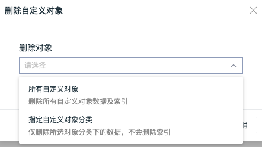

# 空间管理
---

## 创建工作空间

注册完“观测云”账号以后，系统会默认为您创建一个工作空间，并赋予“拥有者”权限。如需要创建其他工作空间，您可以在 “观测云” 工作台点击 「当前空间」-「创建工作空间」。

输入工作空间名称和描述，选择企业团队，即可创建一个新的工作空间。

## 切换工作空间

登录“观测云”工作空间后，您可以通过点击 「当前空间」切换至其他工作空间。

## 查看工作空间基本设置

进入「管理」-「基本设置」，在基本设置中可查看当前“观测云”版本、安全操作审计等信息，拥有者和管理员还可修改空间名称、备注、配置迁移、更换数据存储策略、删除指标集、删除自定义对象等操作。

### 更换Token

“观测云” 支持当前空间拥有者和管理员复制/变更空间内的Token，并自定义当前Token的失效时间。进入「管理」-「基本设置」-「更换Token」，选择失效时间并确认「更换」后，“观测云”会自动生成新的Token，旧的Token会在指定时间内失效。

注意：

- 更换Token会触发「操作事件」和「通知」，详情可参考「[操作审计](../management/operation-audit.md)」「[通知](../management/system-notification.md)」
- 更换Token后，原有Token会在指定时间内失效。失效时间包括：立即失效、10分钟、6小时、12小时、24小时。立即失效一般用于 Token 泄露，选择立即失效后，原有 Token 将立刻停止数据上报，若设置了异常检测，则无法触发事件及告警通知，直至在 DataKit 采集器的`datakit.conf`中把原有 Token 修改成新生成的 Token 。关于`datakit.conf` 文件的存储目录，可参考文档 [DataKit 使用入门](../datakit/datakit-conf.md) 。

### 一键导入导出 {#export-import}

“观测云” 支持拥有者和管理员一键导入、导出当前工作空间内的仪表板、自定义查看器、监控器的配置文件，进入「管理」-「基本设置」，在「配置迁移」选择导出或导入操作。

- 点击导出后，生成一个用于校验的 readme 文件，最终打包成 zip 格式文件。

- 点击导入后，您可以选择当前需要导入的 zip 文件。

**注意**：当前工作空间支持导入其他工作空间的仪表板、自定义查看器、监控器等 JSON 配置。

### 变更数据存储策略

“观测云” 支持拥有者和管理员变更空间内的数据存储策略，进入「管理」-「基本设置」，点击「变更」后，选择所需的数据存储时长，点击「确定」即可变更当前工作空间内的数据存储时长。更多说明可参考文档 [数据存储策略](../billing/billing-method/data-storage.md) 。

### 删除指标集

“观测云” 支持拥有者和管理员删除空间内的指标集，进入「管理」-「基本设置」，点击「删除指标集」后，输入查询并选择指标集名称（支持模糊匹配），点击「确定」后进入删除队列等待删除。

**注意：**

1. 只允许空间拥有者和管理员进行此操作；

1. 指标集一经删除，无法恢复，请谨慎操作

1. 删除指标集时，会产生系统通知事件，如用户创建了删除指标集任务、删除指标集任务执行成功、删除指标集任务执行失败等。

  

## 删除自定义对象

观测云支持拥有者和管理员删除指定自定义对象分类以及所有自定义对象，进入「管理」-「基本设置」，点击「删除自定义对象」后，选择删除自定义对象的方式，即可删除对应的对象数据。

● 指定自定义对象分类：仅删除所选对象分类下的数据，不会删除索引
● 所有自定义对象：删除所有自定义对象数据及索引

## 退出当前工作空间

用户可主动退出工作空间，点击左侧「账号」-「设置」-「空间管理」，选择想要退出的空间，点击右上角的「下拉选项」-「退出」即可。

## 修改当前工作空间

“观测云” 付费版支持修改工作空间，点击左侧「账号」-「设置」-「空间管理」，选择想要修改的空间，点击右上角的「下拉选项」-「修改」即可。

**注意：**

1. 只允许空间拥有者和管理员进行此操作；
1. 仅通过个人注册或在 “观测云” 创建的工作空间可进行修改，通过管理后台创建的工作空间无修改按钮。
1. 支持修改企业/团队名称、所属行业和所属地区。

## 解散当前工作空间

“观测云” 免费版支持解散工作空间，点击左侧「账号」-「设置」-「空间管理」，选择想要解散的空间，点击右上角的「下拉选项」-「解散」即可。

**注意：**

1. 只允许空间拥有者和管理员进行此操作；
2. 解散工作空间前需先清空空间成员、异常检测规则
3. 空间一经解散，数据将无法恢复，请谨慎操作

