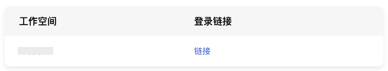

# Authing单点登录示例
---

## 操作场景
Authing 是身份识别与访问管理解决方案提供商。观测云支持基于 SAML 2.0（安全断言标记语言 2.0）的联合身份验证，SAML 2.0 是许多身份验证提供商（Identity Provider， IdP）使用的一种开放标准。您可以通过基于 SAML 2.0 联合身份验证将 Authing 与观测云进行集成，从而实现 Authing 帐户自动登录（单一登录）观测云平台访问对应工作空间资源，不必为企业/团队单独创建观测云账号。

## 操作步骤

### 1、Authing 账号注册 / 创建。
 您可以通过以下本步骤创建 Authing 账号，如您已经有正在使用中的账号，直接进行下一步配置。注意：当前观测云仅支持A邮箱账号 SSO登录。

#### （1）注册（邮箱注册），如下图所示：


#### （2）已有账号，重新在 Authing 【用户管理】-【用户列表页面】创建用户。如下图所示：
 用户名、邮箱两种创建皆可。注意：用户名创建用户时，用户名必须为邮箱。如果使用【用户名】账号实现单点登录，后续在SAML 协议配置处需要新增用户名<>邮箱的 mapping 映射关系。<br /><br />


### 2、 登录 [Authing](https://www.authing.cn) ，如下图所示：


### 3、进入【Authing 应用页面】，点击【添加应用】，配置应用信息。如下图所示：

 您可以通过以下本步骤创建 Authing 应用程序，如您已经有正在使用中的应用程序可忽略此步骤，直接进行下一步配置。注意：此处应用名称、认证地址需要自定义配置。<br />

### 4、进入应用配置页面，下拉到底部找到更多身份协议。配置 SAML2 身份提供商信息。如下图所示：

（1）填写默认 ACS 地址（断言地址），点击保存。（此次配置仅为获取下一步的元数据使用，后面在观测云中获取到正确的断言地址后可以重新替换。断言地址示例：[https://auth.guance.com/saml/assertion](https://auth.guance.com/saml/assertion/)；）<br />（2）下载 SAML2元数据文档，该文档后续会在观测云 SSO身份提供商创建处上传使用；<br />

### 5、调整【认证配置】默认协议类型为 SAML2 。如下图所示：


### 6、调整【访问授权】，设置默认权限：允许所有用户访问。如下图所示：


### 7、登录 [观测云](https://console.guance.com)，进入【管理】->【SSO管理】->【启用】。如下图所示：

在观测云工作空间内启用SSO单点登录，可参考文档 [新建SSO](./17-工作空间管理/06-SSO管理.md) 。<br />注意：

- 基于账号安全考虑，观测云支持工作空间仅配置一个 SSO，若您之前已经配置过 SAML 2.0，我们默认会将您最后一次更新的 SAML2.0 配置视为最终单点登录验证入口。
- 启用 SSO 登录时，需要添加“邮箱域名”，用于观测云和身份提供商进行邮箱域名映射（用户邮箱域名需和观测云中添加的邮箱域名保持一致），实现单点登录。


### 8、配置好观测云SSO单点登录后获取断言地址，更新 Auhting SAML2 【默认 ACS地址 配置】，新增字段 mapping 设置 。如下图所示：

<br />**mapping 映射**

```json
// Authing 邮箱映射邮箱配置，此行不用复制
{
    "mappings": {
        "email": "Email"
    }
}

// Authing 用户名映射邮箱配置，此行不用复制

{
    "mappings": {
        "username": "Email"
    }
}
```


### 9、通过[【单点登录】](https://auth.guance.com/login/sso)访问观测云，输入邮箱地址获取登录链接。如下图所示：

<br />

### 10、点击【链接】登录观测云。重复步骤2，输入用户名、密码。登录后，如下图所示：

注意：若多个工作空间同时配置了相同的身份提供商 SSO 点单登录，用户通过 SSO 单点登录到工作空间后，可以点击观测云左上角的工作空间选项，切换不同的工作空间查看数据。<br />


---

观测云是一款面向开发、运维、测试及业务团队的实时数据监测平台，能够统一满足云、云原生、应用及业务上的监测需求，快速实现系统可观测。**立即前往观测云，开启一站式可观测之旅：**[www.guance.com](https://www.guance.com)<br />
