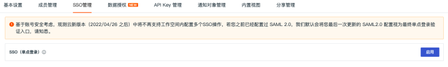
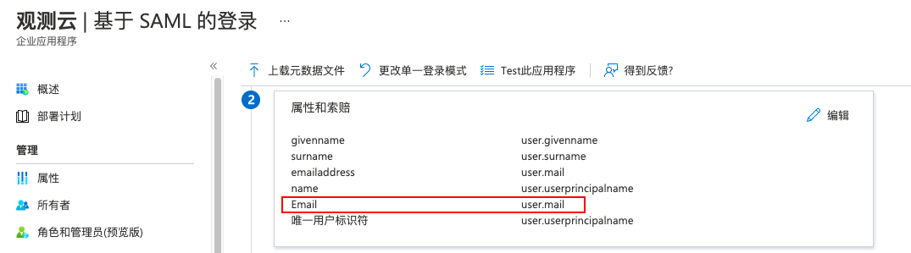
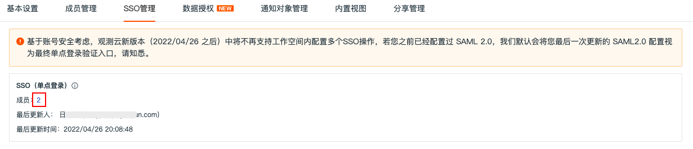

# SSO配置常见问题
---

#### 问题一：什么是观测云SSO单点登录？

单点登录（SSO）是整合企业系统的解决方案之一，用于统一用户身份认证，用户只需要登录一次就可以访问所有企业相互信任的应用系统。观测云的SSO单点登录采用 SAML 的配置方式，SAML 基本概念如下：

- 身份提供商（IdP）：一个包含有关外部身份提供商元数据的实体，身份提供商可以提供身份管理服务。如 Azure AD、Authing、Okta、Keycloak等等；
- 服务提供商（SP）：利用IdP的身份管理功能，为用户提供具体服务的应用，SP会使用IdP提供的用户信息。如观测云；
- 安全断言标记语言（SAML 2.0）：实现企业级用户身份认证的标准协议，它是SP和IdP之间实现互相信任的技术实现方式之一；
- SAML断言（SAML assertion）：SAML协议中用来描述认证请求和认证响应的核心元素。如用户的具体属性（如观测云单点登录需要配置的邮箱信息）就包含在认证响应的断言里；
- 信赖（Trust）：建立在SP和IdP之间的互信机制，通常由公钥和私钥来实现。SP通过可信的方式获取IdP的SAML元数据，元数据中包含IdP签发SAML断言的签名验证公钥，SP则使用公钥来验证断言的完整性。

#### 问题二：如何获取用于在观测云SSO管理创建身份提供商的云数据文档？

在身份提供商配置完 SAML 单点登录的“实体ID”和“回调地址（断言地址）”以后，即可下载云数据文档。若无“实体ID”和“回调地址（断言地址）”，可填入以下示例获取元数据文档。

- 实体 ID：[https://auth.guance.com/saml/metadata.xml](https://auth.guance.com/saml/metadata.xml)
- 断言地址，临时使用：[https://auth.guance.com/saml/assertion](https://auth.guance.com/saml/assertion/)

**注意：在观测云中启用SSO单点登录后，获取到正确的“实体ID”和“断言地址”后重新替换。关于如何获取观测云的断言地址和实体 ID，可参考文档 **[新建SSO](../../management/sso/index.md)** 。**

#### 问题三：常见的SAML协议的SSO单点登录需要通过配置“实体ID”和“回调地址（断言地址）”进行登录，如何获取观测云的“实体ID”和“回调地址（断言地址）”？

1）启用 SSO 单点登录，在观测云工作空间“管理”-“SSO管理”，点击“启用”即可。可参考文档 [新建SSO](../../management/sso/index.md) 。 

2）上传身份提供商的“元数据文档”，配置“邮箱域名”，选择“访问角色”，即可获取该身份提供商的“实体ID”和“断言地址”，支持直接复制“登录地址”进行登录。 

#### 问题四：在身份提供商配置完成“实体ID”和“回调地址（断言地址）”以后，还是无法在观测云进行单点登录，如何解决？

在配置身份提供商 SAML 时，需要配置邮箱映射，用于关联身份提供商的用户邮箱（即身份提供商将登录用户的邮箱映射到观测云的关联字段）。

在观测云中定义了一个关联映射字段，必须填入“Email”来进行映射。如在Azure AD中，需要在“属性和索赔”中增加“属性声明”，见下图：

- 名称：观测云定义的字段，需填入“Email”
- 源属性：根据身份提供商实际邮箱选择“user.mail”。

#### 问题五：在身份提供商配置了邮箱映射声明以后，还是无法在观测云进行单点登录，如何解决？

观测云定义的关联映射邮箱字段通过正则表达式来匹配身份提供商的邮箱规则，若配置的身份提供商邮箱规则不符合观测云支持的邮箱正则表达式，故无法进行单点登录，可联系观测云售后进行处理。

目前的观测云支持的邮箱正则表达式如下： `[\w!#$%&'*+/=?^_`{|}~-]+(?:\.[\w!#$%&'*+/=?^_`{|}~-]+)*@(?:[\w](?:[\w-]*[\w])?\.)+[\w](?:[\w-]*[\w])?`

您可以如下通过测试网站进行正则测试： [https://c.runoob.com/front-end/854/](https://c.runoob.com/front-end/854/)

#### 问题六：在观测云是否可以配置多个SSO单点登录？

基于账号安全考虑，观测云支持工作空间仅配置一个 SSO，若您之前已经配置过 SAML 2.0，我们默认会将您最后一次更新的 SAML2.0 配置视为最终单点登录验证入口。

若多个工作空间同时配置了相同的身份提供商 SSO 点单登录，用户通过 SSO 单点登录到工作空间后，可以点击观测云左上角的工作空间选项，切换不同的工作空间查看数据。

#### 问题七：通过SSO登录的账号有支持哪些访问权限？

SSO单点登录配置时支持设置角色访问权限包括“标准成员”和“只读成员”，可以在“成员管理”设置升级到“管理员”，详情可参考文档 [权限管理](../../management/access-management.md) 。

#### 问题八：通过SSO登录的账号是否可以在观测云删除？删除后是否可以再次登录？

在 SSO 管理，支持点击“成员”的“数字”跳转到“成员管理”查看具体被授权单点登录成员名单，支持删除SSO登录成员，在观测云删除后，只要身份提供商未删除，该成员还可以继续登录观测云工作空间。若需要彻底删除且不让该成员通过SSO登录，需同时删除观测云和身份提供商的用户账号。 

---

