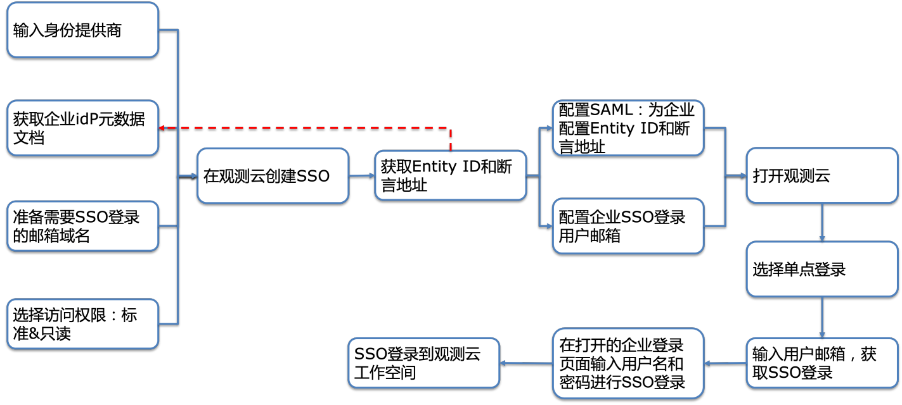
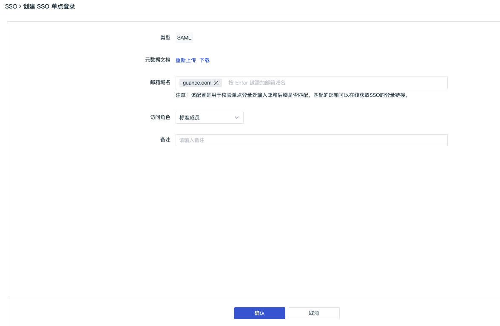
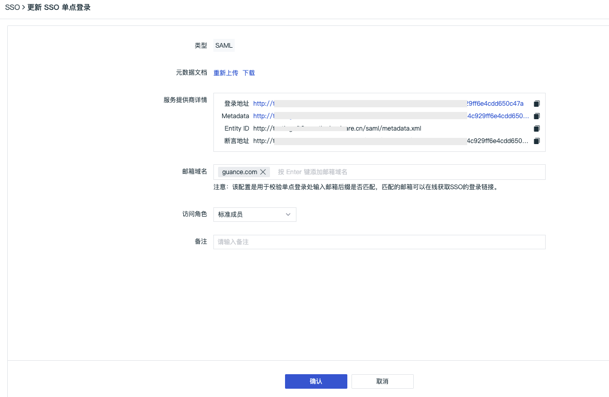
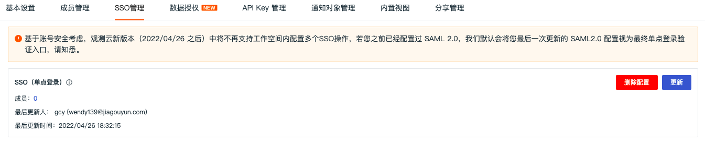
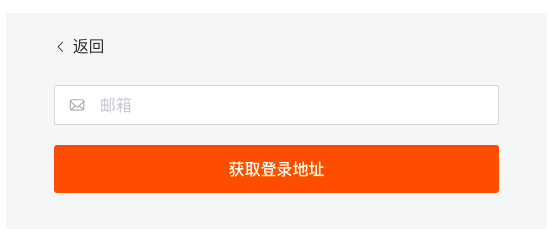
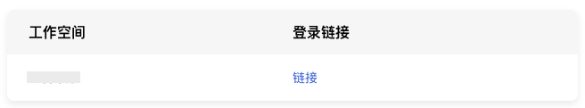
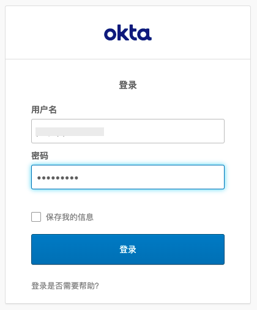
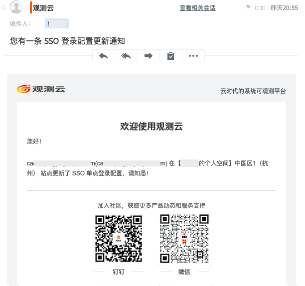
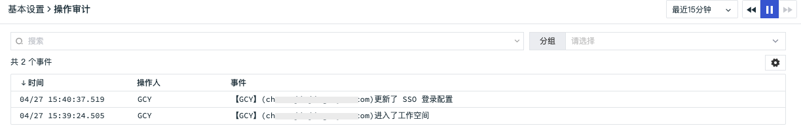
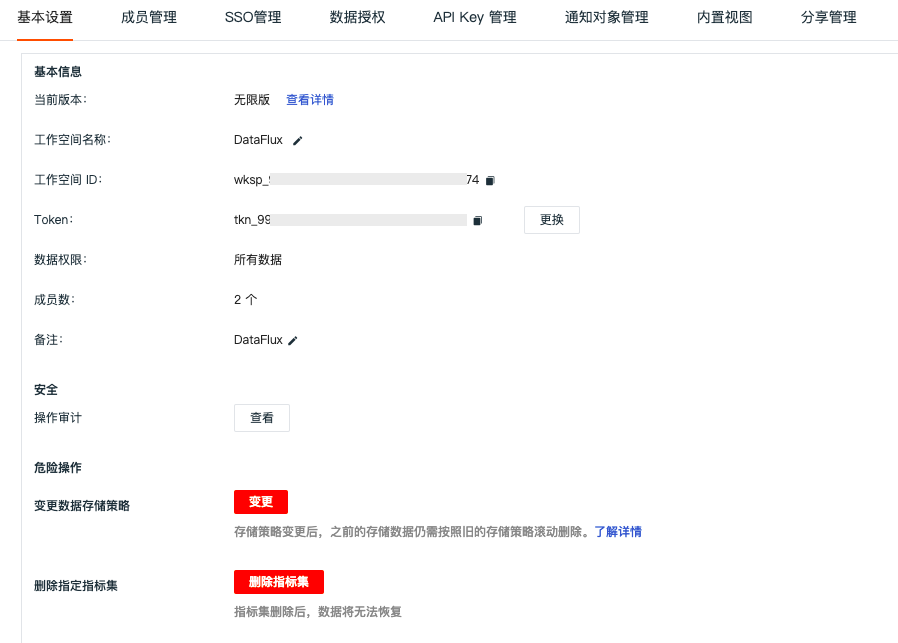

# SSO管理
---

观测云支持基于 SAML 协议的 SSO 管理，支持企业在本地 IdP（身份提供商） 中管理员工信息，无需进行观测云和企业 IdP 之间的用户同步，企业员工即可通过指定的角色登录访问观测云。 

## 新建SSO

观测云支持用户基于工作空间开启 SSO 单点登录，用户在登录时通过输入公司邮箱，获取对应SSO登录，实现对应验证登录。在观测云工作空间「管理」-「SSO管理」-「启用」，即可为员工设置SSO单点登录。

注意：

- 基于账号安全考虑，观测云支持工作空间仅配置一个 SSO，若您之前已经配置过 SAML 2.0，我们默认会将您最后一次更新的 SAML2.0 配置视为最终单点登录验证入口。
- 若多个工作空间同时配置了相同的身份提供商 SSO 点单登录，用户通过 SSO 单点登录到工作空间后，可以点击观测云左上角的工作空间选项，切换不同的工作空间查看数据。

- 元数据文档：IdP(身份提供商)提供的XML文档。
- 邮箱域名：必填项，该配置是用于校验单点登录处输入邮箱后缀是否匹配，匹配的邮箱可以在线获取SSO的登录链接。
- 访问角色：观测云的系统权限角色，目前此处只支持[只读成员]、[标准成员]，支持提升权限为[管理员]，具体可参考文档 [权限管理](./17-工作空间管理/05-权限管理.md) 。
- 备注：用户针对身份提供商可以自定义添加的描述信息。

完成以上信息填写后，点击“确认”，即可获取“Entity ID”和“断言地址”，根据身份提供商IdP的要求在对应的SAML配置完成后即可。

- 登录地址：基于用户上传的元数据文档生成的观测云SSO的登录地址，一个登录地址有且只能访问一个工作空间。
- Metadata：基于用户上传的元数据文档生成的观测云SSO的元数据文档。
- Entity ID：基于用户上传的元数据文档生成的观测云SSO登录的响应实体ID，用于在身份提供商标识服务提供商（SP），如观测云。
- 断言地址：基于用户上传的元数据文档生成的观测云SSO登录的响应目标地址，用于在身份提供商调用进行单点登录。

获取“Entity ID”和“断言地址”后，点击“确认”更新配置，点击“取消”返回 SSO 管理，支持更新/删除 SSO，支持点击“成员”的“数字”查看具体被授权单点登录成员名单。 

## SSO登录

SSO配置完成后，通过 [观测云官网](https://www.dataflux.cn/) 或者 [观测云控制台](https://auth.dataflux.cn/loginpsw) 登录，在登录页面选择「单点登录」。  输入在创建SSO的邮箱地址，点击「获取登录地址」。  点击「链接」打开企业账号登录页面。  输入企业通用邮箱和密码可直接登录到观测云对应的工作空间。 注意：若多个工作空间同时配置了相同的身份提供商 SSO 点单登录，用户通过 SSO 单点登录到工作空间后，可以点击观测云左上角的工作空间选项，切换不同的工作空间查看数据。 

## 邮件通知

启用、配置、删除 SSO，对应工作空间的拥有者和管理员会收到相关邮件通知。 

## 审计事件

启用、配置、删除 SSO 都会产生审计事件。  在观测云工作空间，点击「管理」-「基本设置」-「安全-操作审计」，点击“查看”，即可查看当前工作空间所有的审计事件。 

---

观测云是一款面向开发、运维、测试及业务团队的实时数据监测平台，能够统一满足云、云原生、应用及业务上的监测需求，快速实现系统可观测。**立即前往观测云，开启一站式可观测之旅：**[www.guance.com](https://www.guance.com) 
