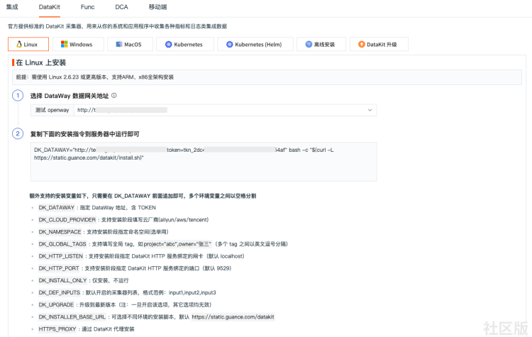
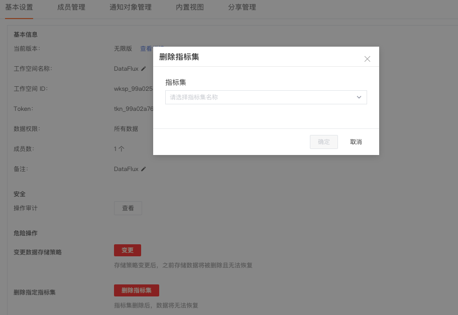

# 指标采集
---

## 简介

观测云具有全域数据采集能力，支持多种标准采集器，可快速配置数据源，轻松采集上百种类型数据。

## 数据采集

登录控制台，进入「集成」页面，即可查看所有支持的采集器。同时可点击「集成」-「DataKit」，选择 安装系统、系统类型、DataWay 地址等信息，即可复制「安装指令」安装DataKit，安装完成后即可开启更多采集器收集数据指标。[了解更多如何安装DataKit](../datakit/datakit-install.md)。

## 删除指标数据

观测云支持管理员删除空间内的指标集，进入「管理」-「基本设置」，点击「删除指标集」后，输入完整的指标集名称，点击「确定」即可删除。

???+ attention

    - 只允许空间管理员进行此操作；
    - 指标集一经删除，无法恢复，请谨慎操作

