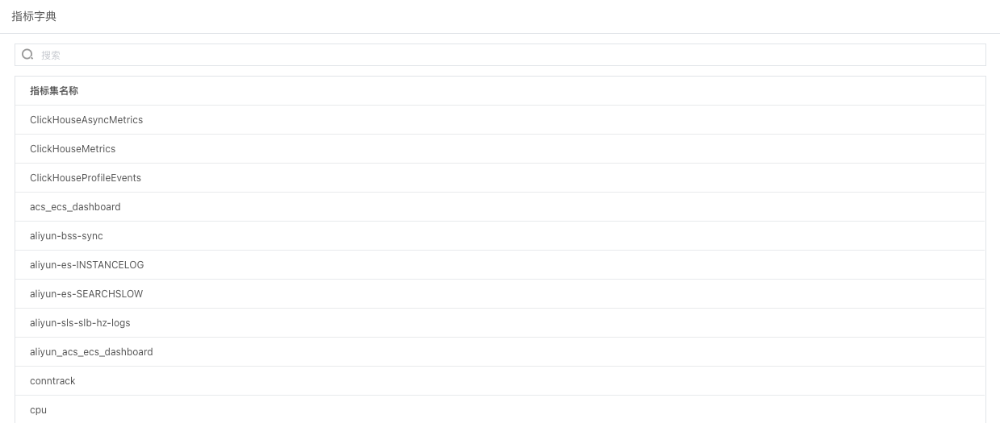
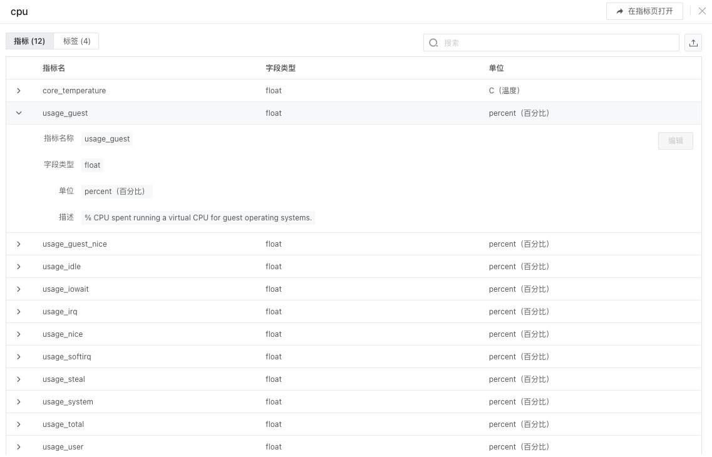
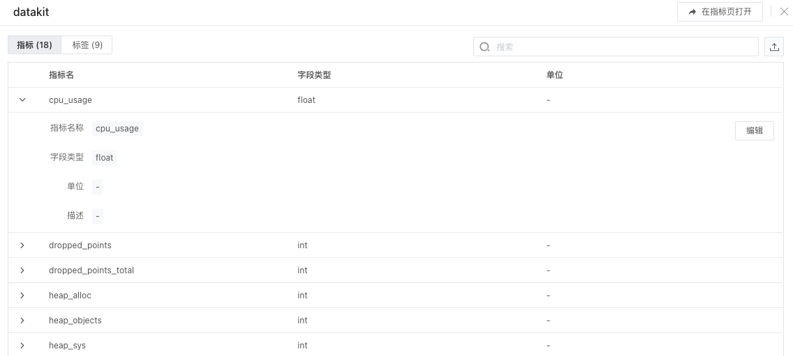
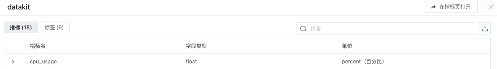
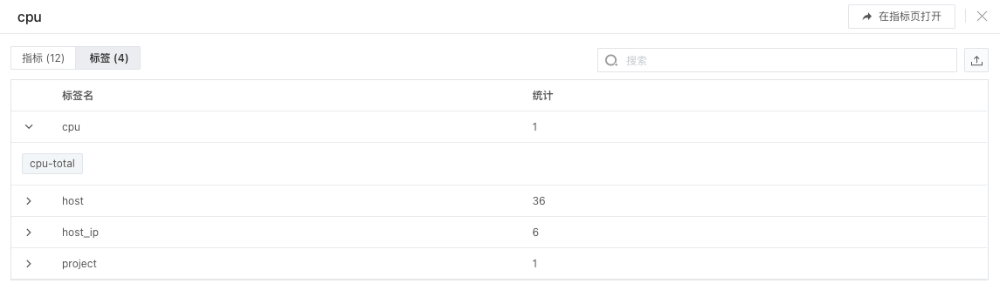

# 指标字典
---

## 简介

指标数据采集后，可以在观测云工作空间的「指标字典」查看所有采集的指标集及其指标和标签。指标集是指同一类型指标的集合，一个指标集可以包含多个指标和标签。

点击指标集，您可以在详情页查看该指标集下所有可用的指标和标签，支持通过模糊搜索来查询指标集。



## 指标

指标可以帮助您了解系统的整体可用性，比如说服务器 CPU 使用情况，网站的加载耗时等，配合观测云提供的日志和链路追踪，可以帮助您快速定位和解决故障。

指标分为指标名和指标值两部分，指标名只标识该指标的一个别名，指标值指采集时指标的具体数值。指标通过由 DataWay 网关将数据最终上报到观测云进行存储、展示和应用。在观测云工作空间指标字典详情页，支持到搜索和导出指标列表。



### 指标采集

采集指标有两种方式，前提是都需要先创建一个[观测云账号](https://auth.guance.com/register)，并在主机上[安装 DataKit](https://www.yuque.com/dataflux/datakit/datakit-install) 。

- DataKit 集成超过100种技术栈，指标采集的第一种方式是安装完 DataKit 以后，开启需要采集指标的采集器，如[CPU采集器](https://www.yuque.com/dataflux/datakit/cpu)、[Nginx采集器](https://www.yuque.com/dataflux/datakit/nginx)等等；
- 第二种方式是通过 [DataKit API](https://www.yuque.com/dataflux/datakit/apis) 方式，[通过 DataKit 自定义写入指标数据](https://www.yuque.com/dataflux/func/write-data-via-datakit)，观测云提供了 [DataFlux Func 函数处理平台](https://www.yuque.com/dataflux/func/quick-start)，集成大量现成的函数，帮您快速上报数据进行整体可观测。

### 指标单位

在指标字典，您可以对通过 DataKit API 直接上报的数据，手动设置指标的单位。

对于指标字典中有单位的指标，在观测云所有图表中会默认显示单位，且进行自动单位转换。但有如下要求：

- 图表查询中需未使用任何函数或使用了如下函数，使用除此之外的函数，不显示默认单位
```
聚合函数: avg、bottom、top、derivative、non_negative_derivative、difference、distinct、first、last、max、min、percentile（p50 p75 p90 p99）、sum、median、mode、spread、moving_average

外层函数: abs、avg、cumsum、derivative、non_negative_derivative、difference、non_negative_difference、first、last、max、min、moving_average、series_sum、round
```

- 当使用 dericative 或 non_negative_derivative 函数时，单位自动加 “/s”，例如：原始单位为KB，选择  dericative 函数，单位变为KB/s

注意：指标单位仅允许管理员及以上权限可编辑

#### 自定义指标单位

选择通过 DataKit API 上报的指标，点击右侧的“编辑”。



添加完成后，即可在指标页面查看添加的单位。



### 指标可视化应用

指标采集上报到观测云工作空间以后，可以在[指标查看器](https://www.yuque.com/dataflux/doc/mx0gcw)、[仪表板](https://www.yuque.com/dataflux/doc/gqatnx)、[笔记](https://www.yuque.com/dataflux/doc/qvf618)、[日志自定义查看器](https://www.yuque.com/dataflux/doc/uynpbs)中通过图表可视化查看和分析。


## 标签

标签可以帮助您关联数据，观测云支持把所有的指标、日志、链路数据统一上报到工作空间，通过对采集的数据打上相同的标签进行关联查询，可以帮您进行关联分析，发现并解决存在的潜在风险。

标签是指标识一个数据点采集对象的属性的集合，标签分为标签名和标签值，一个数据点可以有多个标签。在观测云工作空间指标字典详情页，支持到搜索和导出标签列表，支持通过点击标签值“复制”和“在指标中打开”。

DataKit 采集器会默认给采集到的所有数据追加标签 `host=<DataKit所在主机名>`，更多介绍可参考文档 [DataKit 使用入门](https://www.yuque.com/dataflux/datakit/datakit-how-to#cdcbfcc9) 。




---

观测云是一款面向开发、运维、测试及业务团队的实时数据监测平台，能够统一满足云、云原生、应用及业务上的监测需求，快速实现系统可观测。**立即前往观测云，开启一站式可观测之旅：**[www.guance.com](https://www.guance.com)


