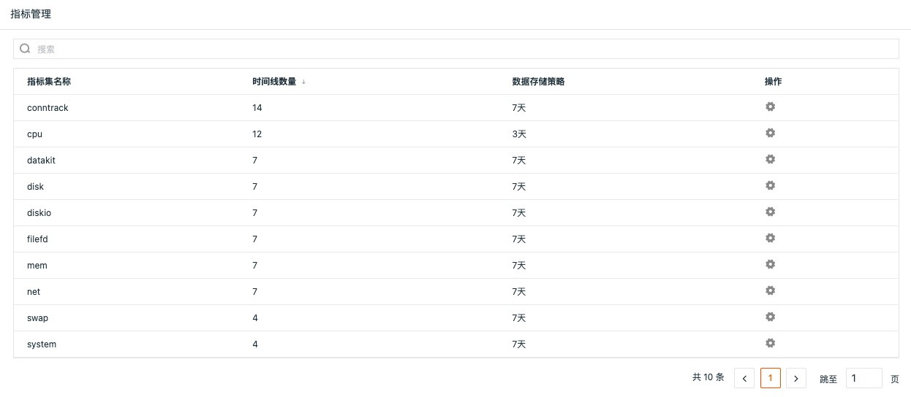

# 指标管理
---

## 简介

完成指标数据采集后，在观测云工作空间的「指标管理」可以查看所有上报的指标集和相关的指标、标签、时间线数量、数据存储策略等。

## 指标集

指标集是指同一类型指标的集合，一个指标集可以包含多个指标和标签。点击指标集，您可以在详情页查看该指标集下所有可用的指标和标签，支持通过模糊搜索来查询指标集。


## 指标

指标分为指标名和指标值两部分，指标名指标识该指标的一个别名，指标值指采集时指标的具体数值。“观测云”的指标是通过DataWay 网关将数据最终上报到观测云进行存储、展示和应用，可以帮助您基于指数、规格、标准等更直观的了解系统的整体可用性。比如：服务器 CPU 使用情况，网站的加载耗时、剩余磁盘空间等。

### 指标列表

在观测云工作空间的「指标管理」中，点击“指标集名称”，即可查看对应的指标列表，包括指标名、指标的字段类型、单位等。

您还可以

- 通过:octicons-search-24:，基于关键字搜索相关的指标。
- 通过 :material-export-variant: ，导出指标列表为csv文件至本地。


### 指标配置

- **默认指标配置**

上报至观测云的全部指标（包括由官方采集器 DataKit上报的数据、通过 DataKit API 直接上报的数据），依据最新的上报信息，默认展示对应的名称、字段类型、单位和描述等。

???+ note

    对于指标管理中有单位的指标，“观测云”的所有图表将会默认显示单位，且进行自动单位转换。但有如下要求：
    
    - 图表查询中需未使用任何函数或使用了如下函数，使用除此之外的函数，不显示默认单位
    ```
    聚合函数: avg、bottom、top、derivative、non_negative_derivative、difference、distinct、first、last、max、min、percentile（p50 p75 p90 p99）、sum、median、mode、spread、moving_average
    外层函数: abs、avg、cumsum、derivative、non_negative_derivative、difference、non_negative_difference、first、last、max、min、moving_average、series_sum、round
    ```
    
    - 当使用 dericative 或 non_negative_derivative 函数时，单位自动加 “/s”，例如：原始单位为KB，选择  dericative 函数，单位变为KB/s

???+ attention

    指标详情仅允许标准成员及以上权限可编辑

- **自定义指标配置**

如您需更改或添加某一“指标”的单位或描述，在指标列表，通过下拉出指标详情，点击「编辑」，然后「保存」新的配置即可。


???+ attention

    用户自定义的指标配置 优先级大于（>） 官方默认的指标配置，用户一旦「保存」了指标设置，该指标的配置信息将会应用于在观测云全局。

### 指标的可视化应用

指标采集上报到观测云工作空间以后，可以在[指标查看器](explorer.md)、[仪表板](../scene/dashboard.md)、[笔记](../scene/note.md)、[日志自定义查看器](../scene/explorer/index.md)中通过图表可视化查看和分析。


## 标签

标签是指标识一个数据点采集对象的属性的集合，标签分为标签名和标签值，一个数据点可以有多个标签。观测云支持把所有的指标、日志、链路数据统一上报到工作空间，并通过对一系列数据打标签的方式，辅助用户进行关联查询。

???+ note

    DataKit 采集器会默认给采集到的所有数据追加标签 `host=<DataKit所在主机名>`，更多介绍可参考文档 [DataKit 使用入门](../datakit/datakit-conf.md#set-global-tag) 。

### 标签列表

在观测云工作空间的「指标管理」中，点击“指标集名称”，即可查看对应的「标签列表」，包括标签名、相关字段统计数量、描述等。

您还可以

- 通过:octicons-search-24:，基于关键字搜索相关的标签。
- 通过 :material-export-variant: ，可以导出标签列表为csv文件至本地。


## 时间线

当前工作空间，上报的指标数据中基于标签可以组合而成的所有组合数量。在 “观测云”中时间线是由指标、标签（字段）、数据存储时长组合而成的，“指标”和“标签（字段）的组合”是数据存储的主键。相关名词解释如下：

- Database：数据库
- Measurement：数据表，可以理解为 mysql 里的 table，指标集
- Field：InfluxDB 中记录真实数据的键值对 (在 Influxdb 中是必须的，不会被索引)，指标
- Field Set：Field 键值对的集合
- Field Key：组成 Field 键值对里的键
- Field Value：组成 Field 键值对里的值 (真正的数据)
- Tag：用来描述 Field 的键值对 (在 Influxdb 中是可选的，会被索引)，标签
- Tag Set：Tag 键值对的集合
- Tag Key：组成 Tag 键值对里的键
- Tag Value：组成 Tag 键值对里的值
- TimeStamp：数据点关联的日期和时间
- Retention Policy：数据存储时间 (数据保存策略)
- Series：时间线由 Retention Policy、Measurement、Tag Set 三部分组成

## 指标存储策略


指标存储策略分成两种，一种是针对指标工作空间级别的全局设置，另外一种是针对指标集的自定义设置。

注意：

- 指标集的自定义设置优先级高于指标的全局设置，即指标集自定义设置数据存储策略后，更改指标的全局设置，不影响指标集的数据存储策略

- 在指标管理一旦修改指标集数据保存策略，工作空间全局策略中保存的对应指标集数据将会被删除，且不能恢复，请谨慎操作；若在指标管理再次修改指标集数据保存策略，之前策略下的指标集数据也会被删除
- 在指标管理修改指标集的数据保存策略后，该指标集数据会单独存储，若在工作空间管理修改指标全局数据存储策略时长，则不会更改该指标集的存储策略时长
- 在指标管理修改指标集数据保存策略后，改回全局默认的指标数据存储策略时长，该指标集会被重新存入全局数据库，此时再次修改工作空间指标的全局数据存储策略时长，则同时更改该指标集的存储策略时长
- 在指标管理修改指标集数据保存策略后，修改工作空间指标的全局数据存储策略时长和指标集的存储策略时长一致，该指标集数据仍然会单独保存，不会存入全局数据库


### 指标全局设置

在观测云工作空间「管理」-「基本设置」，可查看指标工作空间的全局数据存储策略，默认指标数据为7天，包括3天、7天、14天、30天、180天和360天。


### 指标集自定义设置

在指标管理，可查看和自定义设置指标集的数据存储策略。

注意：指标集存储策略仅拥有者可配置，且免费版不支持指标集自定义数据保存策略。



点击操作下的设置按钮可自定义设置指标集的数据保存策略，包括3天、7天、14天、30天、180天和360天，默认和指标全局数据保存策略一致。


修改指标集数据保存策略时长后，之前策略下的指标集数据也会被删除，且不能恢复。


