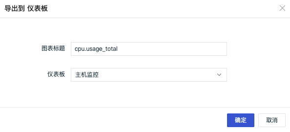
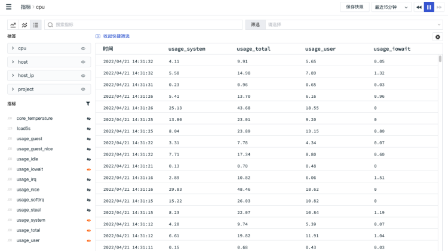

# 指标管理
---

## 简介

指标数据采集后，可以在控制台的「指标」页面查看所有采集的指标集和指标。

进入「指标」页面，左侧显示空间内所有采集的指标集，右侧展示对应的标签和指标内容。支持对指标集和指标进行搜索、筛选过滤等功能。

指标类型说明：
【.00】 ：float 浮点型，是可以有小数点的数值
【123】 ：int 整型，是精确的整数
【str.】 ：是字符串类型
【T/F】 ：Boolean类型，值为true或false
## 标签筛选

DataKit 采集器会默认给采集到的所有数据追加标签 `host=<DataKit所在主机名>`，更多介绍可参考文档 [DataKit 使用入门](https://www.yuque.com/dataflux/datakit/datakit-how-to#cdcbfcc9) 。

标签是标识一个数据点采集对象的属性的集合，标签分为标签名和标签值，在「指标」页面可选择需要查看的标签值对应的指标视图。如下图所示：在标签栏筛选主机，并查看其 `usage_system`、`usage_total`、`usage_user`、`usage_iowait`等指标视图。

在标签栏，支持关键字搜索，支持在选择标签筛选内容时进行“反选”或者“重置”，“反选”表示选中的字段筛选内容不展示（再次点击“反选”可返回字段选中状态），“重置”可清空筛选条件。

## 查看模式

在「指标」页面左侧可选择切换指标查看模式，支持三种查看模式：平铺模式、混合模式、列表模式，默认选中平铺模式。

1. **平铺模式**

该模式下支持同时显示多个图表，每一个指标为一个折线图，方便进行指标的对比分析。支持选择“小”、“中”、“大”三种图表尺寸查看方式，默认为“中”。

鼠标放在图表上，右上角显示导出按钮，点击导出按钮，支持导出图表到场景仪表板。

2. **混合模式**

该模式下所选指标均显示在一个折线统计图中，可查看指标在一定时间内的数据走势。点击右上角导出按钮，即可导出图表到场景视图。

3. **列表模式**

该模式下展示所选指标采集的数据详情，可查看到数据采集时间以及所有的字段。点击右上角设置按钮，即可导出列表到CSV文件。

## 聚合查询

在「指标」页面的平铺和混合模式下，您可以通过选择聚合公式对指标进行聚合查询。聚合函数的使用方法是对一组值执行的统计计算总结。支持`Last（取最后一个值）、First（取第一个值）、Avg（平均值）、Min（取最小值）、Max（取最大值）、Sum（求和）。`

例如：您可以选择以“Avg”函数聚合查询，在指标查看器的平铺和混合模式下，你可以看见以平均数为聚合的指标数据。

---

观测云是一款面向开发、运维、测试及业务团队的实时数据监测平台，能够统一满足云、云原生、应用及业务上的监测需求，快速实现系统可观测。**立即前往观测云，开启一站式可观测之旅：**[www.guance.com](https://www.guance.com)

