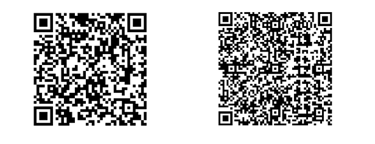
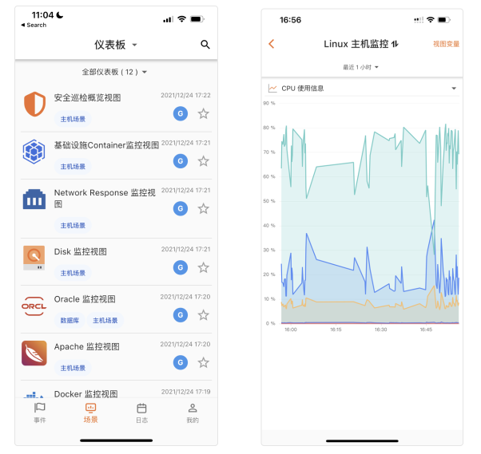
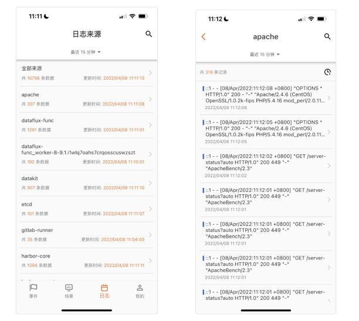
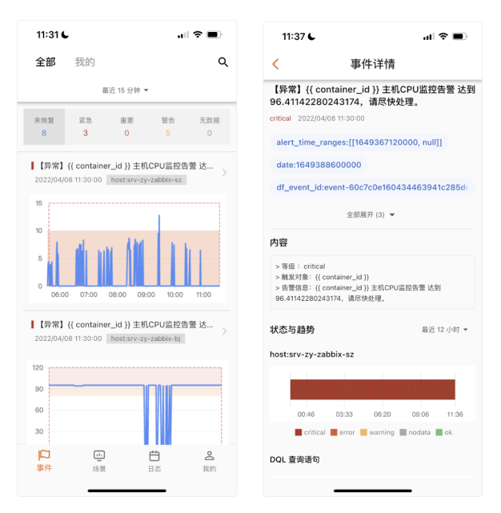

# 移动端
---

观测云移动端可以帮助您在移动设备上随时随地查看来自观测云的日志数据、场景视图等，接收通过邮件、钉钉机器人、企业微信机器人、Webhook等通知到您的全部告警事件。

## 安装

在观测云的工作空间内，您可以通过「集成」-「移动端」进行下载，也可以通过下方扫码进行下载。

或者您也可以直接点击如下链接进行下载。             

- [ iOS 系统下载 ](https://apps.apple.com/cn/app/dataflux-mobile/id1494097190)

- [Android 系统下载](https://android.myapp.com/myapp/detail.htm?apkName=com.cloudcare.ft.dataflux.mobile&info=BC6B6D70A723FAA93DB84F11BF50AE8A)

## 功能说明

### 登录

现有的观测云免费/敏捷版用户可以通过账号密码和手机验证码的方式，选定账号对应的站点，登录至观测云移动端。如若您还没有观测云账号，您可以前往观测云官网 [立即申请](https://auth.guance.com/register) ，选择注册适合的站点账号。如若您需要切换账号，请先退出当前用户登录。

### 工作空间

观测云移动端支持查看账号下全部工作空间的数据内容，通过切换工作空间，您可以查看不同工作空间内的日志、事件、场景&视图。

在登入观测云移动端后， 您需要选择一个默认的工作空间查看相对应的数据；在使用过程中，如若您需要切换至另一个工作空间，您可以通过「我的」-「切换工作空间」变更工作空间。

如果您当前没有工作空间，可以前往观测云网页版 [创建新的工作空间](../management/space-management.md) ，或者由其他空间的空间管理员 [邀请您成为其他空间的新成员](../management/member-management.md) 。

### 消息通知

观测云移动端提供基于观测云工作台告警通知的移动智能推送服务，帮助您快速集成通知到您的告警事件，实现高效、精准、实时的信息推送。您可以通过「我的」-「消息推送开关」，开启或关闭告警通知推送。

### 清理缓存

观测云移动端的缓存文件包括一些应用产生的临时文件，可能会导致应用运行缓慢，您可以通过「我的」-「清理缓存」，对文件缓存等进行清理。

### 小组件

通过观测云移动端的搜索、筛选和过滤组件，您可以快速定位到数据，及时发现、调查和解决问题。

#### 时间范围
观测云移动端仍为您提供时间组件来设定场景视图、日志、事件数据展示的时间范围，您可以快速选择预设的时间范围，也可以通过选择开始和结束时间自定义时间范围。

#### 关键字搜索
关键词搜索为您省去了在海量数据中定位和寻找数据的麻烦，通过搜索按钮，您可以在场景视图、日志、事件查看器中，对相关文本数据进行搜索。

#### 列表排序
观测云移动端支持对原始列表进行正序排序和倒序排序。

## 场景与视图

在「场景」页面上，您可以查看当前空间下满足不同业务场景的全部仪表板。
            

### 仪表板过滤

观测云 支持您通过点击下拉菜单切换“全部仪表板”，“我的收藏”、“导入项目”、“我的创建”和“经常浏览”，以快速过滤查找对应的仪表板。仪表板与网页端内容同步，详情可参考 [仪表板](../scene/dashboard.md) 。

### 可视化图表

当您选择进入一个场景时，观测云移动端默认为您展示该场景的第一个可视化图表（视图），若您需要切换至其他视图，您可以通过点击下拉菜单切换至其他图表。更多详情可参考 [可视化图表](../scene/visual-chart/index.md) 。

### 视图变量

观测云移动端支持您在场景视图中切换已有的视图变量，通过「视图变量」选择视图变量，您可以动态地完成全局图表的筛选。若您需要添加、变更或删除视图变量等，您可以前往观测云工作台进行设置，详情可参考 [视图变量 ](../scene/view-variable.md)。

## 日志数据

在「日志」中，您可以同步查看观测云工作台的日志数据。通过选择不同的日志来源，您可以对工作空间内的不同日志数据进行查询和分析。观测云移动端默认为您显示最近 15 分钟内的日志数据，如您需要查看更多日志数据，可以通过选择时间范围来搜寻和查看相关数据。 更多详情可参考 [日志查看器](../logs/explorer.md) 。

## 事件
观测云移动端支持您随时随地与 观测云 工作台保持连接。您可以通过「全部」事件，查看、搜索和过滤异常检测库触发的全部未恢复事件内容；通过「我的」事件，您可以查看通过邮件、钉钉机器人、企业微信机器人、Webhook等通知到您的，且当前仍未恢复的事件内容。出现通知到您的告警事件后，观测云移动端会及时为您发送通知，以保证您能够快速反应和解决相关问题。更多详情可参考 [事件查看器](../events/explorer.md) 。

注意：观测云移动端在「全部」事件/「我的」事件中仅为您提供1000条时间数据，如需查看更多时间，请前往网页端查看更多。 

  
