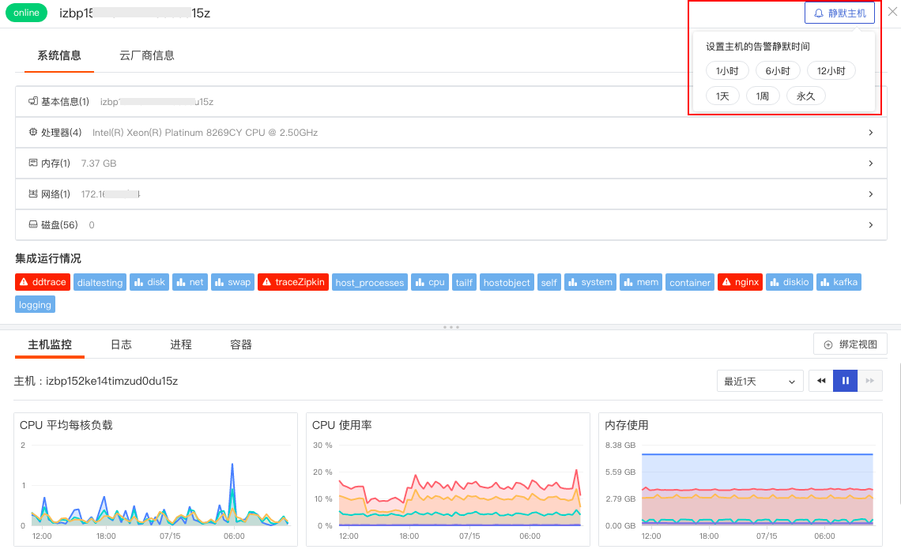

# 告警设置
---

## 概述

“观测云” 支持对监控器的检测结果进行告警设置，通过发送告警通知邮件或者群消息通知，让您及时了解监测的异常数据情况，发现问题，解决问题。

## 告警配置

“观测云”支持对分组下的全部监控器配置告警。在「监控器」列表中，点击「分组名称」或点击告警按钮，可进行配置通知成员、告警沉默时长操作。

### 通知对象

告警通知支持选择不同的通知类型，对多个对象发送告警通知。“观测云”支持多种通知类型，包括「空间成员」、「邮件组」、「钉钉机器人」、「企业微信机器人」、「飞书机器人」和「Webhook自定义」。

- 空间成员：邮件通知，通过在「管理」-「成员管理」，添加通知对象，可参考此文档中的「告警示例」。
- 邮件组：邮件通知，一个邮件组可添加多个空间成员，通过在「管理」-「[通知对象管理](https://www.yuque.com/dataflux/doc/osstog) 」，添加通知对象。
- 钉钉机器人、企业微信机器人、飞书机器人：群通知，通过在「管理」-「[通知对象管理](https://www.yuque.com/dataflux/doc/osstog)」，添加通知对象。
- Webhook自定义：用户自行设定，通过在「管理」-「[通知对象管理](https://www.yuque.com/dataflux/doc/osstog)」，添加通知对象。
- 短信：短信通知，一个短信组可以添加多个空间成员，通过在「管理」-「[通知对象管理](https://www.yuque.com/dataflux/doc/osstog)」，添加通知对象。“观测云”免费版无短信通知，其他版本短信通知0.1 元 / 条，按天计费，没有免费额度。

**注意：**

- **邮件、钉钉、微信、飞书、短信告警通知都是每分钟合并了发送，并不是产生后立刻发送，会存在约一分钟的延迟；**
- **邮件、钉钉、微信、飞书收到的告警通知包含“观测云跳转链接”，点击可直接跳转到对应的观测云事件详情，时间范围为当前时间的往前15分钟，即18:45:00的事件，点击链接后跳转至事件详情页，时间范围固定为4.20 18:30:00 ~ 4.20 18:45:00。**

### 告警沉默

若同一个事件不是非常紧急，但是告警通知频率高，可以通过设置告警沉默的方式减少告警通知频率。在「监控器」，点击右侧「告警配置」，选择告警沉默时间，点击「确定」。

**注意：告警沉默后事件会继续产生，但是告警通知不会再发送，产生的事件会存入事件管理**

## 主机静默

若需要对单个主机进行如压测等操作，会触发频繁的告警，对于这种告警通知，可临时开启主机静默功能。在「基础设施」-「主机」，点击云主机详情即可选择主机静默时间。

**注意：主机静默后事件会继续产生，但是告警通知不会再发送，产生的事件会存入事件管理**

所有静默的主机列表可在「监控」-「主机静默管理」中查看。「删除」静默的主机或者在主机详情页「取消静默」后，可以重新接收到对应主机的告警通知。

## 告警示例

### 1.创建监控器

在「监控」中，新建监控器，点击「+新建监控器」，并选择对应检测规则（如：阈值检测），开始配置检测规则。 配置详情参考 [阈值检测 ](https://www.yuque.com/dataflux/doc/zdeogm)。

### 2.配置告警对象

- 添加告警对象

在「管理」，进入「成员管理」，点击「添加成员」，添加成功后，可用于告警通知的对象。

- 配置告警对象

在「监控器」，选择指定分组进行「告警配置」，并选择相关通知对象和告警沉默，点击「确定」。】

### 3.告警邮件

配置完成告警对象后，即可收到告警邮件。

### 5.告警事件

在「监控器」，点击「查看相关事件」，即可在「事件」查看对应的告警事件列表。详情参考 [事件管理](https://www.yuque.com/dataflux/doc/aisb71) 。

---

观测云是一款面向开发、运维、测试及业务团队的实时数据监测平台，能够统一满足云、云原生、应用及业务上的监测需求，快速实现系统可观测。**立即前往观测云，开启一站式可观测之旅：**[www.guance.com](https://www.guance.com)

