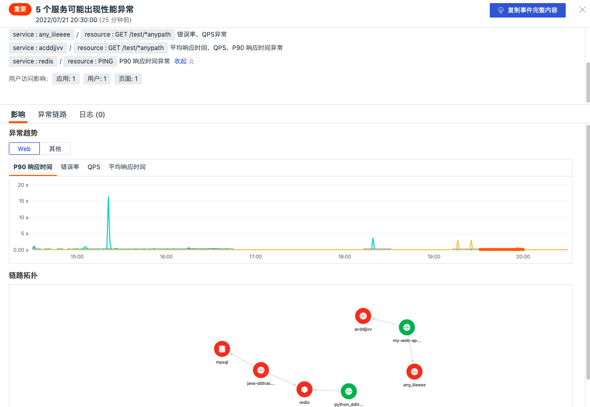
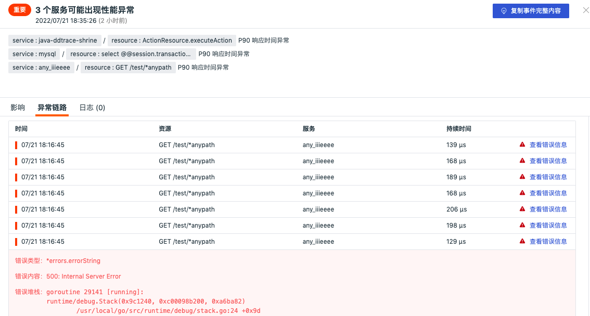
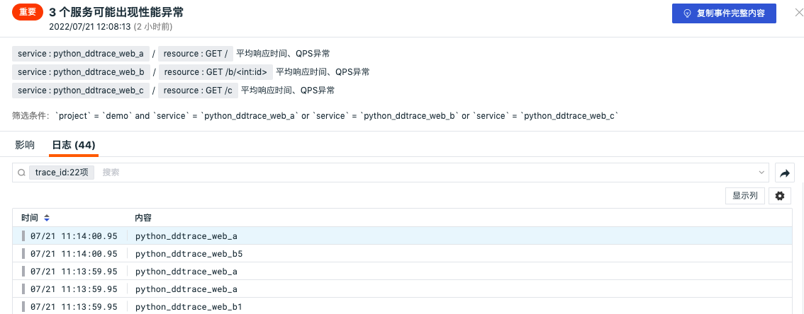
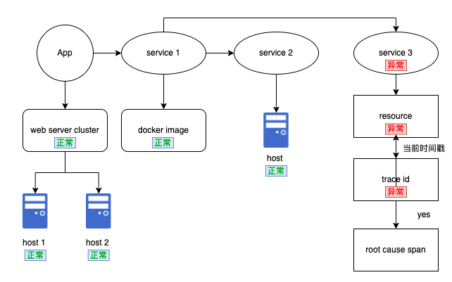

# 应用性能检测
---

## 概述

「应用性能检测」基于APM异常根因分析检测器，选择要检测的 `service` 、 `resource` 、 `project` 、 `env` 信息，定期对应用性能进行智能巡检，通过应用程序服务指标异常来自动分析该服务的上下游信息，为该应用程序确认根因异常问题。

## 启用/禁用

智能巡检「应用性能检测」默认是「禁用」状态，可手动「启用」，开启后，将对当前工作空间的所有应用性能进行巡检，支持添加 `service` 、 `resource` 、 `project` 、 `env` 筛选条件。

## 编辑

智能巡检「应用性能检测」支持用户手动添加筛选条件，在智能巡检列表右侧的操作菜单下，点击「编辑」按钮，即可对巡检模版进行编辑。

- 默认以 `service + resource + project + env` 为检测对象
- 支持用户手动填写“项目（project）”，“环境（env）”，“版本（version）”，“服务（service）” 筛选条件
- 支持“项目（project）”，“环境（env）”，“版本（version）”，“服务（service）” 单选和多选

## 查看相关事件

智能巡检基于观测云智能算法，会查找 APM 指标中的异常情况，如 `resource` 突然发生异常。对于异常情况，智能巡检会生成相应的事件，在智能巡检列表右侧的操作菜单下，点击「查看相关事件」按钮，即可查看对应异常事件。

点击「事件」，可查看智能巡检事件的详情页。

- 状态：红色代表未恢复，绿色代表已恢复（已解决）
- 时间：异常发生的时间
- 标签属性：点击标签属性如 `service` ，支持复制和查看相关日志、容器、进程、安全巡检、链路、用户访问监测、可用性监测以及 CI 等
- 消息：描述异常巡检事件内容
- 用户访问影响：通过根因分析获取出现的异常的 resource 及其可能产生的错误堆栈信息，通过关联分析获取受影响的前端应用、页面地址以及用户群体
-  基础属性：支持查看事件的标签及属性、检测维度、事件内容以及其他的字段属性
-  -  告警通知：显示通知对象类型、通知对象名称、通知是否发送成功等信息
-  历史记录：支持查看检测对象主机、异常/恢复时间和持续时长
-  关联事件：支支持通过筛选字段和所选取的时间组件信息，查看关联事件

- 影响：该智能检测异常事件的影响，帮助用户快速定位内存异常的原因
    - 异常趋势：包括 Web 类型和其他类型，对于 Web 类型可查看包括平均响应时间、P90 响应时间、错误率、QPS 等趋势图表（其中虚线代表提前预测的趋势）；
    - 链路拓扑：通过拓扑方式查看异常服务的上下游链路信息，点击链路可查看异常资源

- 异常链路：支持查看异常服务链路，包括发生的时间、资源、服务、持续时间以及查看错误信息；

- 关联日志：基于发生巡检事件链路 `trace_id` 筛选出关联日志，支持搜索、筛选、显示列、多行显示、导出等操作，点击日志或者「跳转」按钮可直接跳转到相关日志查看器。

- 内置视图：支持手动添加 `tags` 关联的内置视图结合智能巡检进行分析。关于如何配置内置视图可参考文档 [绑定内置视图](../../management/built-in-view/bind-view.md) 。

## 根因分析

下图是展示自动分析给定问题的所有垂直和水平拓扑依赖关系。在示例中，当应用程序服务的观测指标出现异常时，该服务的底层水平堆栈未显示任何异常事件。智能巡检会自动分析该服务的上下游信息来为该应用来确定根因异常。如 APP service 出现异常但是在该服务的底层信息没有发现异常，但是检测到其对 service 1 的依赖，且 service 1 也表现出异常行为，但是 service 1 的底层也没有发现异常，同理发现 service 1 对 service 3 的依赖，检测到 Service 3 的所有依赖项都表现出异常行为，并且是整个问题的根本原因的一部分。

由此可见问题很少是一次性事件，可能通常以常规模式出现，如果依赖于相同组件的任何其他实体也在大约同一时间遇到问题，那么这些实体也将成为问题根本原因分析的一部分。

## 影响分析

根据异常的 resource 信息来查看是否为 web 类型的 resource，如果为 web 类型的 resource 则对其进行 RUM 数据查询，来获取对应的用户影响和异常页面影响。

- 确定遇到错误的确切用户，以便快速评估其范围
- 通过自动洞察问题对前端视图和后端服务的影响，轻松确定修复工作的优先级

## 常见问题

**1.智能巡检内存泄漏的检测频率**

应用性能检测开启后，观测云会按照每 1 小时 1 次的检测频率，巡检过去 6 小时时间范围内服务的请求速率、延迟、错误率是否出现异常，通过根因分析获取出现的异常的 `resource` 及其可能产生的错误堆栈信息，通过关联分析获取受影响的前端应用、页面地址以及用户群体。

**2.智能巡检内存泄漏相关的指标集**

APM 检测标签： `service` 、 `resource` 、 `project` 、 `env` 

APM 检测指标：平均响应时间、P90 响应时间、错误率、QPS

**3.在何种情况下会产生APM智能巡检事件**

通过观测云的智能算法，跟踪平均响应时间、P90 响应时间、错误率、QPS 指标趋势，当其中一个指标发生异常变动时，触发收集报警信息进行根因分析，产生巡检事件。

- 跟踪阈值：如 P90 > 15秒，错误率 >10%
- 跟踪请求数、延迟、错误率趋势，当发生剧烈数据变化时触发事件，或当触发临界值时触发事件
