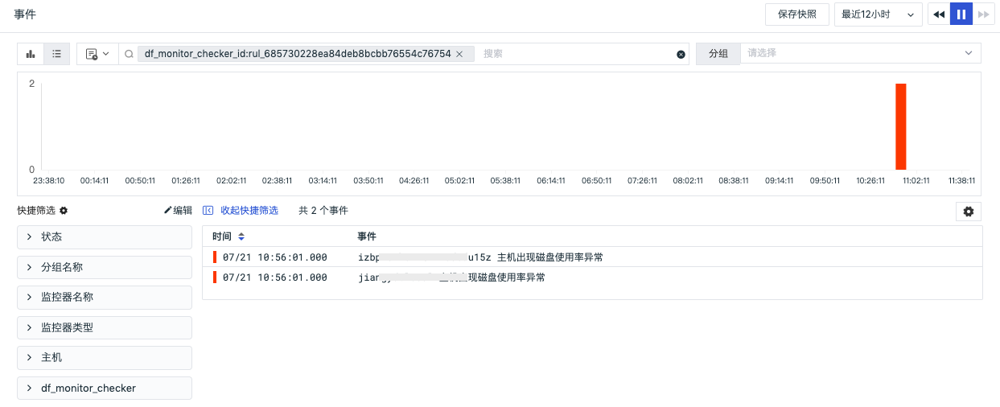

# 磁盘使用率
---

## 概述

「磁盘使用率」基于磁盘异常分析检测器，定期对主机磁盘进行智能巡检，通过出现磁盘异常的主机来进行根因分析，确定对应异常时间点的磁盘挂载点和磁盘信息，分析当前工作空间主机是否存在磁盘使用率问题。

## 启用/禁用

智能巡检「磁盘使用率」默认是「禁用」状态，可手动「启用」，开启后，将对当前工作空间的所有主机进行巡检，支持添加主机磁盘筛选条件。

## 导出

智能巡检支持“导出 JSON 配置”。在智能巡检列表右侧的操作菜单下，点击「导出」按钮，即可导出当前巡检的 JSON 代码，导出文件名格式：智能巡检名称.json 。

## 编辑

智能巡检「磁盘使用率」支持用户手动添加主机和磁盘筛选条件，在智能巡检列表右侧的操作菜单下，点击「编辑」按钮，即可对巡检模版进行编辑。

- 检测对象：主机对象的磁盘使用情况
- 数据范围： 14 天；检测频率：6 小时
- 筛选条件：支持手动配置`key` 和 `value` 的筛选条件，支持多种筛选方式：
  -  `或` 和 `并且` ：支持根据需求进行多条件筛选
  -  `>` 、`>=` 、`<` 、`<=` 、`=` 、`!=` 、`match` 、`not match` 、`wildcard` 、`not wildcard`：同时支持数值和字符串类型的字段筛选

- 告警通知：支持选择和编辑告警策略，包括需要通知的事件等级、通知对象、以及告警沉默周期等

注意：若配置了筛选条件，在未恢复事件/事件详情页的「基础属性」下「检测维度」区域处显示对应的筛选条件。

## 查看相关事件

智能巡检基于观测云智能算法，会查找磁盘指标中的异常情况，如磁盘使用率突然飙升。对于异常情况，智能巡检会生成相应的事件，在智能巡检列表右侧的操作菜单下，点击「查看相关事件」按钮，即可查看对应异常事件。

点击「事件」，可查看智能巡检事件的详情页。

- 状态：红色代表未恢复，绿色代表已恢复（已解决）
- 时间：异常发生的时间
- 标签属性：点击标签属性如 `host` ，支持复制和查看相关日志、容器、进程、安全巡检、链路、用户访问监测、可用性监测以及 CI 等
- 消息：描述异常巡检事件内容
-  基础属性：支持查看事件的标签及属性、检测维度、事件内容以及其他的字段属性
- 影响：该异常事件的影响，包括智能检测的磁盘指标异常图表趋势（其中虚线代表提前预测的趋势），磁盘挂载点，帮助用户快速定位磁盘异常的原因
-  告警通知：显示通知对象类型、通知对象名称、通知是否发送成功等信息
-  历史记录：支持查看检测对象主机、异常/恢复时间和持续时长
-  关联事件：支支持通过筛选字段和所选取的时间组件信息，查看关联事件
- 内置视图：支持手动添加 `tags` 关联的内置视图结合智能巡检进行分析。关于如何配置内置视图可参考文档 [绑定内置视图](../../management/built-in-view/bind-view.md) 。

## 常见问题

**1.智能巡检磁盘使用率的检测频率**

磁盘使用率智能巡检开启后，观测云会按照每 6 小时 1 次的检测频率，巡检过去 14 天时间范围内主机磁盘否出现异常，通过根因分析获取出现的异常的磁盘挂载点和信息。

**2.智能巡检磁盘使用率相关的指标集**

基于主机对象`(hostobject)` 和 磁盘指标`(disk) ` 。

**3.在何种情况下会产生磁盘使用率智能巡检事件**

通过观测云的智能算法，跟踪 `used_percent`  指标趋势，当指标将要逼近临界值、或触发临界值时会触发巡检事件。

