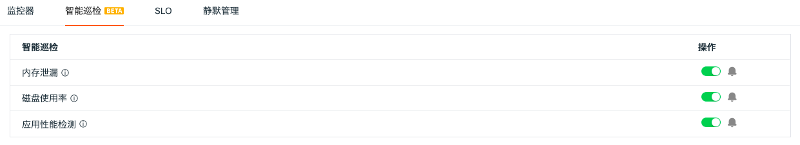
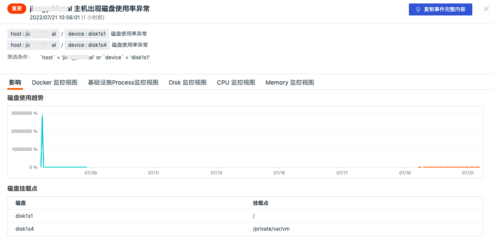

# 磁盘使用率
---

## 概述

「磁盘使用率」基于磁盘异常分析检测器，定期对主机磁盘进行智能巡检，通过出现磁盘异常的主机来进行根因分析，确定对应异常时间点的磁盘挂载点和磁盘信息，分析当前工作空间主机是否存在磁盘使用率问题。

## 启用/禁用

智能巡检「磁盘使用率」默认是「禁用」状态，可手动「启用」，开启后，将对当前工作空间的所有主机进行巡检。

## 查看相关事件

智能巡检基于观测云智能算法，会查找磁盘指标中的异常情况，如磁盘使用率突然飙升。对于异常情况，智能巡检会生成相应的事件，在智能巡检列表右侧的操作菜单下，点击「查看相关事件」按钮，即可查看对应异常事件。

点击「事件」，可查看智能巡检事件的详情页。

- 状态：红色代表未恢复，绿色代表已恢复（已解决）
- 时间：异常发生的时间

- 筛选条件：手动配置的「筛选条件」，点击「筛选条件」支持复制和查看相关日志、容器、进程、安全巡检、链路、用户访问监测、可用性监测以及 CI 等
- 消息：描述异常巡检事件内容
- 影响：该异常事件的影响，包括智能检测的磁盘指标异常图表趋势（其中虚线代表提前预测的趋势），磁盘挂载点，帮助用户快速定位磁盘异常的原因

- 内置视图：支持手动添加 `tags` 关联的内置视图结合智能巡检进行分析。关于如何配置内置视图可参考文档 [绑定内置视图](../management/built-in-view/bind-view.md) 。

## 常见问题

**1.智能巡检磁盘使用率的检测频率**

磁盘使用率智能巡检开启后，观测云会按照每 1 天 1 次的检测频率，巡检过去 14 天时间范围内主机磁盘否出现异常，通过根因分析获取出现的异常的磁盘挂载点和信息。

**2.智能巡检磁盘使用率相关的指标集**

基于主机对象`(hostobject)` 和 磁盘指标`(disk) ` 。

**3.在何种情况下会产生磁盘使用率智能巡检事件**

通过观测云的智能算法，跟踪 `used_percent`  指标趋势，当指标将要逼近临界值、或触发临界值时会触发巡检事件。

