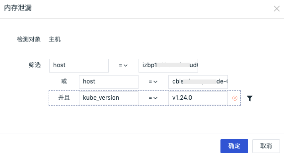
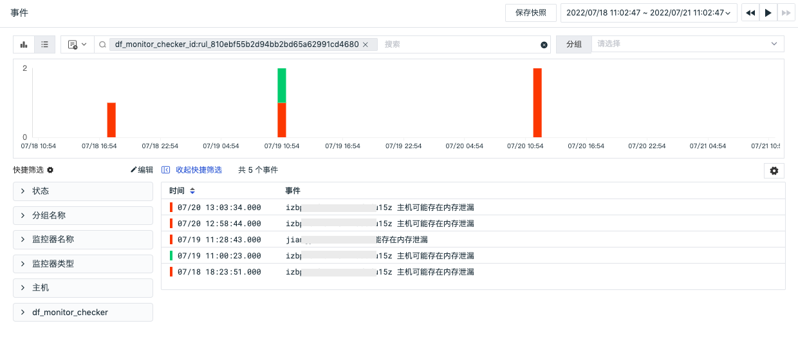

# 内存泄漏
---

## 概述

「内存泄漏」基于内存异常分析检测器，定期对主机进行智能巡检，通过出现内存异常的主机来进行根因分析，确定对应异常时间点的进程和 pod 信息，分析当前工作空间主机是否存在内存泄漏问题。

## 启用/禁用

智能巡检「内存泄漏」默认是「禁用」状态，可手动「启用」，开启后，将对当前工作空间的所有主机进行巡检，支持添加主机筛选条件。

## 编辑

智能巡检「内存泄漏」支持用户手动添加主机筛选条件，在智能巡检列表右侧的操作菜单下，点击「编辑」按钮，即可对巡检模版进行编辑。

- 检测对象：默认为「主机」
- 筛选：支持手动配置`key` 和 `value` 的筛选条件，支持多种筛选方式：
  -  `或` 和 `并且` ：支持根据需求进行多条件筛选
  -  `>` 、`>=` 、`<` 、`<=` 、`=` 、`!=` 、`match` 、`not match` ：同时支持数值和字符串类型的字段筛选

注意：若配置了筛选条件，在未恢复事件/事件详情页的「筛选条件」区域处显示对应的配置文本。

## 查看相关事件

智能巡检基于观测云智能算法，会查找内存指标中的异常情况，如内存使用率突然飙升。对于异常情况，智能巡检会生成相应的事件，在智能巡检列表右侧的操作菜单下，点击「查看相关事件」按钮，即可查看对应异常事件。

点击「事件」，可查看智能巡检事件的详情页。

- 状态：红色代表未恢复，绿色代表已恢复（已解决）
- 时间：异常发生的时间
- 标签属性：点击标签属性如 `host` ，支持复制和查看相关日志、容器、进程、安全巡检、链路、用户访问监测、可用性监测以及 CI 等
- 消息：描述异常巡检事件内容
- 影响：该异常事件的影响，包括智能检测的内存指标异常图表趋势（其中虚线代表提前预测的趋势），内存占用 Top 10 的进程和 Pod 列表，帮助用户快速定位内存异常的原因
- 内置视图：支持手动添加 `tags` 关联的内置视图结合智能巡检进行分析。关于如何配置内置视图可参考文档 [绑定内置视图](../management/built-in-view/bind-view.md) 。

## 常见问题

**1.智能巡检内存泄漏的检测频率**

内存泄漏智能巡检开启后，观测云会按照每 1 小时 1 次的检测频率，巡检过去 6 小时时间范围内主机内存否出现异常，通过根因分析获取出现的异常的进程或者 Pod 。

**2.智能巡检内存泄漏相关的指标集**

基于主机对象`(hostobject)` 和 内存指标`(mem)` 。

**3.在何种情况下会产生内存泄漏智能巡检事件**

通过观测云的智能算法，跟踪 `used_percent`  指标趋势，当指标快速升高、或将要逼近临界值、或触发临界值时会触发巡检事件。

