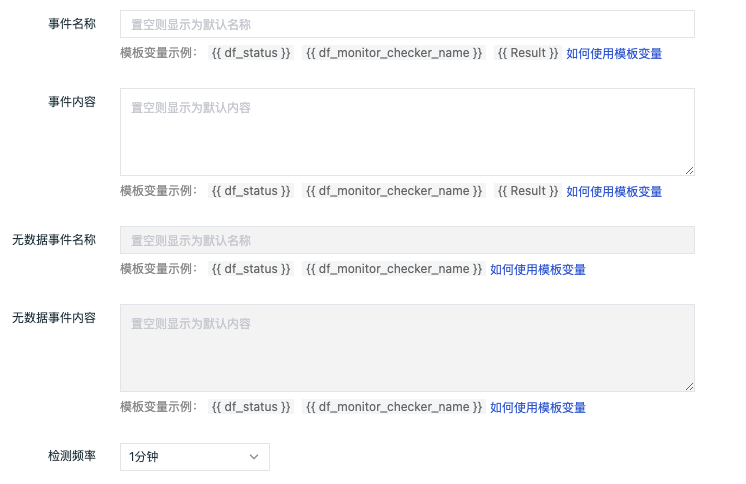

# 应用性能指标检测
---

## 概述

「应用性能指标检测」用于监控工作空间内「应用性能监测」的指标数据，通过设置阈值范围，当指标到达阈值后触发告警。“观测云”支持对单个指标设置告警和自定义告警等级。

## 规则说明

在「监控器」中，点击「+新建监控器」，选择「应用性能指标检测」，进入检测规则的配置页面。

1）**规则名称：**检测规则的名称。

2）**分组**：自定义创建的监测器组合。每个监控器只能归属于一个分组。

3）**关联仪表板：**每一个监控器都支持关联一个仪表板，即通过「关联仪表板」功能能够自定义快速跳转的仪表板。

4）**检测指标：**设置检测数据的指标。支持设置工作空间内全部/单个服务列表中一定时间范围内的指标数据。

| 字段 | 说明 |
| --- | --- |
| 服务 | 支持对当前工作空间内「应用性能监测」的全部/单个服务的指标数据进行监控，支持全选或单选 |
| 指标 | 具体的检测指标，支持设置单个指标，包括请求数、错误请求数、请求错误率、平均每秒请求数、平均响应时间、P50响应时间、P75响应时间、P90响应时间、P99响应时间等 |
| 筛选条件 | 基于指标的标签对检测指标的数据进行筛选，限定检测的数据范围。支持添加一个或多个标签筛选 |
| 维度 | 检测指标的触发维度，即触发对象。任意一个触发对象的指标满足告警条件则触发告警，不支持 int 型字段为触发维度，且最多支持选择三个字段 |
| 时间范围 | 当前检测指标的数据时间范围，默认为 5 分钟 |

5）**触发条件：**设置告警级别的触发条件。

- 告警级别：包含紧急（红色）、重要（橙色）、警告（黄色）、无数据（灰色）、正常（绿色）五个等级，每个等级只能设置一个触发条件。
- 触发条件：基于配置条件判断操作符和检测周期。若查询结果带单位，则提示单位进位后的结果。

**告警级别紧急（红色）、重要（橙色）、警告（黄色）基于配置条件判断操作符，说明如下：**

| 操作符 | 说明 | 支持的判断类型 |
| --- | --- | --- |
| `=` | 等于 | `Integer`、`Float`、`String` |
| `!=` | 不等于 | `Integer`、`Float`、`String` |
| `>=` | 大于等于 | `Integer`、`Float`、`String` |
| `<=` | 小于等于 | `Integer`、`Float`、`String` |
| `>` | 大于 | `Integer`、`Float`、`String` |
| `<` | 小于 | `Integer`、`Float`、`String` |
| `between` | 大于等于且小于等于（闭区间） | `Integer`、`Float`、`String` |

**告警级别无数据（灰色）、正常（绿色）基于配置检测周期，说明如下：**

- 检测周期＝检测频率
- 自定义检测周期＝检测频率 * N

1.无数据（灰色）：无数据状态支持「触发无数据事件」、「触发恢复事件」、「不触发事件」三种配置，需要手动配置无数据处理策略。

检测规则生效后，第一次检测无数据且持续无数据，不产生无数据告警事件；若检测有数据且在配置的自定义检测周期内，数据上报发生断档，则产生无数据告警事件。可参考以下场景：

| 场景 | 最后一次无数据事件 | 最后一次事件状态 | 结果 |
| --- | --- | --- | --- |
| 数据始终正常 | - | - | 数据无断档，正常 |
| 数据发生断档 | - | - | 数据存在断档，产生无数据事件 |
| 数据新上报 | 不存在 | - | 首次上报数据，正常 |
| 数据新上报 | 存在 | 正常 | 重新上报数据，且已经发送过数据恢复上报事件，不再产生告警事件 |
| 数据新上报 | 存在 | 无数据 | 重新上报数据，产生数据恢复上报事件 |
| 始终没有数据 | - | - | 持续无数据，不产生告警事件 |

2.正常（绿色）：检测规则生效后，产生紧急、重要、警告异常事件后，在配置的自定义检测周期内，数据检测结果恢复正常，则产生恢复告警事件。可参考以下场景：
| 场景 | 最后一次事件产生时间 | 结果 |
| --- | --- | --- |
| 从未发生异常 | - | 无恢复事件 |
| 异常已恢复 | 若自定义检测周期为15分钟，最后一次事件产生时间不到15分钟时 | 无恢复事件 |
| 异常已恢复 | 若自定义检测周期为15分钟，最后一次事件产生时间在15分钟时 | 产生恢复事件 |

注意：恢复告警事件不受[告警沉默](../alert-setting.md)限制。若未设置恢复告警事件检测周期，则告警事件不会恢复，且一直会出现在「事件」-「未恢复事件列表」中。

6）**事件名称：**设置告警触发条件的事件名称，支持使用预置的模板变量，详情参考 [模板变量](../event-template.md) 。

7）**事件内容：**设置告警触发条件的事件内容，支持使用预置的模板变量，详情参考 [模板变量](../event-template.md) 。

8）**无数据事件名称：**默认不可填写，当选择触发无数据事件时为可填写无数据事件名称，支持使用预置的模板变量，详情参考 [模板变量](../event-template.md) 。

9）**无数据事件内容：**默认不可填写，当选择触发无数据事件时为可填写无数据事件内容，支持使用预置的模板变量，详情参考 [模板变量](../event-template.md) 。

10）**检测频率：**当前检测规则的执行频率，即检测周期，默认 1 分钟检测一次。
