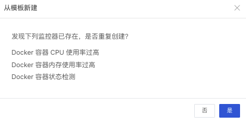

# 监控器
---

观测云支持自建监控器，包括阈值检测、日志检测、突变检测、区间检测、水位监测、安全检测、应用性能指标检测、用户访问指标检测、进程异常检测、基础设施存活检测、可用性监测、网络数据检测。允许用户自定义配置检测规则和触发条件，开启监控器后，即可接收到由检测规则触发的相关异常事件告警。

## 简介

工作空间的全部监控器可通过“观测云”平台的「监控」进行查看和管理。您不仅可以创建新的监控器，还可以对现有告警策略、监控器进行管理、删除、批量操作等。

## 新建监控器

“观测云” 支持您从主机、Docker、Elasticsearch等监控模板快速创建监控器，或自定义新的监控器和触发条件并配置告警。

### 从模板新建

“观测云”内置多种开箱即用的监控模板，支持一键创建主机、Docker、Elasticsearch、Redis、阿里云 RDS、阿里云 SLB、Flink 监控等。即自动添加对应的官方监控器至当前工作空间。详情可参考文档 [模板](../template.md) 。

注意：反复从模板创建监控器会导致监控器列表内出现重复的监控器，“观测云” 支持检测重复的监控器，您可以通过在弹窗提示中选择“是”正常创建模板库中所有的监控器，或选择“否”仅创建不重复的监控器。

### 新建监控器

在监控器中，支持通过「+新建监控器」添加新的监控器，并自定义触发规则。

- [阈值检测](threshold-detection.md)：基于设置的阈值对指标数据进行异常检测，当数据达到阈值时，触发告警并通知用户。
- [日志检测](log-detection.md)：基于工作空间内的日志数据进行异常检测，多适用于 IT 监控场景下的代码异常或任务调度检测等。
- [突变检测](mutation-detection.md)：基于历史数据对指标的突发反常表现进行异常检测，多适用于业务数据、时间窗短的场景。
- [区间检测](interval-detection.md)：基于动态阈值范围对指标的异常数据点进行检测，当数据超出设定的区间范围后，产生告警并通知用户，多适用于趋势稳定时间线的场景。
- [水位检测](water-level-detection.md)：基于历史数据对指标的持续反常表现进行异常检测，可避免突发检测的毛刺告警。
- [安全巡检](security_checker.md)：基于工作空间内安全巡检数据进行异常检测，用于监控工作空间内系统、容器、网络等存在的漏洞、异常和风险。
- [应用性能指标检测](application-performance-detection.md)：基于工作空间内「应用性能监测」的指标数据，当指标到达设置的阈值范围后触发告警。
- [用户访问指标检测](real-user-detection.md)：基于工作空间内「用户访问监测」的指标数据，当指标到达设置的阈值范围后触发告警。
-  [进程异常检测](processes-detection.md)：用于监控工作空间内的进程数据，支持对进程数据的一个或多个字段类型设置触发告警。
- [基础设施存活检测](infrastructure-detection.md)：用于监控基础设施的运行状态。
- [可用性监测数据检测](usability-detection.md)：基于工作空间内的云拨测数据，通过对一定时间段内拨测任务产生的指定数据量设置阈值范围后触发告警。
- [网络数据检测](network-detection.md)：用于监控工作空间内「网络性能监测」的指标数据，通过设置阈值范围，当指标到达阈值后触发告警。

## 告警策略管理

告警策略功能支持您在设定监控器时，自定义创建有意义的监测器组合，支持通过「告警策略」筛选出对应监控器，方便告警策略管理各项监控器。
注意：

- 每个监控器创建时必须选择一个告警策略，默认选中「默认」；
- 当某个告警策略被删除时，删除告警策略下的监控器将自动归类到「默认」下。

### 新建告警策略

在观测云工作空间「监控」-「告警策略管理」，点击「新建告警策略」即可添加新的告警策略。可以为告警策略配置告警对象和告警沉默。更多详情可参考文档 [告警策略](../alert-setting.md) 。

### 配置监视器告警策略

创建告警策略以后，可以为监视器选择告警策略。在观测云工作空间「监控」-「监控器」，点击「新建监控器」，即可在创建监控器时选择告警策略。

## 监控器列表

「监控器」列表中，保存有当前工作空间内的全部监控器。支持查看监控器名称、 告警策略、状态、操作和是否被添加到 SLO 的 SLI 目标列表中。被添加至 SLO 作为 SLI 的监控器将以特殊标识展示。

### 查询

监控器列表支持基于监控器名称、告警策略名称进行搜索。

- 搜索框🔍，支持监控器名称、告警策略名称搜索；
- 选择「告警策略」支持基于指定告警策略筛选出对应监控器。

### 批量操作

「批量操作」功能支持用户在 监控器列表中  “批量导出监控器” 和 “批量删除监控器”。通过选定批量操作，您可以同时选定多个监控器进行删除和导入。

### 导入/导出监控器

在「监控器」中支持「导入/导出监控器」，即通过导入/导出监控器配置 json 文件的方式创建监控器。导入的json文件将直接导入为监控器，并默认分组。

**注意**：导入的 json 文件需要是来自“观测云”的配置json文件。

## 操作说明
| **操作** | **说明** |
| --- | --- |
| 状态 | 当前监控器的状态，共 已启用/禁用 两种状态，可以通过操作栏来启用或禁用监控器; |
| 启动/禁用 | 观测云支持启用/禁用已有的监控器。新建的监控器将默认启动，您可以「禁用」监控器，或重新「启动」被禁用的监控器。 **注意**：「禁用」的监控器将不再生效；被禁用的监控器可以通过「启用」重新开启。 |
| 测试 | 观测云支持手动触发监控器检测。若当前检测规则触发，你可以在事件查看器查看相关详情。 **注意**：为了方便进行监控器的测试，手工触发的事件不受到【告警沉默】影响（即只要是手工触发的，一定会发送告警通知）。 【静默规则】不受影响，被指定为静默的对象依然会被跳过 |
| 编辑 | “观测云”支持对已有的监控器进行重新编辑，通过点击监控器名称或「编辑」即可对监控器的触发条件进行重新编辑。 |
| 删除 | “观测云”支持对已有的监控器进行「删除」。当不需要某个监控器时，可以通过「删除」按钮删除对应监控器。 **注意**：一旦删除监控器，将无法恢复监控器数据，事件数据仍做保留。 |
| 查看相关事件 | 由同一监控器触发的告警事件统一存储在对应「监控器」下，通过「查看相关事件」操作，可直接跳转由该规则触发的全部未恢复事件，详情可参考 [事件管理](../../events/explorer.md) 。 |
| 查看相关视图（关联仪表板） | 每一个监控器都支持关联一个仪表板，编辑监控器，即可通过「关联仪表板」功能关联对应所需的仪表板。 |
