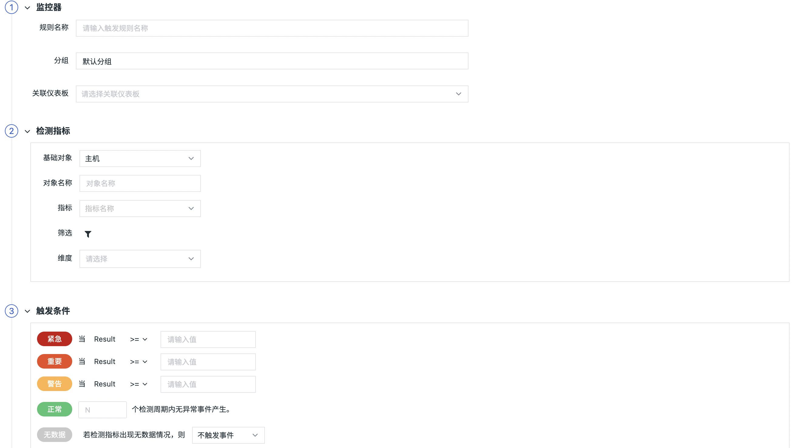

# 基础设施对象检测
---

## 概述

「基础设施对象检测」用于监控工作空间内的基础设施对象数据，基础设施对象支持选择：主机、容器、进程、Pod、Deployment、Replicaset、Job、自定义对象。支持对基础设施对象数据的一个或多个字段类型设置触发告警，如：你可以基于进程数据中 ‘host’ 字段为 ‘izaqbin’ 并且 ‘state’ 的字段为 ‘sleep’ 出现的次数设置告警。

## 规则说明

在「监控器」中，点击「+新建监控器」，选择「基础设施对象监控」，进入检测规则的配置页面。

1）**规则名称：**检测规则的名称。

2）**分组**：自定义创建的监测器组合。每个监控器只能归属于一个分组。

3）**关联仪表板：**每一个监控器都支持关联一个仪表板，即通过「关联仪表板」功能能够自定义快速跳转的仪表板。

4）**检测指标：**设置检测的指标数据。支持设置当前工作空间内基础设施对象数据中一个或多个字段类型关键词在一定时间范围内出现的次数。

| 字段 | 说明 |
| --- | --- |
| 基础对象 | 选择基础对象，包括：主机、容器、进程、Pod、Deployment、Replicaset、Job、自定义对象 |
| 对象名称 | 输入对象名称，进行wildcard搜索 |
| 指标 | 基于基础设施对象获取的指标列表， **主机**（包括CPU使用率、MEM使用率、系统负载、主机数量等） **容器**（包括容器CPU使用率、容器内存使用量、容器内存使用率、内存分配失败的次数、接收总字节数、发送总字节数、容器数量等） **进程**（包括CPU使用占比、内存使用占比、进程数量等） **Deployment**（包括Pod可用数、不可用的Pod数、非终止Pod数、Deployment数量等） **Job**（包括Pod成功数、Pod失败数、执行成功数、执行失败数、Job数量等） **replicaset**（包括就绪副本数、可用副本数、Replicaset数量等） **Pod**（包括集群CPU使用率、集群内存使用量、容器重启次数、Pod阶段、就绪pod数、Pod数量等） |
| 筛选条件 | 支持对基础设施对象数据的字段进行筛选，限定检测的数据范围。支持添加一个或多个标签筛选 |
| 维度 | 检测指标的触发维度，即触发对象。任意一个触发对象的指标满足告警条件则触发告警，不支持 int 型字段为触发维度，且最多支持选择三个字段 |
| 时间范围 | 当前检测指标的数据时间范围，默认为 5 分钟 |

**指标说明**

| 基础对象 | 指标 | DQL |
| --- | --- | --- |
| 主机 | CPU使用率 | O::`HOST`:(LAST(`cpu_usage`)) |
|  | MEM使用率 | O::`HOST`:(LAST(`mem_used_percent`)) |
|  | 系统负载 | O::`HOST`:(LAST(`load`)) |
|  | 主机数量 | O::`HOST`:(COUNT(`__docid`)) |
| 容器 | 容器CPU使用率 | O::`docker_containers`:(LAST(`cpu_usage`)) |
|  | 容器内存使用量 | O::`docker_containers`:(LAST(`mem_usage`)) |
|  | 容器内存使用率 | O::`docker_containers`:(LAST(`mem_used_percent`)) |
|  | 内存分配失败的次数 | O::`docker_containers`:(SUM(`mem_failed_count`)) |
|  | 接收总字节数 | O::`docker_containers`:(SUM(`network_bytes_rcvd`)) |
|  | 发送总字节数 | O::`docker_containers`:(SUM(`network_bytes_sent`)) |
|  | 容器数量 | O::`docker_containers`:(COUNT(`__docid`)) |
| 进程 | CPU使用占比 | O::`host_processes`:(LAST(`cpu_usage`)) |
|  | 内存使用占比 | O::`host_processes`:(LAST(`mem_used_percent`)) |
|  | 进程数量 | O::`host_processes`:(COUNT(`__docid`)) |
| Deployment | Pod可用数 | O::`kubernetes_deployments`:(SUM(`available`)) |
|  | 不可用的Pod数 | O::`kubernetes_deployments`:(SUM(`unavailable`)) |
|  | 非终止Pod数 | O::`kubernetes_deployments`:(SUM(`up_dated`)) |
|  | Deployment数量 | O::`kubernetes_deployments`:(COUNT(`__docid`)) |
| Job | Pod成功数 | O::`kubernetes_jobs`:(SUM(`succeeded`)) |
|  | Pod失败数 | O::`kubernetes_jobs`:(SUM(`failed`)) |
|  | 执行成功数 | O::`kubernetes_jobs`:(SUM(`completion_succeeded`)) |
|  | 执行失败数 | O::`kubernetes_jobs`:(SUM(`completion_failed`)) |
|  | Job数量 | O::`kubernetes_jobs`:(COUNT(`__docid`)) |
| replicaset | 就绪副本数 | O::`kubernetes_replica_sets`:(SUM(`ready`)) |
|  | 可用副本数 | O::`kubernetes_replica_sets`:(SUM(`available`)) |
|  | Replicaset数量 | O::`kubernetes_replica_sets`:(COUNT(`__docid`)) |
| Pod | 集群CPU使用率 | O::`kubelet_pod`:(Last(`cpu_usage`)) |
|  | 集群内存使用量 | O::`kubelet_pod`:(SUM(`memory_usage_bytes`)) |
|  | 容器重启次数 | O::`kubelet_pod`:(SUM(`restarts`)) |
|  | Pod阶段 | O::`kubelet_pod`:(LAST(`phase`)) |
|  | 就绪pod数 | O::`kubelet_pod`:(SUM(`ready`)) |
|  | Pod数量 | O::`kubelet_pod`:(COUNT(`__docid`)) |

5）**触发条件：**设置告警级别的触发条件。

- 告警级别：包含紧急（红色）、重要（橙色）、警告（黄色）、无数据（灰色）、正常（绿色）五个等级，每个等级只能设置一个触发条件。
- 触发条件：基于配置条件判断操作符和检测周期。若查询结果带单位，则提示单位进位后的结果。

**告警级别紧急（红色）、重要（橙色）、警告（黄色）基于配置条件判断操作符，说明如下：**

| 操作符 | 说明 | 支持的判断类型 |
| --- | --- | --- |
| `=` | 等于 | `Integer`、`Float`、`String` |
| `!=` | 不等于 | `Integer`、`Float`、`String` |
| `>=` | 大于等于 | `Integer`、`Float`、`String` |
| `<=` | 小于等于 | `Integer`、`Float`、`String` |
| `>` | 大于 | `Integer`、`Float`、`String` |
| `<` | 小于 | `Integer`、`Float`、`String` |
| `between` | 大于等于且小于等于（闭区间） | `Integer`、`Float`、`String` |

**告警级别无数据（灰色）、正常（绿色）基于配置检测周期，说明如下：**

- 检测周期＝检测频率
- 自定义检测周期＝检测频率 * N

1.无数据（灰色）：无数据状态支持「触发无数据事件」、「触发恢复事件」、「不触发事件」三种配置，需要手动配置无数据处理策略。

检测规则生效后，第一次检测无数据且持续无数据，不产生无数据告警事件；若检测有数据且在配置的自定义检测周期内，数据上报发生断档，则产生无数据告警事件。可参考以下场景：

| 场景 | 最后一次无数据事件 | 最后一次事件状态 | 结果 |
| --- | --- | --- | --- |
| 数据始终正常 | - | - | 数据无断档，正常 |
| 数据发生断档 | - | - | 数据存在断档，产生无数据事件 |
| 数据新上报 | 不存在 | - | 首次上报数据，正常 |
| 数据新上报 | 存在 | 正常 | 重新上报数据，且已经发送过数据恢复上报事件，不再产生告警事件 |
| 数据新上报 | 存在 | 无数据 | 重新上报数据，产生数据恢复上报事件 |
| 始终没有数据 | - | - | 持续无数据，不产生告警事件 |

2.正常（绿色）：检测规则生效后，产生紧急、重要、警告异常事件后，在配置的自定义检测周期内，数据检测结果恢复正常，则产生恢复告警事件。可参考以下场景：

| 场景 | 最后一次事件产生时间 | 结果 |
| --- | --- | --- |
| 从未发生异常 | - | 无恢复事件 |
| 异常已恢复 | 若自定义检测周期为15分钟，最后一次事件产生时间不到15分钟时 | 无恢复事件 |
| 异常已恢复 | 若自定义检测周期为15分钟，最后一次事件产生时间在15分钟时 | 产生恢复事件 |

注意：恢复告警事件不受[告警沉默](../alert-setting.md)限制。若未设置恢复告警事件检测周期，则告警事件不会恢复，且一直会出现在「事件」-「未恢复事件列表」中。

6）**事件名称：**设置告警触发条件的事件名称，支持使用预置的模板变量，详情参考 [模板变量](../event-template.md) 。

7）**事件内容：**设置告警触发条件的事件内容，支持添加链接并点击打开新页跳转，支持使用预置的模板变量，详情参考 [模板变量](../event-template.md) 。

8）**无数据事件名称：**默认不可填写，当选择触发无数据事件时为可填写无数据事件名称，支持使用预置的模板变量，详情参考 [模板变量](../event-template.md) 。

9）**无数据事件内容：**默认不可填写，当选择触发无数据事件时为可填写无数据事件内容，支持使用预置的模板变量，详情参考 [模板变量](../event-template.md) 。

10）**检测频率：**当前检测规则的执行频率，即检测周期，默认 1 分钟检测一次。
