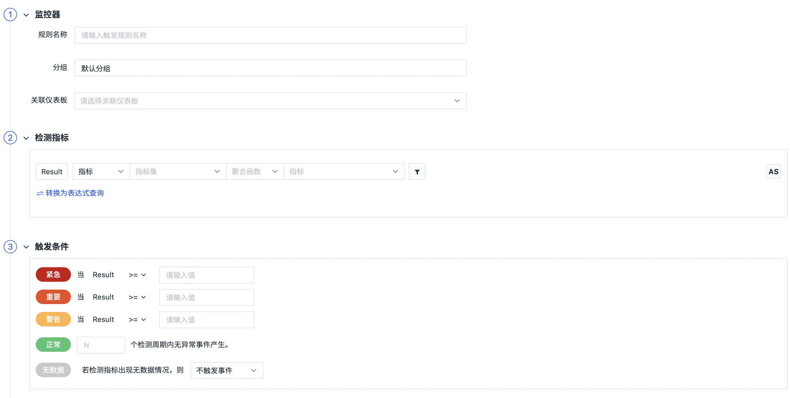

# 阈值检测
---

## 概述

阈值检测用于监控指标数据异常，用户可设置阈值范围，当指标到达阈值后触发告警并通知用户。支持同时检测多个指标数据并设定告警级别。

## 规则说明

在「监控器」中，点击「+新建监控器」，选择「阈值检测」，进入阈值检测规则配置页面。

1）**规则名称：**检测规则的名称。

2）**分组**：自定义创建的监测器组合。每个监控器只能归属于一个分组。

3）**关联仪表板：**每一个监控器都支持关联一个仪表板，即通过「关联仪表板」功能能够自定义快速跳转的仪表板。

4）**检测指标：**设置检测的数据，支持自定义检测指标名称。

| 字段 | 说明 |
| --- | --- |
| 检测对象 | 当前检测的对象，支持检测「指标」、「日志」、「基础设施」、「自定义对象」、「应用性能监测」、「用户访问监测」、「安全巡检」和「网络」等检测对象 |
| 指标集 | 当前检测指标所在的指标集 |
| 指标 | 当前检测所针对的指标 |
| 聚合算法 | 包含Last（取最后一个值）、First by（取第一个值）、Avg by（取平均值）、Min by（取最小值）、Max by（取最大值）、Sum by（求和）、Count by（取数据点数）、Count_distinct by（取非重复的数据点数）、p50(取中位数值)、p75（取处于75%位置的值）、p90（取处于90%位置的值）、p99(取处于99%位置的值) |
| 触发维度 | 检测维度决定着检测规则基于哪个维度触发，即触发对象。“观测云”支持添加多个检测维度，任意一个检测维度的指标满足告警条件则触发告警，不支持 int 型字段为触发维度，且最多支持选择三个字段。当检测对象为“日志”：<li>触发维度由当前数据来源决定<li>数据来源选择“*”时，默认以“status”，“host”，“service”，“source”，“filename”为触发维度 |
| 筛选条件 | 基于指标的标签对检测指标的数据进行筛选，限定检测的数据范围，支持添加一个或多个标签筛选 |
| 别名 | 自定义检测指标名称 |
| 查询方式 | 支持简单查询和表达式查询，详情参考 [查询](https://www.yuque.com/dataflux/doc/cxlbps) |
| 时间范围 | 当前检测指标的数据时间范围，默认为 15 分钟 |

5）**触发条件：**设置告警级别的触发条件。

- 告警级别：包含紧急（红色）、重要（橙色）、警告（黄色）、无数据（灰色）、正常（绿色）五个等级，每个等级只能设置一个触发条件。
- 触发条件：基于配置条件判断操作符和检测周期。若查询结果带单位，则提示单位进位后的结果。

**告警级别紧急（红色）、重要（橙色）、警告（黄色）基于配置条件判断操作符，说明如下：**

| 操作符 | 说明 | 支持的判断类型 |
| --- | --- | --- |
| `=` | 等于 | `Integer`、`Float`、`String` |
| `!=` | 不等于 | `Integer`、`Float`、`String` |
| `>=` | 大于等于 | `Integer`、`Float`、`String` |
| `<=` | 小于等于 | `Integer`、`Float`、`String` |
| `>` | 大于 | `Integer`、`Float`、`String` |
| `<` | 小于 | `Integer`、`Float`、`String` |
| `between` | 大于等于且小于等于（闭区间） | `Integer`、`Float`、`String` |
| `match` | 检测值中包含 | `String` |
| `not match` | 检测值中不包含 | `String` |
| `isTure` | 检测值为`true` | `Boolean` |
| `isFalse` | 检测值为`false` | `Boolean` |
| `likeTrue` | 检测值为`true`、`"true"`、`“yes”`都可以认定为真的值 | `Integer`、`Float`、`String`、
`Boolean` |
| `likeFalse` | 检测值为`false`、`"false"`、`“no”`都可以认定为假的值 | `Integer`、`Float`、`String`、`Boolean` |

`likeTrue`和`likeFalse`真值表如下：

| 值 | 类型 | 判定为 | 示例 |
| --- | --- | --- | --- |
| `true` | `Boolean` | `true` | `true` |
| `false` | `Boolean` | `false` | `false` |
| 大于0的数字 | `Integer`、`Float` | `true` | `1` |
| 小于等于0的数字 | `Integer`、`Float` | `false` | `0` |
| 转换为小写后值为`"true"`字符串 | `String` | `true` | `"True"` |
| 转换为小写后值为`"yes"`字符串 | `String` | `true` | `"Yes"` |
| 转换为小写后值为`"ok"`字符串 | `String` | `true` | `"OK"` |
| 转换为小写后值为`"on"`字符串 | `String` | `true` | `"ON"` |
| 转换为小写后值为`"1"`字符串 | `String` | `true` | `"1"` |
| 转换为小写后值为`"o"`字符串 | `String` | `true` | `"o"` |
| 转换为小写后值为`"y"`字符串 | `String` | `true` | `"y"` |
| 转换为小写后值为`"false"`字符串 | `String` | `false` | `"False"` |
| 转换为小写后值为`"no"`字符串 | `String` | `false` | `"No"` |
| 转换为小写后值为`"ng"`字符串 | `String` | `false` | `"NG"` |
| 转换为小写后值为`"off"`字符串 | `String` | `false` | `"OFF"` |
| 转换为小写后值为`"0"`字符串 | `String` | `false` | `"0"` |
| 转换为小写后值为`"x"`字符串 | `String` | `false` | `"x"` |
| 转换为小写后值为`"n"`字符串 | `String` | `false` | `"n"` |

注意：满足以上场景才会被判定满足真假条件，其他场景不匹配，即不会产生告警。

**告警级别无数据（灰色）、正常（绿色）基于配置检测周期，说明如下：**

- 检测周期＝检测频率
- 自定义检测周期＝检测频率 * N

1.无数据（灰色）：无数据状态支持「触发无数据事件」、「触发恢复事件」、「不触发事件」三种配置：

- 指标类数据监控器配置时，需要手动配置无数据处理策略；
- 日志类数据监控器配置时，默认选择「触发恢复事件」策略，不需要做无数据的配置，获取「正常」条件处的周期作为无数据恢复事件周期；
- 阈值（仅指标数据）支持手动配置无数据策略，若选中了非指标类数据，则自动适配日志类数据无数据策略，无需手动选择。

检测规则生效后，第一次检测无数据且持续无数据，不产生无数据告警事件；若检测有数据且在配置的自定义检测周期内，数据上报发生断档，则产生无数据告警事件。可参考以下场景：

| 场景 | 最后一次无数据事件 | 最后一次事件状态 | 结果 |
| --- | --- | --- | --- |
| 数据始终正常 | - | - | 数据无断档，正常 |
| 数据发生断档 | - | - | 数据存在断档，产生无数据事件 |
| 数据新上报 | 不存在 | - | 首次上报数据，正常 |
| 数据新上报 | 存在 | 正常 | 重新上报数据，且已经发送过数据恢复上报事件，不再产生告警事件 |
| 数据新上报 | 存在 | 无数据 | 重新上报数据，产生数据恢复上报事件 |
| 始终没有数据 | - | - | 持续无数据，不产生告警事件 |

2.正常（绿色）：检测规则生效后，产生紧急、重要、警告异常事件后，在配置的自定义检测周期内，数据检测结果恢复正常，则产生恢复告警事件。可参考以下场景：

| 场景 | 最后一次事件产生时间 | 结果 |
| --- | --- | --- |
| 从未发生异常 | - | 无恢复事件 |
| 异常已恢复 | 若自定义检测周期为15分钟，最后一次事件产生时间不到15分钟时 | 无恢复事件 |
| 异常已恢复 | 若自定义检测周期为15分钟，最后一次事件产生时间在15分钟时 | 产生恢复事件 |

注意：恢复告警事件不受[告警沉默](https://www.yuque.com/dataflux/doc/qxz5xz#WsTxH)限制。若未设置恢复告警事件检测周期，则告警事件不会恢复，且一直会出现在「事件」-「未恢复事件列表」中。

6）**事件名称：**设置告警触发条件的事件名称，支持使用预置的模板变量，详情参考 [模版变量](https://www.yuque.com/dataflux/doc/zvayo3) 。

7）**事件内容：**设置告警触发条件的事件内容，支持使用预置的模板变量，详情参考 [模版变量](https://www.yuque.com/dataflux/doc/zvayo3) 。

8）**无数据事件名称：**默认不可填写，当选择触发无数据事件时为可填写无数据事件名称，支持使用预置的模板变量，详情参考 [模版变量](https://www.yuque.com/dataflux/doc/zvayo3) 。

9）**无数据事件内容：**默认不可填写，当选择触发无数据事件时为可填写无数据事件内容，支持使用预置的模板变量，详情参考 [模版变量](https://www.yuque.com/dataflux/doc/zvayo3) 。

10）**检测频率：**当前检测规则的执行频率，即检测周期，默认 1 分钟检测一次。

---

观测云是一款面向开发、运维、测试及业务团队的实时数据监测平台，能够统一满足云、云原生、应用及业务上的监测需求，快速实现系统可观测。**立即前往观测云，开启一站式可观测之旅：**[www.guance.com](https://www.guance.com)

