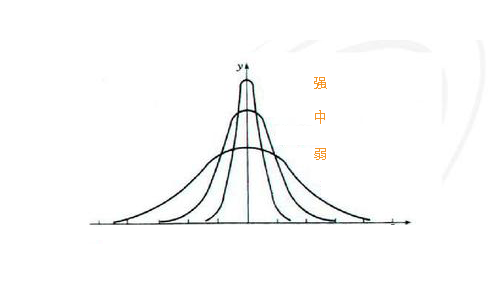

# 水位检测
---

## 概述

水位检测基于历史数据对指标的持续反常表现进行异常检测，可避免突发检测的毛刺告警。

## 规则说明

在「监控器」中，点击「+新建监控器」，选择「水位检测」，进入水位检测规则配置页面。

### 步骤1.基本信息

1）**规则名称：**检测规则的名称。

2）**关联仪表板：**每一个监控器都支持关联一个仪表板，即通过「关联仪表板」功能能够自定义快速跳转的仪表板（监控器关联的仪表板，支持快速跳转查看监控视图）。

### 步骤2.检测配置

3）**检测频率：**检测规则的执行频率，包含1m/5m/15/30m/1h/6h（默认选中5m）。

4）**检测区间：**下拉选项与检测频率有联动，支持用户自定义。

| 检测频率 | 检测区间（下拉可选项） | 自定义区间限制 |
| --- | --- | --- |
| 1m | 1m/5m/15m/30m/1h/3h | <=3h |
| 5m | 5m/15m/30m/1h/3h | <=3h |
| 15m | 15m/30m/1h/3h/6h | <=6h |
| 30m | 30m/1h/3h/6h | <=6h |
| 1h | 1h/3h/6h/12h/24h | <=24h |
| 6h | 6h/12h/24h | <=24h |

5）**检测指标：**监控的指标数据，每次只允许检测一个指标。

| 字段 | 说明 |
| --- | --- |
| 检测指标 | 当前检测的指标，即「Result」，支持检测指标数据 |
| 指标集 | 当前检测指标所在的指标集 |
| 指标 | 当前检测所针对的指标 |
| 聚合周期 | 当前检测指标的数据聚合周期，默认为 1 分钟 |
| 聚合算法 | 包含Last（取最后一个值）、First by（取第一个值）、Avg by（取平均值）、Min by（取最小值）、Max by（取最大值）、Sum by（求和）、Count by（取数据点数）、Count_distinct by（取非重复的数据点数）、p50(取中位数值)、p75（取处于75%位置的值）、p90（取处于90%位置的值）、p99(取处于99%位置的值) |
| 触发维度 | 检测维度决定着检测规则基于哪个维度触发，即触发对象。“观测云”支持添加多个检测维度，任意一个检测维度的指标满足告警条件则触发告警，不支持 int 型字段为触发维度，且最多支持选择三个字段 |
| 筛选条件 | 基于指标的标签对检测指标的数据进行筛选，限定检测的数据范围，支持添加一个或多个标签筛选，支持模糊匹配和模糊不匹配的筛选条件。 |
| 查询方式 | 支持简单查询和表达式查询，详情参考 [查询](../../scene/visual-chart/chart-query.md) |

6）**触发条件：**设置告警级别的触发条件。

配置触发条件及严重程度，当查询结果为多个值时，任一值满足触发条件则产生事件。

**告警级别紧急（红色）、重要（橙色）、警告（黄色）基于周期范围、突变次数、突变方向以及突变强度，说明如下：**

- 周期范围：设置统计几个聚合周期的数据情况，一个聚合周期相当于折线图中的一个数据点。
- 突变方向：包含向上（数据升高）、向下（数据下降）、向上或向下三种检测标准。
- 突变强度：根据向上或向下的数据突破程度分为强、中、弱三个等级（如图所示）

**告警级别无数据（灰色）、正常（绿色）基于配置检测周期，说明如下：**

- 每执行一次检测任务即为1个检测周期，如【检测频率 = 5 分钟】，则一个检测周期 = 5 分钟
- 可以自定义检测周期，如【检测频率 = 5 分钟】，则 3 个检测周期 = 15 分钟

1.无数据（灰色）：无数据状态支持「触发无数据事件」、「触发恢复事件」、「不触发事件」三种配置，需要手动配置无数据处理策略。

检测规则生效后，第一次检测无数据且持续无数据，不产生无数据告警事件；若检测有数据且在配置的自定义检测周期内，数据上报发生断档，则产生无数据告警事件。可参考以下场景：

| 场景 | 最后一次无数据事件 | 最后一次事件状态 | 结果 |
| --- | --- | --- | --- |
| 数据始终正常 | - | - | 数据无断档，正常 |
| 数据发生断档 | - | - | 数据存在断档，产生无数据事件 |
| 数据新上报 | 不存在 | - | 首次上报数据，正常 |
| 数据新上报 | 存在 | 正常 | 重新上报数据，且已经发送过数据恢复上报事件，不再产生告警事件 |
| 数据新上报 | 存在 | 无数据 | 重新上报数据，产生数据恢复上报事件 |
| 始终没有数据 | - | - | 持续无数据，不产生告警事件 |

2.正常（绿色）：检测规则生效后，产生紧急、重要、警告异常事件后，在配置的自定义检测周期内，数据检测结果恢复正常，则产生恢复告警事件。可参考以下场景：

| 场景 | 最后一次事件产生时间 | 结果 |
| --- | --- | --- |
| 从未发生异常 | - | 无恢复事件 |
| 异常已恢复 | 若自定义检测周期为15分钟，最后一次事件产生时间不到15分钟时 | 无恢复事件 |
| 异常已恢复 | 若自定义检测周期为15分钟，最后一次事件产生时间在15分钟时 | 产生恢复事件 |

注意：恢复告警事件不受[告警沉默](../alert-setting.md)限制。若未设置恢复告警事件检测周期，则告警事件不会恢复，且一直会出现在「事件」-「未恢复事件列表」中。

### 步骤3.事件通知

7）**事件标题：**设置告警触发条件的事件名称，支持使用预置的模板变量，详情参考 [模板变量](../event-template.md) 。

8）**事件内容：**设置告警触发条件的事件内容，支持添加链接并点击打开新页跳转，支持使用预置的模板变量，详情参考 [模板变量](../event-template.md) 。

9）**告警策略：**监控满足触发条件后，立即发送告警消息给指定的通知对象。告警策略中包含需要通知的事件等级、通知对象、以及告警沉默周期。
