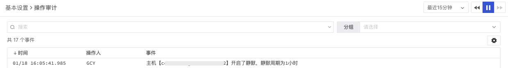

# 静默管理
---

## 简介

“静默管理”是对当前空间的全部静默规则进行管理。“观测云”提供了三种静默类型，包括主机静默、监控器静默、告警策略静默，支持对不同的主机、监控器、告警策略进行静默管理，使静默对象在静默时间内不向任一告警通知对象发送告警通知。

## 新建静默规则

点击「新建静默规则」，您可以对不同的主机、监控器、告警策略进行静默配置，包括设置静默范围、静默时间、静默通知对象、通知内容、通知时间等。

- 静默类型：“观测云” 提供了三种静默类型，包括主机、监控器、告警策略

  | 类型 | 说明 |
  | --- | --- |
  | 主机 | 主机静默是对一台或多台主机设置告警沉默。被设置为“告警沉默”的主机将在静默时间范围内，不发送告警通知 |
  | 监控器 | 监控器静默是对一个或多个监控器设置告警沉默。被设置为“告警沉默”的监控器在静默时间范围内，不发送告警通知。 |
  | 告警策略 | 告警策略静默是对单个告警策略设置告警沉默。被设置为“告警沉默”的[告警策略](monitor/monitor-management.md)，相关监控器在静默时间范围内不发送告警通知。 |

- 静默范围：静默范围是在静默任务中设置为“停止发送告警通知的监控对象”。支持选定相关的主机、监控器或告警策略作为静默对象，由静默对象产生的告警将不会发送给对应告警通知人。
- 静默时间：支持用户自定义告警静默的开始时间和结束时间，在设定的时间范围内将不发送告警信息，支持快速设定为1小时/6小时/12小时/1天/1周/永久。

- 通知对象：每一个静默任务都可以配置相关的通知对象，支持为静默规则的产生和修改配置一个或多个通知对象。可通过邮件、机器人（企业微信、钉钉、飞书）、Webhook设置[通知对象](../management/notify-object.md)。
- 通知内容：设定通知对象后，您需要自定义相关的通知内容以确保被通知人能够了解静默详情，最多可包含256个字符。
- 通知时间：设定通知对象后，您需要设定触发通知的时间，支持设定立刻、静默开始前15分钟、静默开始前30分钟、静默开始前1小时触发通知行为。

## 规则管理

空间内的全部静默规则可通过「监控」-「静默管理」进行统一管理，您可以快速查看静默规则的类型、静默范围、静默时间和操作人，并对静默规进行搜索、编辑、删除、禁用/启用。

注意：静默规则管理列表仅显示未过期的静默规则。

- 搜索：支持基于静默范围的关键字搜索相关静默任务
- 编辑：支持通过「编辑」对静默任务进行重新编辑
- 删除：支持「删除」静默任务，被删除的静默范围将会恢复告警状态
- 禁用/启用：支持「禁用/启用」静默任务
   - 启用：静默规则按照正常流程执行
   - 禁用：静默规则不生效；若有设置静默通知策略，选择的是开始前“xx分钟”且静默通知操作还未执行的情况下，通知不会执行
   - 禁用/启用：都会产生操作审计事件，可在观测云工作空间「管理」-「基本设置」下的操作审计进行查看

## 静默规则示例

以主机静默为例，对主机设置告警静默，并配置通知策略信息。

根据设置通知策略信息，可以收到对应的静默规则设置邮件。

