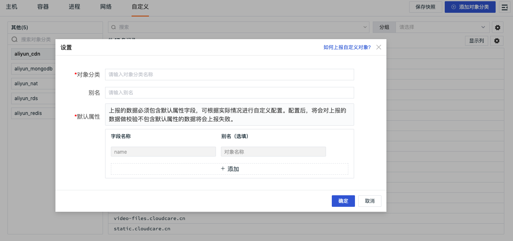

# 如何采集自定义对象
---

## 简介

除了主机、容器、进程以外，“观测云” 支持您自定义新的对象分类并上报相关对象数据到“观测云” 控制台。通过「基础设施」的「自定义」，您可以查看上报到工作空间的全部“自定义对象”数据。

## 前置条件

- 安装 DataKit（[DataKit 安装文档](../datakit/datakit-install.md)）
- 安装 DataFlux Func ([DataFlux Func 安装文档](../dataflux-func/quick-start.md)）
- 连接 DataFlux Func 和 DataKit ([连接并操作DataKit](../dataflux-func/connect-to-datakit.md)）

## 方法/步骤

### Step1：添加自定义对象分类

在观测云工作空间，通过 「基础设施」-「自定义」-「添加对象分类」，您可以创建新的对象分类，并自定义对象分类名称和对象字段。

- 对象分类：自定义对象的分类名称，即进行自定义对象数据上报时的 “对象分类名称”。在数据上报时，您需要使 **“对象分类名称”与数据上报时的命名保持一致。**
- 别名：对当前对象分类添加别名，即当前对象分类在自定义对象列表显示的名称。
- 默认属性：添加对象需要的自定义字段及字段别名，默认添加对象的`name`字段。在进行数据上报时，自定义字段为该对象分类下进行数据上报时的必填字段。

**注意：**

1. 「默认属性」中的自定义字段，均为通过数据上报时的必填字段，若上报的数据缺失必填字段，该数据将无法上报到观测云工作空间
2. 若上报的数据包含必填字段且包括其他的字段，非必填字段显示为数据标签。
3. 若上报的数据类型与定义的字段数据类型不符，该数据无法上报到观测云工作空间。如：在 DataFlux Func 中定义了字段类型是字符型，上报的时候数据类型为整型，该数据将无法上报到观测云工作空间。

更多详情可参考帮助文档 [自定义对象分类](../infrastructure/custom/index.md) 。

### Step2：自定义上报对象数据

添加完自定义对象分类以后，即可进行自定义数据上报。进行自定义对象数据上报时，需要先安装并连通 DataKit 和 DataFlux Func，再通过 DataFlux Func 上报数据到 DataKit，最终通过 DataKit 上报数据到观测云工作空间。

具体操作过程可参考文档 [自定义对象数据上报](../infrastructure/custom/data-reporting.md) 。
