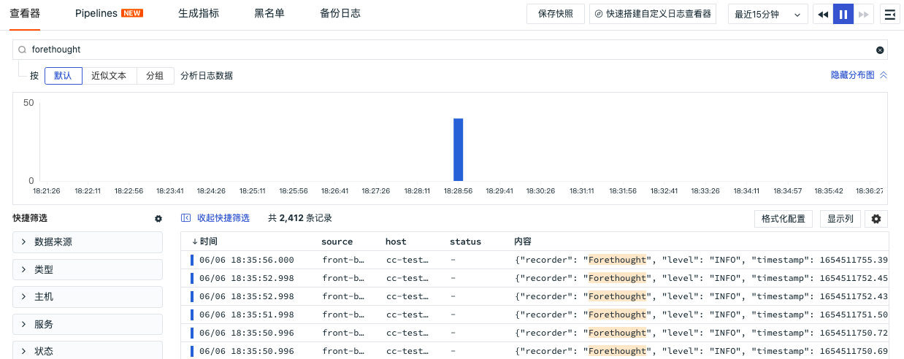
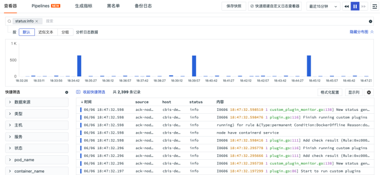
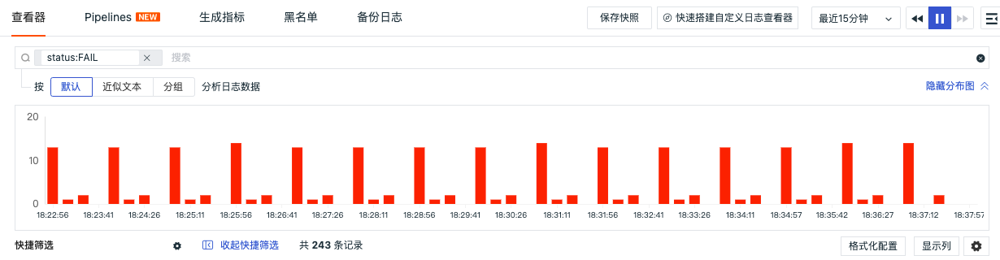
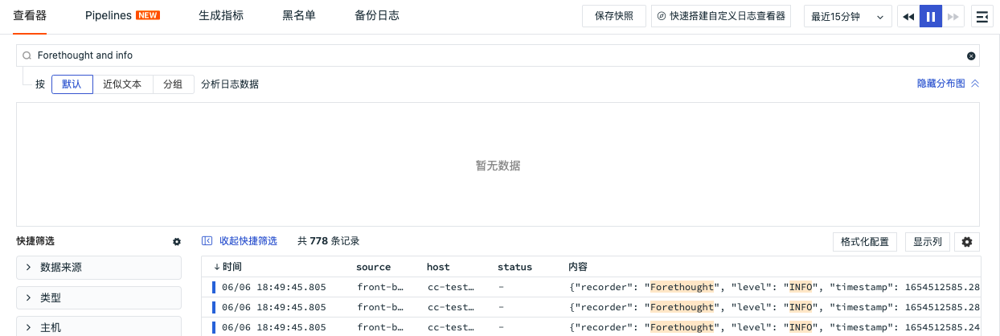

# 查看器搜索说明
---

事件、基础设施、日志、应用性能监测、用户访问监测、可用性监测、安全巡检等查看器搜索栏合并搜索和筛选功能，支持字段、文本进行关键字搜索、字段筛选和关联搜索。

- 关键字搜索：支持通配符进行模糊搜索，如在日志搜索栏输入“关键字A”，返回含“关键字A”的搜索结果；如在日志搜索栏输入“关键字A*”，返回关键字含“关键字A”的搜索结果；

- 字段筛选：支持按照“字段:值”的方式进行筛选，支持添加标签并按照“标签:值”的方式进行精确筛选或模糊筛选，如在日志搜索栏输入“status:”，可自动下拉选择对应的值如“info”进行精确查询，查询结果返回所有状态为info的筛选结果；在日志搜索栏输入“status:in*”，并选择wildcard查询可基于包含in的变量进行模糊查询。

在搜索栏，点击“字段:值”，支持对“字段:值”进行修改。

- 关联搜索：支持按照 AND/OR/NOT 逻辑进行关联搜索。
   - AND可使用空格或者逗号隔开进行搜索，输入的关键字越多，数据匹配的范围就越精准，如在日志搜索栏输入“关键字A,关键字B”或者“关键字A 关键字B”或者“关键字A AND 关键字B”，返回同时包含“关键字A和关键字B”的搜索结果；
   - OR用于两者满足其一即都显示匹配的数据，如在日志搜索栏输入“关键字A OR 关键字B”，返回包含“关键字A”或则“关键字B”的搜索结果；
   - NOT用于排除显示匹配数据，如在日志搜索栏输入“NOT 关键字A”，返回不包含“关键字A”搜索结果。

