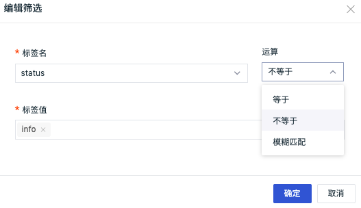
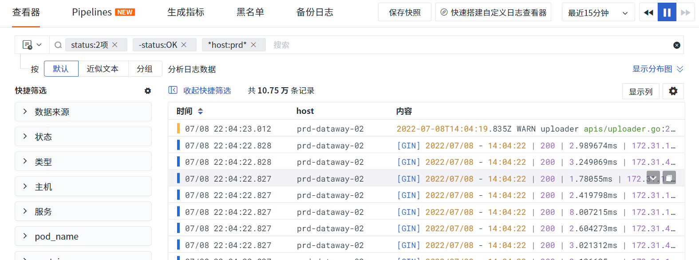

# 查看器搜索说明
---

事件、基础设施、日志、应用性能监测、用户访问监测、可用性监测、安全巡检等查看器搜索，支持关键字搜索、字段筛选搜索、关联搜索、JSON 搜索。

## 关键字搜索

- 支持在日志搜索栏输入“关键字A”，返回含“关键字A”的搜索结果，如下图所示。

- 支持通配符进行模糊搜索，如在日志搜索栏输入“关键字A*”，返回关键字含“关键字A”的搜索结果。

## 字段筛选搜索

支持按照“字段:值”的方式进行筛选，支持添加标签并按照“标签:值”的方式进行精确筛选、模糊筛选（wildcard）和反选，支持对筛选的“字段:值”进行编辑修改。

### 精确筛选

在日志搜索栏输入“status:”，可自动下拉选择对应的值如“info”进行精确查询，查询结果返回所有状态为info的筛选结果；

### 模糊筛选（wildcard）

在日志搜索栏输入“status:”，并选择 `wildcard` 查询可进行模糊查询。

### 反选

在日志搜索栏输入“status:”，并选择 `不等于` 查询可进行反选查询。

### 修改筛选字段和值

在搜索栏，点击“字段:值”，弹出对话框对“字段:值”进行修改，支持正选（等于）/反选（不等于）/wildcard（模糊匹配）。

- 注意：label 不支持弹窗编辑

- 对于有特殊字符或手动强制书写的标签，key 和 value 直接强制填入对应输入框中即可

## 关联搜索

支持按照 AND/OR/NOT 逻辑进行关联搜索。

- AND可使用空格或者逗号隔开进行搜索，输入的关键字越多，数据匹配的范围就越精准，如在日志搜索栏输入“关键字A,关键字B”或者“关键字A 关键字B”或者“关键字A AND 关键字B”，返回同时包含“关键字A和关键字B”的搜索结果；
- OR用于两者满足其一即都显示匹配的数据，如在日志搜索栏输入“关键字A OR 关键字B”，返回包含“关键字A”或则“关键字B”的搜索结果；
- NOT用于排除显示匹配数据，如在日志搜索栏输入“NOT 关键字A”，返回不包含“关键字A”搜索结果。

正选、反选、wildcard 分别放在三个标签下拉中，每个标签之间都为 and 关系。

## JSON 搜索

 JSON 搜索支持在日志查看器按照 `@key.key:value` 格式搜索日志内容（message）。

注意：JSON 搜索仅支持 `2022年6月23日` 后后创建的工作空间。

## 快捷筛选

### 自定义快捷筛选字段

在查看器，支持编辑“快捷筛选”，添加新的筛选字段。

添加完成后，可以选择其字段值进行快捷筛选。

### 反选和重置

在日志查看器“快捷筛选”，支持在选择字段筛选内容时进行“重置”，并通过“All”和“only”进行“反选”。

- All：查看所有数据
- only：查看当前选中的字段相关数据
- 重置：清空筛选条件

**示例说明：**

在日志查看器“快捷筛选”，默认全选。

点击快捷筛选“only”，日志内容显示`status`为`info`的数据。

点击快捷筛选“All”，日志内容所有的数据。

### 正选和反选

若在搜索框同时包括正选和反选，则对应的快捷筛选标签置灰不可选择。

