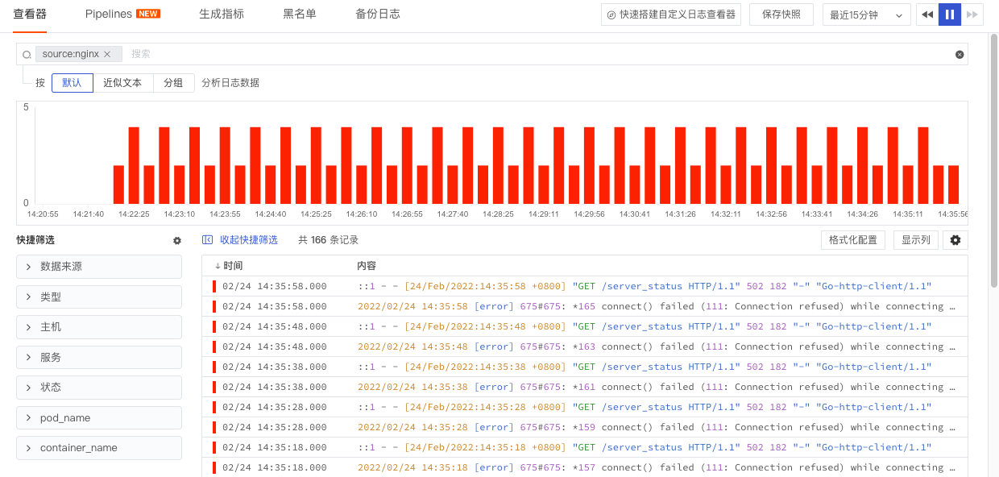
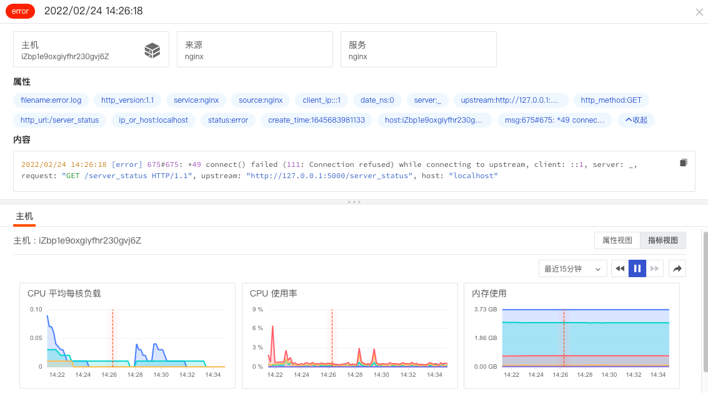
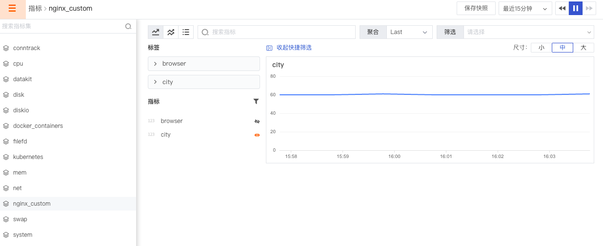
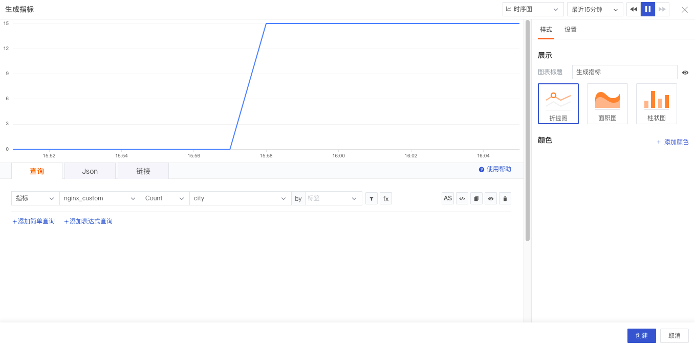
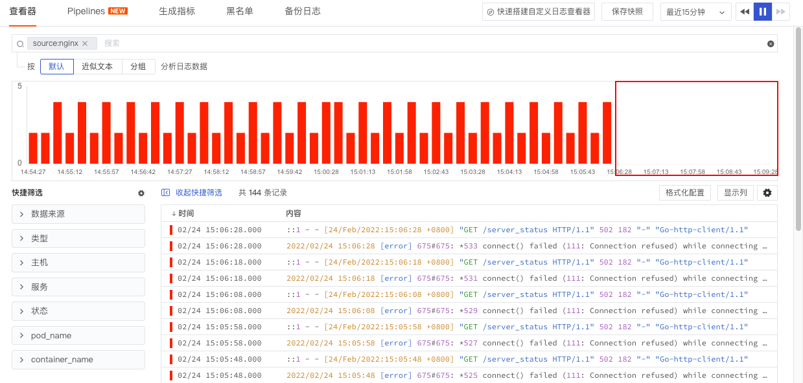
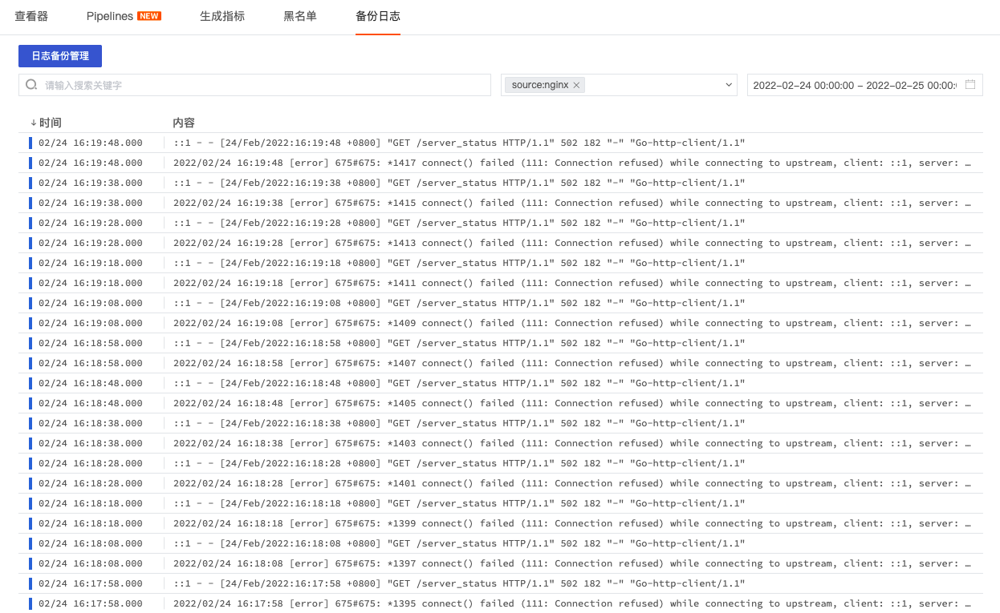

# 如何开启日志监测
---

观测云拥有全面的日志采集能力，包括系统日志、应用日志、安全日志等多种日志类型，通过观测云提供的自定义日志采集器可采集任意日志汇总到观测云进行统一存储和分析；通过观测云提供的文本处理器（Pipeline）可对采集的日志进行自定义切割，并把切割出来的字段作为属性使用。通过属性字段，我们可以快速筛选相关日志、进行数据关联分析，帮助我们快速去定位问题并解决问题。

本文以 Nginx 日志为例，介绍如何开启日志监测。

## 前置条件

您需要先创建一个[观测云账号](https://www.guance.com/)，并在您的主机上[安装 DataKit](../datakit/datakit-install.md) 。

## 方法/步骤

### Step1: 开启 Nginx 采集器

主机安装 Datakit 以后，在`/usr/local/datakit/conf.d/nginx`目录下，复制 `nginx.conf.sample` 并命名为 `nginx.conf`，编辑 `nginx.conf`，开启存放 Nginx 日志的地址和Pipeline。如：

- `files = ["/var/log/nginx/access.log","/var/log/nginx/error.log"]`
- `Pipeline = "nginx.p"`（其中 `""`中可以不填写具体的 Pipeline 脚本名称，DataKit 会自动匹配跟 source 同名的脚本文件）

注意：Pipeline 开启后，DataKit 会自动根据日志来源来匹配 Pipeline 脚本文件。若日志来源和 Pipeline 文件名称不一致，则需要在采集器配置，如日志来源`nginx`，Pipeline 文件名`nginx1.p`，则需要配置`Pipeline = "nginx1.p"`。

```
[[inputs.nginx]]
        url = "http://localhost/server_status"
        # ##(optional) collection interval, default is 30s
        # interval = "30s"
        use_vts = false
        ## Optional TLS Config
        # tls_ca = "/xxx/ca.pem"
        # tls_cert = "/xxx/cert.cer"
        # tls_key = "/xxx/key.key"
        ## Use TLS but skip chain & host verification
        insecure_skip_verify = false
        # HTTP response timeout (default: 5s)
        response_timeout = "20s"

        [inputs.nginx.log]
                files = ["/var/log/nginx/access.log","/var/log/nginx/error.log"]
        #       # grok pipeline script path
                pipeline = "nginx.p"
        [inputs.nginx.tags]
        # some_tag = "some_value"
        # more_tag = "some_other_value"
        # ...
```

配置完成后，使用命令行`datakit --restart`重启 DataKit 使配置生效。更多 Nginx 采集器配置可参考文档 [Nginx](../integrations/nginx.md) 。

### Step2: 在观测云工作空间查看和分析日志数据

开启 Nginx 采集器，配置日志文件路径，开启 Pipeline 以后，即可在观测云工作空间查看采集到的 Nginx 日志。



在观测云工作空间的日志下，选择 nginx 的日志，在日志详情页，我们可以看到产生日志的主机及其属性指标视图、日志来源、通过pipeline切割的日志属性、日志内容详情等数据，通过 [配置链路关联日志](../application-performance-monitoring/collection/connect-log/index.md) ，我们还可以在日志详情页查看相关的链路详情，帮助您快速做数据关联分析。



## 进阶参考

### 日志文本处理（Pipeline）

观测云提供三种日志 Pipeline 文本处理方式：

- [Pipelines](../logs/pipelines/manual.md)：支持在观测云工作空间手动配置和查看日志 pipeline 文件，无需登录 DataKit 服务器进行操作，帮助您方便的使用在线日志Pipeline功能来切割您的日志；

- [DataKit](../logs/pipelines/datakit-manual.md)：在服务器安装DataKit以后，在终端工具中配置DataKit的日志采集器及其对应的 pipeline 文件，对文本数据进行处理；
- DCA：DataKit Control APP，是DataKit的桌面客户端应用，需要先安装，安装完成后可在客户端查看和编辑 DataKit 默认自带的日志 pipeline 文件和自定义手动添加 pipeline 文件。

### 生成指标

观测云支持通过生成指标的方式，基于当前工作空间内的现有数据来自定义指标数据。在观测云工作空间「日志」-「生成指标」页面，点击「新建规则」即可开始创建新的生成指标规则。更多详情参考文档 [生成指标](../logs/generate-metrics.md) 。


生成的指标可统一在观测云「指标」中查看，或者在「生成指标」页面，点击规则右侧的「查看指标」，跳转至「指标」页面查看对应的指标集和指标。



生成的指标支持在观测云「场景」搭建仪表板，结合其他指标对采集的日志数据进行全面的可视化监测。



### 日志黑名单

观测云支持通过设置日志黑名单的方式过滤掉符合条件的日志，即配置日志黑名单以后，符合条件的日志数据不再上报到“观测云” 工作空间，帮助用户节约日志数据存储费用。

在 观测云工作空间，点击「日志」-「黑名单」-「新建黑名单」，选择「日志来源」，添加一条或多条日志筛选过滤规则，点击确定即默认开启该日志过滤规则。


在日志黑名单设置了过滤掉所有日志来源为“nginx”的日志，在设置生效后，我们可以看到“02/24 15:06:28”之后，nginx日志不再上报到工作空间。更多详情参考文档 [日志黑名单](../logs/blacklist.md) 。



### 日志备份

观测云基础日志最多存储60天，如果需要更长时间的存储和查看需要对基础日志进行备份。日志备份支持两种方式：

- 备份到 “观测云”：支持备份日志最多存储长达720天。
- 备份到外部存储：支持备份日志到阿里云 OSS，具体可参考文档 [日志数据备份到 OSS 最佳实践](../best-practices/guance-skill/log-backup-to-oss-by-func.md) 。

在日志「备份日志」页面，点击「日志备份管理」-「新建规则」，输入「规则名称」即可添加一条新的规则，支持通过「过滤条件」和「搜索关键字」更精准定位需要备份的日志，节省备份日志存储费用。<br />**注意：**

- 备份周期：按天进行备份，每天 `00:00:00` 开始备份前一天 `00:00:00—23:59:59` 的日志数据
- 免费版用户：无法备份日志数据


设置日志备份规则以后，在日志「备份日志」页面，默认数据为空，需要先选择查看备份日志的时间范围。更多详情可参考文档 [日志备份](../logs/backup.md) 。

