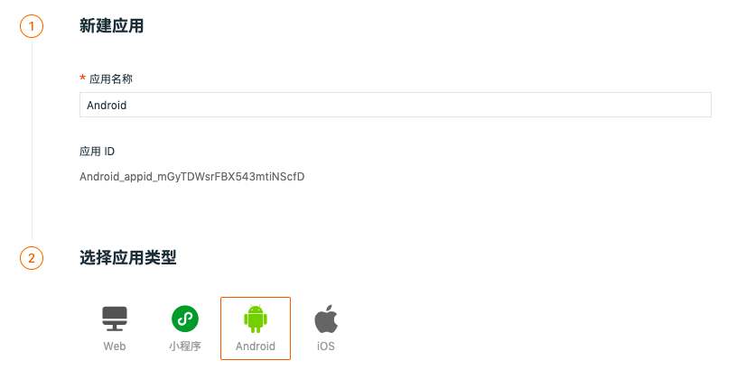

# Android 应用接入
---

## 简介

“观测云” 应用监测能够通过收集各个Android应用的指标数据，以可视化的方式分析各个Android应用端的性能。

## 前置条件

- 安装 DataKit（[DataKit 安装文档](../../datakit/datakit-install.md)）

## Android 应用接入 {#android-integration} 

登录观测云控制台，进入「用户访问监测」页面，点击右上角「新建应用」，在新窗口输入「应用名称」并自定义「应用 ID 标识」，点击「创建」，即可选择应用类型获取接入方式。

- 应用名称（必填项）：用于识别当前实施用户访问监测的应用名称。
- 应用 ID（必填项）：应用在当前工作空间的唯一标识，用于 SDK 采集数据上传匹配，数据入库后对应字段：app_id 。该字段仅支持英文、数字、下划线输入，最多为 48 个字符。



## 安装 {#setup}


Demo：[https://github.com/GuanceCloud/datakit-android/demo](https://github.com/GuanceCloud/datakit-android/tree/dev/demo)

源码地址：[https://github.com/GuanceCloud/datakit-android](https://github.com/GuanceCloud/datakit-android)

### Gradle 配置 {#gradle-setting}

在项目的根目录的 `build.gradle` 文件中添加 `DataFlux SDK` 的远程仓库地址

```groovy
buildscript {
    //...省略部分代码
    repositories {
        //...省略部分代码
        //添加 DataFlux SDK 的远程仓库地址
        maven {
            url 'https://mvnrepo.jiagouyun.com/repository/maven-releases'
        }
    }
    dependencies {
        //...省略部分代码
        //添加 DataFlux Plugin 的插件依赖
        classpath 'com.cloudcare.ft.mobile.sdk.tracker.plugin:ft-plugin:1.1.2-beta01'
    }
}
allprojects {
    repositories {
        //...省略部分代码
        //添加 DataFlux SDK 的远程仓库地址
        maven {
            url 'https://mvnrepo.jiagouyun.com/repository/maven-releases'
        }
    }
}
```

在项目主模块 `app` 的 `build.gradle` 文件中添加 `DataFlux SDK` 的依赖及 `DataFlux Plugin` 的使用 和 Java 8 的支持

```groovy
dependencies {
    //添加 DataFlux SDK 的依赖
    implementation 'com.cloudcare.ft.mobile.sdk.tracker.agent:ft-sdk:1.3.8-beta01'
    //捕获 native 层崩溃信息的依赖，需要配合 ft-sdk 使用不能单独使用
    implementation 'com.cloudcare.ft.mobile.sdk.tracker.agent:ft-native:1.0.0-alpha05'
    //推荐使用这个版本，其他版本未做过充分兼容测试
    implementation 'com.google.code.gson:gson:2.8.5'

}
//应用插件
apply plugin: 'ft-plugin'
//配置插件使用参数
FTExt {
    //是否显示 Plugin 日志，默认为 false
    showLog = true
}
android{
	//...省略部分代码
	defaultConfig {
        //...省略部分代码
        ndk {
            //当使用 ft-native 捕获 native 层的崩溃信息时，应该根据应用适配的不同的平台
            //来选择支持的 abi 架构，目前 ft-native 中包含的 abi 架构有 'arm64-v8a',
            // 'armeabi-v7a', 'x86', 'x86_64'
            abiFilters 'armeabi-v7a'
        }
    }
    compileOptions {
        sourceCompatibility = 1.8
        targetCompatibility = 1.8
    }
}
```

> 最新的版本请看上方的 Agent 和 Plugin 的版本名


## SDK 初始化

### 基础配置

```kotlin
class DemoApplication : Application() {
    override fun onCreate() {
        val config = FTSDKConfig
            .builder(DATAKIT_URL)//Datakit 安装地址
            .setDebug(true);

        FTSdk.install(config)
        
        //...
    }
}
```

| **方法名** | **含义** | **必须** | **注意** |
| --- | --- | --- | --- |
| metricsUrl | Datakit 安装地址 | 是 | datakit 安装地址 IP 地址，安装 SDK 设备需能访问这地址 |
| setXDataKitUUID | 设置数据采集端的识别 ID | 否 | 默认为随机`uuid` |
| setDebug | 是否开启调试模式 | 否 | 默认为 `false`，开启后方可打印 SDK 运行日志 |
| setEnv | 设置采集环境 | 否 | 默认为 `EnvType.PROD` |
| setOnlySupportMainProcess | 是否只支持在主进程运行 | 否 | 默认为 `true` ，如果需要在其他进程中执行需要将该字段设置为 `false` |
| setEnableAccessAndroidID | 开启获取 `Android ID` | 否 | 默认，为 `true`，设置为 `false`，则 `device_uuid` 字段数据将不进行采集,市场隐私审核相关[查看这里](#adpot-to-privacy-audits)|
| addGlobalContext | 添加 SDK 全局属性 | 否 | 添加规则请查阅[此处](#key-conflict) |

### RUM 配置

```kotlin
FTSdk.initRUMWithConfig(
            FTRUMConfig()
                .setRumAppId(RUM_APP_ID)
                .setEnableTraceUserAction(true)
                .setEnableTraceUserView(true)
                .setEnableTraceUserResource(true)
                .setSamplingRate(0.8f)
                .setExtraMonitorTypeWithError(ErrorMonitorType.ALL)
                .setDeviceMetricsMonitorType(DeviceMetricsMonitorType.ALL)
                .setEnableTrackAppUIBlock(true)
                .setEnableTrackAppCrash(true)
                .setEnableTrackAppANR(true)
        )
```

| **方法名** | **含义** | **必须** | **注意** |
| --- | --- | --- | --- |
| setRumAppId | 设置`Rum AppId` | 是 | 对应设置 RUM `appid`，才会开启`RUM`的采集功能，[获取 appid 方法](#android-integration) |
| setEnableTrackAppCrash | 是否上报 App 崩溃日志 | 否 | 默认为 `false`，开启后会在错误分析中显示错误堆栈数据。<br> [关于崩溃日志中混淆内容转换的问题](#retrace-log) |
| setExtraMonitorTypeWithError | 设置辅助监控信息 | 否 | 添加附加监控数据到 `Rum` 崩溃数据中，`ErrorMonitorType.BATTERY` 为电池余量，`ErrorMonitorType.MEMORY` 为内存用量，`ErrorMonitorType.CPU` 为 CPU 占有率 |
| setDeviceMetricsMonitorType | 设置 View 监控信息 | 否 | 在 View 周期中，添加监控数据，`DeviceMetricsMonitorType.BATTERY` 监控当前页的最高输出电流输出情况，`DeviceMetricsMonitorType.MEMORY` 监控当前应用使用内存情况，`DeviceMetricsMonitorType.CPU` 监控 CPU 跳动次数 ，`DeviceMetricsMonitorType.FPS` 监控屏幕帧率|
| setEnableTrackAppANR | 是否开启  ANR 检测 | 否 | 默认为 `false` |
| setEnableTrackAppUIBlock | 是否开启 UI 卡顿检测 | 否 | 默认为 `false` |
| setEnableTraceUserAction | 是否自动追踪用户操作 | 否 | 目前只支持用户启动和点击操作，默认为 `false` |
| setEnableTraceUserView | 是否自动追踪用户页面操作 | 否 | 默认为 `false` |
| setEnableTraceUserResource | 是否自动追动用户网络请求 | 否 | 仅支持 `Okhttp`，默认为 `false` |
| addGlobalContext | 添加自定义标签 | 否 | 添加标签数据，用于用户监测数据源区分，如果需要使用追踪功能，则参数 `key` 为 `track_id` ,`value` 为任意数值，添加规则注意事项请查阅[此处](#key-conflict) |

#### 添加自定义标签 {#track}

##### 静态使用

1.在 `build.gradle` 中创建多个 `productFlavors` 来做区分区分标签

```groovy
android{
    //…
	productFlavors {
        prodTest {
            buildConfigField "String", "CUSTOM_VALUE", "\"Custom Test Value\""
 			//…
        }
        prodPublish {
            buildConfigField "String", "CUSTOM_VALUE", "\"Custom Publish Value\""
 			//…
        }
    }
}
```

2.在 `RUM` 配置中添加对应 `BuildConfig` 常量

```kotlin
FTSdk.initRUMWithConfig(
            FTRUMConfig()
                .addGlobalContext(CUSTOM_STATIC_TAG, BuildConfig.CUSTOM_VALUE)
                //… 添加其他配置
        )
```

##### 动态使用

1.通过存文件类型数据，例如 `SharedPreferences`，配置使用 `SDK`，在配置处添加获取标签数据的代码。

```kotlin
val sp = context.getSharedPreferences(SP_STORE_DATA, MODE_PRIVATE)
val customDynamicValue = sp.getString(CUSTOM_DYNAMIC_TAG, "not set")

//配置 RUM
FTSdk.initRUMWithConfig(
     FTRUMConfig().addGlobalContext(CUSTOM_DYNAMIC_TAG, customDynamicValue!!)
     //… 添加其他配置
)
```

2.在任意处添加改变文件数据的方法。

```kotlin
fun setDynamicParams(context: Context, value: String) {
            val sp = context.getSharedPreferences(SP_STORE_DATA, MODE_PRIVATE)
            sp.edit().putString(CUSTOM_DYNAMIC_TAG, value).apply()

        }
```

3.最后重启应用，详细细节请见 [SDK Demo](#setup)

### Log 配置

```kotlin
   FTSdk.initLogWithConfig(
            FTLoggerConfig()
                .setEnableConsoleLog(true)
              //.setEnableConsoleLog(true,"log prefix")
                .setServiceName("ft-sdk-demo")
                .setEnableLinkRumData(true)
                .setEnableCustomLog(true)
              //.setLogLevelFilters(arrayOf(Status.CRITICAL,Status.ERROR))
                .setSamplingRate(0.8f)
        )
```

| **方法名** | **含义** | **必须** | **注意** |
| --- | --- | --- | --- |
| setServiceName | 设置服务名 | 否 | 默认为 `df_rum_android`  |
| setSampleRate | 设置采集率 | 否 | 采集率的值范围为>= 0、<= 1，默认值为 1 |
| setTraceConsoleLog | 是否上报控制台日志 | 否 | 日志等级对应关系<br>Log.v -> ok;<br>Log.i、Log.d -> info;<br>Log.e -> error;<br>Log.w -> warning，<br> `prefix` 为控制前缀过滤参数，默认不设置过滤 |
| setEnableLinkRUMData | 是否与 RUM 数据关联 | 否 | 默认为 `false` |
| setLogCacheDiscardStrategy | 设置频繁日志丢弃规则 | 否 | 默认为 `LogCacheDiscard.DISCARD`，`DISCARD` 为丢弃追加数据，`DISCARD_OLDEST` 丢弃老数据 |
| setEnableCustomLog | 是否上传自定义日志 | 否 | 默认为 `false` |
| setLogLevelFilters | 设置日志等级过滤 | 否 | 设置等级日志过滤，默认不设置 |
| addGlobalContext | 添加 log 全局属性 | 否 | 添加规则请查阅[此处](#key-conflict) |

### Trace 配置

```kotlin
   FTSdk.initTraceWithConfig(
            FTTraceConfig()
                .setSamplingRate(0.8f)
                .setEnableAutoTrace(true)
                .setEnableLinkRUMData(true)
        )
```

| **方法名** | **含义** | **必须** | **注意** |
| --- | --- | --- | --- |
| setSampleRate | 设置采集率 | 否 | 采集率的值范围为>= 0、<= 1，默认值为 1 |
| setTraceType | 设置链路追踪的类型 | 否 | 默认为 `DDTrace`，目前支持 `Zipkin` , `Jaeger`, `DDTrace`，`Skywalking` (8.0+)，`TraceParent` (W3C)，如果接入 OpenTelemetry 选择对应链路类型时，请注意查阅支持类型及 agent 相关配置 |
| setEnableLinkRUMData | 是否与 RUM 数据关联 | 否 | 默认为 `false` |
| setEnableAutoTrace | 设置是否开启自动 http trace | 否 | 目前只支持 OKhttp 的自动追踪，默认为 `false` |
| setEnableWebTrace | 设置 webview 是否开启链路追踪 | 否 | alpha 功能，有一部分场景可能会有部分 js 加载问题，默认为 `false` |


## RUM 用户数据追踪

可以 `FTTraceConfig` 配置开启自动模式，或手动添加，示例如下：

### Action

```kotlin
FTRUMGlobalManager.get().startAction("action name", "action type")
```

### View

```kotlin
override fun onResume() {
     super.onResume()
     FTRUMGlobalManager.get().startView("Current Page Name", "Pre Page Name")
}

override fun onPause() {
     super.onPause()
     FTRUMGlobalManager.get().stopView()
}
```

### Error

```kotlin
FTRUMGlobalManager.get().addError("error log", "error msg", ErrorType.JAVA, AppState.RUN)
```
### LongTask
```kotlin
FTRUMGlobalManager.get().addLongTask("error log",1000000L)
```

### Resource

```kotlin
//请求开始
FTRUMGlobalManager.get().startResource("resourceId")

//请求结束
FTRUMGlobalManager.get().stopResource("resourceId")

//最后，在请求结束之后，发送请求相关的数据指标
val params = ResourceParams()
params.url = "https://www.guance.com"
params.responseContentType = response.header("Content-Type")
arams.responseConnection = response.header("Connection")
params.responseContentEncoding = response.header("Content-Encoding")
params.responseHeader = response.headers.toString()
params.requestHeader = request.headers.toString()
params.resourceStatus = response.code
params.resourceMethod = request.method

val bean = NetStatusBean()
bean.tcpStartTime = 60000000
//...
FTRUMGlobalManager.get().addResource("resourceId",params,bean)

```

| **方法名** | **含义** | **必须** | **说明** |
| --- | --- | --- | --- |
| NetStatusBean.fetchStartTime | 请求开始时间 | 否 | 
 |
| NetStatusBean.tcpStartTime | tcp 连接时间 | 否 |  |
| NetStatusBean.tcpEndTime | tcp 结束时间 | 否 |  |
| NetStatusBean.dnsStartTime | dns 开始时间 | 否 |  |
| NetStatusBean.dnsEndTime | dns 结束时间 | 否 |  |
| NetStatusBean.responseStartTime | 响应开始时间 | 否 |  |
| NetStatusBean.responseEndTime | 响应结束时间 | 否 |  |
| NetStatusBean.sslStartTime | ssl 开始时间 | 否 |  |
| NetStatusBean.sslEndTime | ssl 结束时间 | 否 |  |
| ResourceParams.url | url 地址 | 是 |  |
| ResourceParams.requestHeader | 请求头参数 | 否 |  |
| ResourceParams.responseHeader | 响应头参数 | 否 |  |
| ResourceParams.responseConnection | 响应  connection | 否 |  |
| ResourceParams.responseContentType | 响应  ContentType | 否 |  |
| ResourceParams.responseContentEncoding | 响应  ContentEncoding | 否 |  |
| ResourceParams.resourceMethod | 请求方法 | 否 |  GET,POST 等 |
| ResourceParams.responseBody | 返回 body 内容 | 否 |  |

## Logger 日志打印 

```kotlin
//上传单个日志
FTLogger.getInstance().logBackground("test", Status.INFO)

//批量上传日志
FTLogger.getInstance().logBackground(mutableListOf(LogData("test",Status.INFO)))
```

### 日志等级

| **方法名** | **含义** |
| --- | --- |
| Status.INFO | 提示 |
| Status.WARNING | 警告 |
| Status.ERROR | 错误 |
| Status.CRITICAL | 严重 |
| Status.OK | 恢复 |

## Tracer 网络链路追踪

可以 `FTTRUMConfig` 配置开启自动模式，或手动添加，示例如下：

```kotlin
val url = "https://www.guance.com"
val uuid ="uuid"
//获取链路头参数
val headers = FTTraceManager.get().getTraceHeader(uuid, url)

val client: OkHttpClient = OkHttpClient.Builder().addInterceptor { chain ->
   
                    val original = chain.request()
                    val requestBuilder = original.newBuilder()
                    //在请求中，添加链路头参数
                    for (key in headers.keys) {
                        requestBuilder.header(key!!, headers[key]!!)
                    }
                    val request = requestBuilder.build()

                    response = chain.proceed(request)

                    if (response != null) {
                        val requestHeaderMap = HashMap<String, String>()
                        val responseHeaderMap = HashMap<String, String>()
                        request.headers.forEach {
                            requestHeaderMap[it.first] = it.second
                        }
                        response!!.headers.forEach {
                            responseHeaderMap[it.first] = it.second

                        }
                    
                    }

                    response!!
                }.build()

 val builder: Request.Builder = Request.Builder().url(url).method(RequestMethod.GET.name, null)
client.newCall(builder.build()).execute()


```

## 用户信息绑定与解绑

```kotlin
//可以在用户登录成功后调用此方法用来绑定用户信息
FTSdk.bindRumUserData("001")

val userData = UserData()
userData.name = "test.user"
userData.id = "test.id"
userData("test@mail.com")
val extMap = HashMap<String, String>()
extMap["ft_key"] = "ft_value"
userData.setExts(extMap)
            
FTSdk.bindRumUserData(userData)

//可以在用户退出登录后调用此方法来解绑用户信息
FTSdk.unbindRumUserData()
```

### UserData
| **方法名** | **含义** | **必须** | **说明** |
| --- | --- | --- | --- |
| setId |  设置用户 ID | 否 | |
| setName | 设置用户名 | 否 | |
| setEmail | 设置邮箱 | 否 | |
| setExts | 设置用户扩展 | 否 | 添加规则请查阅[此处](#key-conflict)|


## 关闭 SDK

```kotlin
//如果动态改变 SDK 配置，需要先关闭，以避免错误数据的产生
FTSdk.shutDown()
```

## 动态开启和关闭获取 AndroidID
```kotlin
//开启获取 Android ID
FTSdk.setEnableAccessAndroidID(true);

//关闭获取 Android ID
FTSdk.setEnableAccessAndroidID(fasle);
```


## R8 / Proguard 混淆配置

```c
-dontwarn com.ft.sdk.**

-keep class com.ft.sdk.**{*;}

-keep class ftnative.*{*;}

-keepnames class * extends android.view.View
```

## 符号文件上传
### plugin 上传
`ft-plugin` 版本需要 `1.1.2` 以上版本支持符号文件上传，支持 `productFlavor` 多版本区分管理，plugin 会在 `gradle task assembleRelease` 之后执行上传符号文件，详细配置可以参考 [SDK Demo](#setup)

``` groovy
FTExt {
	//...
    autoUploadMap = true
    autoUploadNativeDebugSymbol = true
    datakitDCAUrl = 'https://datakit.url:9531'//datakit 安装地址，默认 9531 
    appId = "appid_xxxxx"// appid
    env = 'common'

    prodFlavors { //prodFlavors 配置会覆盖外层设置
        prodTest {
            autoUploadMap = false
            autoUploadNativeDebugSymbol = false
            datakitDCAUrl = 'https://datakit.test.url:9531'
            appId = "appid_prodTest"
            env = "gray"
        }
        prodPublish {
            autoUploadMap = true
            autoUploadNativeDebugSymbol = true
            datakitDCAUrl = 'https://datakit.publish.url:9531'
            appId = "appid_prodPublish"
            env = "prod"
        }
    }
}

```
### 手动上传
需要开发者将符号文件自行打包成 `zip` 文件，然后自行上传至 `datakit` ，推荐使用 `zip` 命令行进行打包，避免将一些系统隐藏文件打入 `zip` 包中，符号上传请参考 [sourcemap 上传](../../integrations/rum.md#sourcemap)

## 权限配置说明

| **名称** | **使用原因** |
| --- | --- |
| `READ_PHONE_STATE` | 用于获取手机的设备信息，便于精准分析数据信息 |

> 关于如何申请动态权限，具体详情参考 [Android Developer](https://developer.android.google.cn/training/permissions/requesting?hl=en)


## 常见问题 {#FAQ}
### 添加局变量避免冲突字段 {#key-conflict}

为了避免自定义字段与 SDK 数据冲突，建议标签命名添加项目缩写的前缀，例如 `df_tag_name`，项目中使用 `key` 值可[查询源码](https://github.com/DataFlux-cn/datakit-android/blob/dev/ft-sdk/src/main/java/com/ft/sdk/garble/utils/Constants.java)。SDK 全局变量中出现与 RUM、Log 相同变量时，RUM、Log 会覆盖 SDK 中的全局变量。

### 应对市场隐私审核 {#adpot-to-privacy-audits}
#### 隐私声明
[前往查看](https://docs.guance.com/agreements/app-sdk-privacy-policy/)
#### SDK AndroidID 配置
SDK 为更好关联相同用户数据，会使用 Android ID。如果需要在应用市场上架，需要通过如下方式对应市场隐私审核。

```kotlin
class DemoApplication : Application() {
    override fun onCreate() {
    
        //在初始化设置时将  setEnableAccessAndroidID 设置为 false
        val config = FTSDKConfig
            .builder(DATAKIT_URL)
            . setEnableAccessAndroidID(false)

        FTSdk.install(config)
        
        //...
    }
}

//用户同意隐私协议后再开启
FTSdk.setEnableAccessAndroidID(true);
```

