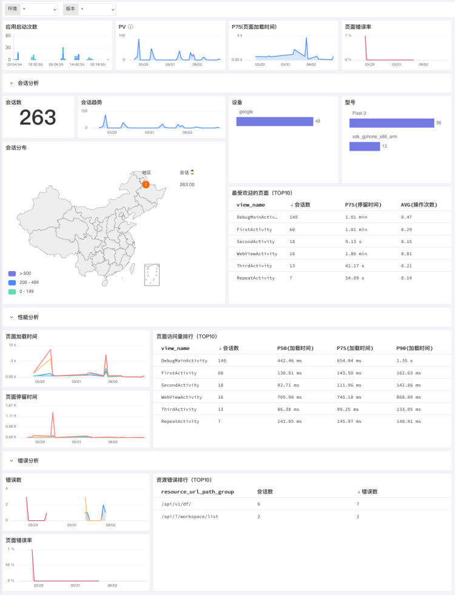
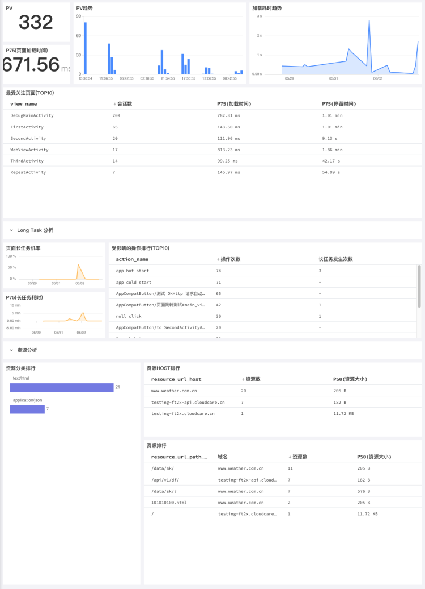
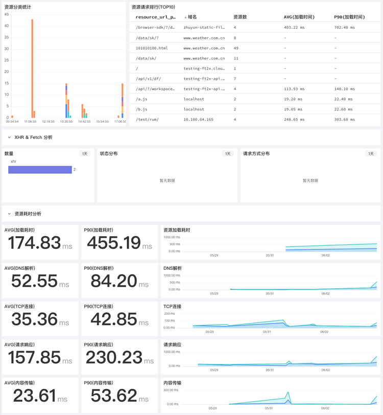
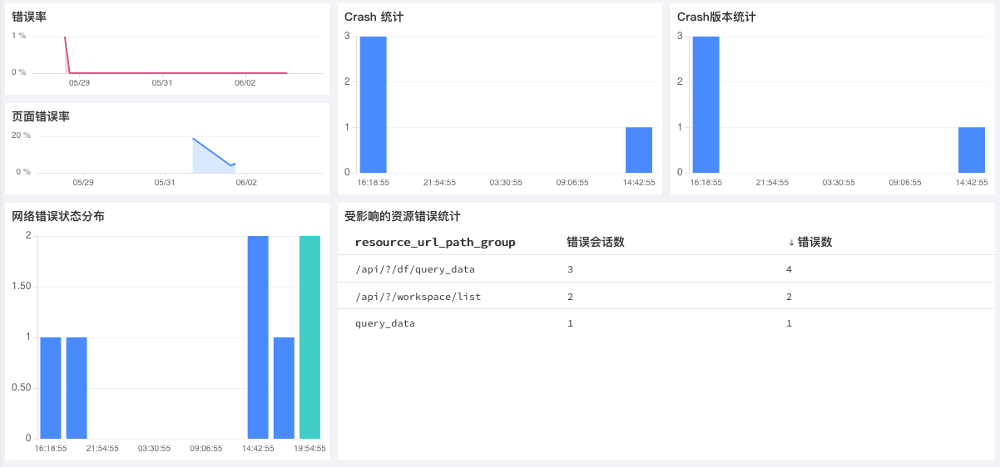

# Android 应用分析
---

## 简介

应用数据采集到的 “观测云” 后，可以通过 “观测云” 控制台查看应用性能分析。

“观测云” 提供可视化的Android应用分析，内置多种Android应用监测方案，包括概览、性能分析、资源分析、错误分析。

## 场景分析

### 概览

Android应用的概览场景统计Android访问的启动次数、PV数、页面错误率、页面加载时间、会话分析、性能分析、错误分析等指标，从Android应用启动、会话分布、访问用户设备、受欢迎页面排行、页面访问量排行、资源错误排行等方面，可视化的展示用户访问Android应用的数据统计，快速定位用户访问Android应用的问题，提高用户访问性能。可通过环境、版本筛选查看已经接入的Android应用。

### 性能分析

Android应用的性能分析，通过统计PV数、页面加载时间、最受关注页面会话数、页面长任务分析、资源分析等指标，可视化的实时查看整体的Android应用页面性能情况，更精准的定位需要优化的页面，可通过环境、版本等筛选查看已经接入的Android应用。

### 资源分析

Android应用的资源分析，通过统计资源分类、XHR & Fetch 分析、资源耗时分析等指标，可视化的实时查看整体的Android应用资源情况；通过统计资源请求排行，更精准的定位需要优化的资源；可通过环境、版本等筛选查看已经接入的Android应用。

### 错误分析

Android应用的JS错误分析，通过统计错误率、Crash、Crash版本、网络错误状态分布等指标，可视化的实时查看整体的Android应用错误情况；通过受影响的资源错误统计，可快速定位资源错误；可通过环境、版本等筛选查看已经接入的Android应用。

---

观测云是一款面向开发、运维、测试及业务团队的实时数据监测平台，能够统一满足云、云原生、应用及业务上的监测需求，快速实现系统可观测。**立即前往观测云，开启一站式可观测之旅：**[www.guance.com](https://www.guance.com)

