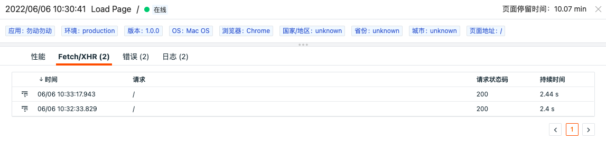

# 查看器
---

## 简介

查看器可以帮助您查看与分析用户访问应用程序的详细信息。在观测云工作空间内打开「用户访问监测」，点击任意一个应用后即可通过「查看器」了解每个用户会话、页面性能、资源、长任务、动态组件中的错误、延迟对用户的影响、帮助你通过搜索、筛选和关联分析全面了解和改善应用的运行状态和使用情况，提高用户体验。

观测云用户访问监测查看器包括 session（会话）、view（页面）、resource（资源）、action（操作）、long_task（长任务）、error（错误）。

| 查看器类型 | 概述 |
| --- | --- |
| session（会话） | 查看用户访问的一系列详情，包括用户访问时间、访问页面路径、访问操作数、访问路径和出现的错误信息等。 |
| view（页面） | 查看用户访问环境、回溯用户的操作路径、分解用户操作的响应时间以及了解用户操作导致后端应用一系列调用链的性能指标情况 |
| resource（资源） | 查看网页上加载的各种资源信息，包括状态码、请求方式、资源地址，加载耗时等 |
| action（操作） | 查看用户在使用应用期间的操作交互，包括操作类型，页面操作详情，操作耗时等 |
| long_task（长任务） | 查看用户在使用应用期间，阻塞主线程超过 50ms 的长任务，包括页面地址、任务耗时等 |
| error（错误） | 查看用户在使用应用期间，浏览器发出的前端错误，包括错误类型、错误内容等 |

## session 查看器

通过左上角的数据类型筛选栏，您可以切换至「session 查看器」对用户访问时的会话数据进行查询和分析，您可以查看用户访问时的会话时长（即用户从打开一个应用到关闭的时间）、会话类型（真实用户访问 "user" 、机器仿真访问 "synthetics"）、页面访问数量、操作数量、错误数、用户最初访问页面和最后浏览页面等。

### session 详情页

点击列表中的您需要查看的数据，在划出详情页中：

- 查看该次用户访问的属性详情，包括应用、所在的环境(env)、版本(version)、使用的浏览器(browser)、地理位置(country、city)、页面停留时间(time_spent, 单位：ms)等。当鼠标点击属性字段，支持“筛选字段值”、“反向筛选字段值”、“添加到显示列”和“复制”进行快速筛选查看。
    - “筛选字段值”，即添加该字段至查看器，查看与该字段相关的全部数据
    - “反向筛选字段值”，即添加该字段至查看器，查看除了该字段以外的其他数据
    - “添加到显示列”，即添加该字段到查看器列表进行查看
    - “复制”，即复制该字段至剪贴板 
- 查看该次用户访问的「会话」详情，包括用户访问时间、访问动作（action)、访问路径(view)和出现的错误信息等。点击view、action类型的数据，打开对应的页面访问性能详情。

点击error错误信息，打开错误详情。

## view 查看器

通过左上角的数据类型筛选栏，您可以切换至「view 查看器」对用户访问时的页面性能数据进行查询和分析，您可以快速查看用户访问时的页面地址、页面加载类型、页面加载时间、用户停留时间等。

### view 详情页

点击列表中的您需要查看的数据，在划出详情页中显示用户访问的页面性能详情，包括属性、性能详情、链路详情、错误详情、关联日志等。

#### 属性
属性是数据对象的性质和特点，定义了每一个属性的值。观测云支持通过点击属性，将其添加到当前筛选或复制（复制该标签至本地粘贴板），直接在查看器中筛选查看属性相关的数据。

#### 性能详情

「性能」页面可以帮助您查看到用户访问指定应用时前端的页面性能，包括页面加载时间、内容绘制时间、交互时间、输入延时等。以下图为例，可以看出LCP（[最大内容绘制时间](web/app-analysis.md)）的指标达到了8.79秒，而推荐的时间在2.5秒以内，说明页面速度载入慢，需要进行优化。性能详情页支持筛选和搜索，帮助用户快速定位资源和内容。

点击性能详情中的错误（在 View 列表中含“错误”标志的数据），可查看错误对应的详情。

#### 扩展字段

当鼠标选中扩展字段，点击前面的下拉图标，显示“筛选字段值”、“反向筛选字段值”、“添加到显示列”和“复制”的小图标进行快速筛选查看。

#### 关联Fetch/XHR

切换至「Fetch/XHR」时，支持查看用户访问时向后端应用发出的每一个网络请求，包括发生时间、请求的链路和持续时间。

若网络请求存在对应的trace_id，在请求前会有提示的小图标，点击请求，可跳转至对应链路的详情页。

#### 关联错误

切换至「错误」时，您可以查看出现在该次用户访问时的错误数据信息、错误类型和错误发生时间。

点击错误信息，可跳转至对应错误的详情页。

#### 关联日志

切换至「日志」时，您可以基于当前用户访问查看关联日志。同时，您可以对日志进行关键字搜索和多标签筛选。若您需要查看更详细的日志内容，您可以点击跳转按钮到日志页打开。

## resource 查看器

通过左上角的数据类型筛选栏，您可以切换至「resource 查看器」对用户访问时的资源加载性能进行查询和分析，您可以快速查看用户访问时的资源地址、状态码、请求方式、资源加载时间等。

### resource 详情页

点击列表中的您需要查看的数据，在划出详情页中显示用户访问的资源性能详情，和 view 详情页一样，包括属性、性能详情、关联链路、关联错误、关联日志等，支持通过筛选和搜索查看性能详情。

## action 查看器

通过左上角的数据类型筛选栏，您可以切换至「action 查看器」对用户访问时的操作行为进行查询和分析，您可以快速查看用户访问时的操作类型、操作内容、操作时间等。

### action 详情页

点击列表中的您需要查看的数据，在划出详情页中显示用户访问的资源性能详情，和 view 详情页 一样，包括属性、性能详情、关联链路、关联错误、关联日志等，支持通过筛选和搜索查看性能详情。

## long_task 查看器

通过左上角的数据类型筛选栏，您可以切换至「long_task 查看器」对用户访问时的资源加载性能进行查询和分析，您可以快速查看用户访问时的资源地址、状态码、请求方式资源加载时间等。

### long_task 详情页

点击列表中的您需要查看的数据，在划出详情页中显示用户访问的长任务详情，和 view 详情页 一样，包括属性、性能详情、关联链路、关联错误、关联日志等，支持通过筛选和搜索查看性能详情。

## error 查看器

通过左上角的数据类型筛选栏，您可以切换至「error 查看器」对用户访问时的发生的代码错误进行查询和分析，您可以快速查看用户访问时的页面地址、代码错误类型、错误内容等。

### error 详情页

点击列表中的您需要查看的数据，在划出详情页中显示用户访问的错误详情。

## 查询与分析

在查看器中，观测云支持通过选择时间范围、搜索关键字，筛选等方式查询和分析用户访问数据。

### 时间控件

观测云查看器默认展示最近 15 分钟的数据，通过右上角的「时间控件」，您可以选择数据展示的时间范围。更多详情可参考文档 [时间控件说明](../getting-started/necessary-for-beginners/explorer-search.md#time) 。

### 搜索与筛选

在查看器搜索栏，支持关键字搜索、通配符搜索、关联搜索、JSON 搜索等多种搜索方式，支持通过 `标签/属性` 进行值的筛选，包括正向筛选、反向筛选、模糊匹配、反向模糊匹配、存在和不存在等多种筛选方式。更多搜索与筛选可参考文档 [查看器的搜索和筛选](../getting-started/necessary-for-beginners/explorer-search.md) 。

### 快捷筛选

在查看器快捷筛选，支持编辑“快捷筛选”，添加新的筛选字段。添加完成后，可以选择其字段值进行快捷筛选。更多快捷筛选可参考文档 [快捷筛选](../getting-started/necessary-for-beginners/explorer-search.md#quick-filter) 。

### 自定义显示列

查看列表时，可通过「显示列」自定义添加、编辑、删除、拖动显示列。当鼠标放在查看器显示列上时，点击「设置」按钮，支持对显示列进行升序、降序、向左移动列、向右移动列、向左添加列、向右添加列、替换列、添加到快捷筛选、添加到分组、移除列等操作。更多自定义显示列可参考文档 [显示列说明](../getting-started/necessary-for-beginners/explorer-search.md#columns) 。

### 数据状态提醒

观测云为方便您快速识别用户访问时出现的性能问题，包括网络问题、页面加载错误、页面DOM解析错误等，数据的状态被分为warning(警告）和info(正常）两种类型。当用户访问数据数据中出现错误时（error>0) 时，该数据为warning状态；用户访问数据不存在错误时，数据为info状态，无其他高亮显示。

### 用户访问统计

观测云会依据选择的时间范围统计每个时间点上的用户访问数量。你可以通过堆积柱状图，查看不同时间点的数据数量。同时，若对数据进行了筛选过滤，柱状图将同步展示筛选后结果。
