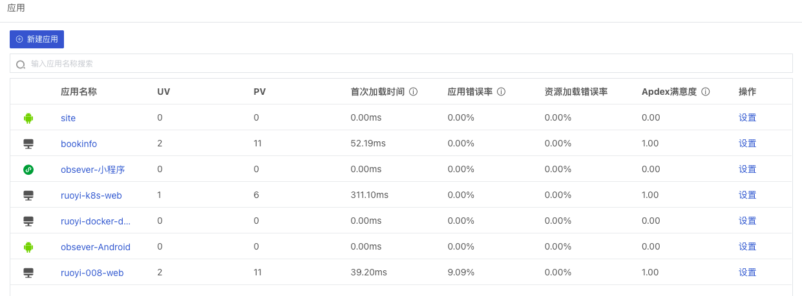

# 用户访问监测
---

“观测云” 支持采集Web、Android、iOS和小程序的用户访问数据，可帮助你快速监测用户的使用行为和遇到的问题。通过对用户访问数据的查看和分析，你可以快速了解用户访问环境、回溯用户的操作路径、分解用户操作的响应时间以及了解用户操作导致后端应用一系列调用链的性能指标情况。

## 主要功能

- Web监测：多维度场景分析，包含页面性能、资源加载、JS错误等多个场景；查看器支持页面、资源、JS错误等数据的快速检索和筛选查看。
- Android监测：多维度场景分析，包含页面性能、资源加载等多个场景；查看器支持页面、资源、崩溃、卡顿等数据的快速检索和筛选查看。
- iOS监测：多维度场景分析，包含页面性能、资源加载等多个场景；查看器支持页面、资源、崩溃、卡顿等数据的快速检索和筛选查看。
- 小程序监测：多维度场景分析，包含页面性能、资源加载、请求加载、JS错误等多个场景；查看器支持页面、资源、请求、JS错误等数据的快速检索和筛选查看。

注意：在用户访问监测「应用」，列表数据展现时间范围时为当天（00:01-23:59），其中UV和PV每30分钟刷新一次。

