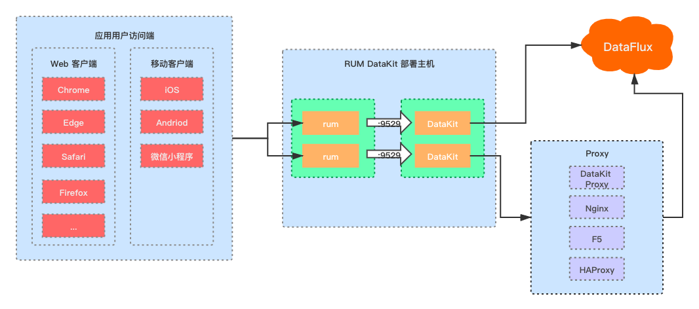

# 用户访问监测
---

## 简介

观测云支持采集 Web、Android、iOS 、小程序和第三方框架的用户访问数据，可帮助您快速监测用户的使用行为和遇到的问题。通过对用户访问数据的查看和分析，你可以快速了解用户访问环境、回溯用户的操作路径、分解用户操作的响应时间以及了解用户操作导致后端应用一系列调用链的性能指标情况。

## 前置条件

要开启应用用户访问监测功能，首先需要部署一个公网 DataKit 作为 agent，客户端的用户访问数据通过这个 agent 后将数据打到观测云工作台，具体的 DataKit 安装方法与配置方法，见 [DataKit 安装文档](../datakit/datakit-install.md) 。

DataKit 安装完成后，默认开启 [RUM采集器](../datakit/rum.md) ，即可开始采集用户访问的相关数据。

## 部署架构

## 主要功能

- Web监测：多维度场景分析，包含页面性能、资源加载、JS 错误等多个场景；查看器支持页面、资源、JS 错误等数据的快速检索和筛选查看。

- Android监测：多维度场景分析，包含页面性能、资源加载等多个场景；查看器支持页面、资源、崩溃、卡顿等数据的快速检索和筛选查看。

- iOS监测：多维度场景分析，包含页面性能、资源加载等多个场景；查看器支持页面、资源、崩溃、卡顿等数据的快速检索和筛选查看。

- 小程序监测：多维度场景分析，包含页面性能、资源加载、请求加载、JS 错误等多个场景；查看器支持页面、资源、请求、JS错误等数据的快速检索和筛选查看。

注意：在用户访问监测应用列表，数据展现时间范围时为当天（00:01-23:59），其中 UV 和 PV 每 30 分钟刷新一次。

