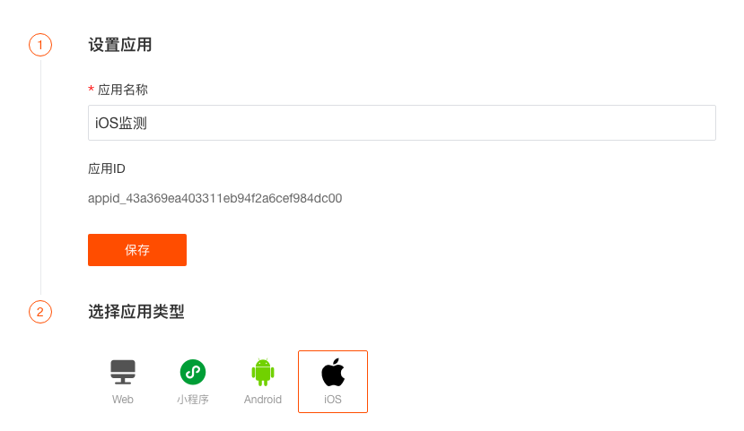
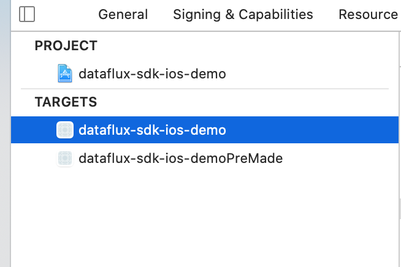
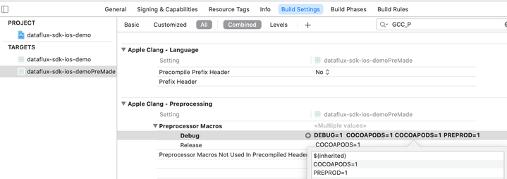

# iOS 应用接入
---

## 简介

“观测云” 应用监测能够通过收集各个iOS应用的指标数据，以可视化的方式分析各个iOS应用端的性能。

## 前置条件

- 安装 DataKit（[DataKit 安装文档](../../datakit/datakit-install.md)）

## iOS应用接入

登录 “观测云” 控制台，进入「应用监测」页面，点击右上角「新建应用」，在新窗口输入「应用名称」，点击「创建」，即可开始配置。


## 安装

 

**Demo**：[https://github.com/GuanceCloud/datakit-ios/demo](https://github.com/GuanceCloud/datakit-ios/tree/develop/demo)

**源码地址**：[https://github.com/GuanceCloud/datakit-ios](https://github.com/GuanceCloud/datakit-ios)
### 源码方式

1.从 GitHub 获取 SDK 的源代码。

2.将 SDK 源代码导入 App 项目，并选中 `Copy items if needed`。直接将 **FTMobileSDK** 整个文件夹导入项目。


### CocoaPods 方式

1.配置 `Podfile` 文件。

```objectivec
target 'yourProjectName' do

# Pods for your project
pod 'FTMobileSDK', '1.3.4-beta.2'
    
end
```

2.在 `Podfile` 目录下执行 `pod install` 安装 SDK。

### Carthage 方式

1.配置 `Cartfile` 文件。

```
github "GuanceCloud/datakit-ios" == 1.3.4-beta.2
```

2.在 `Cartfile` 目录下执行  `carthage update --platform iOS` ， 并将  `FTMobileSDK.framework` 拖拽到您的项目中使用。若出现 "Building universal frameworks with common architectures is not possible. The device and simulator slices for "FTMobileSDK.framework" both build for: arm64" 错误，请执行  `carthage update --platform iOS --use-xcframeworks` 命令，生成  `FTMobileSDK.xcframework `，与普通的 Framework 使用方法相同，请将它拖拽到您的项目中使用。

3.debug 模式下，为了方便 SDK 调试，建议使用 debug 模式的静态库。在命令后添加  `--configuration Debug` 获取 debug 模式的静态库。

4.在 `TARGETS`  -> `Build Setting` ->  `Other Linker Flags`  添加  `-ObjC`。

5.目前只支持 1.3.4-beta.2 及以上的版本。

### 添加头文件

```objectivec
//使用 Carthage 方式
#import <FTMobileAgent/FTMobileAgent.h>
...
//使用 源码 或 CocoaPods 方式
#import "FTMobileAgent.h"
```

## SDK 初始化

### 基础配置

```objectivec
-(BOOL)application:(UIApplication *)application didFinishLaunchingWithOptions:(NSDictionary *)launchOptions{
    // SDK FTMobileConfig 设置
    FTMobileConfig *config = [[FTMobileConfig alloc]initWithMetricsUrl:@"Your App metricsUrl"];
    config.enableSDKDebugLog = YES;
    //启动 SDK
    [FTMobileAgent startWithConfigOptions:config];
    
   //...
    return YES;
}
```

| **字段** | **类型** | **说明** | **必须** |
| --- | --- | --- | --- |
| metricsUrl | NSString | 数据上报地址 | 是 |
| enableSDKDebugLog | BOOL | 设置是否允许打印日志 | 否（默认NO） |
| env | NS_ENUM | 环境 | 否  （默认FTEnvProd） |
| XDataKitUUID | NSString | 请求HTTP请求头X-Datakit-UUID 数据采集端  如果用户不设置会自动配置 | 否 |
| globalContext | NSDictionary | [添加自定义标签](#user-global-context) |     否 |

#### env 环境

```objectivec
typedef NS_ENUM(NSInteger, FTEnv) {
    FTEnvProd         = 0, //线上环境
    FTEnvGray,             //灰度环境
    FTEnvPre,              //预发布环境
    FTEnvCommon,           //日常环境
    FTEnvLocal,            //本地环境
};

@property (nonatomic, assign) FTEnv env;
```

### RUM 配置

```objectivec
    //开启 rum
    FTRumConfig *rumConfig = [[FTRumConfig alloc]init];
    rumConfig.appid = appid;
    rumConfig.enableTrackAppCrash = YES;
    rumConfig.enableTrackAppANR = YES;
    rumConfig.enableTrackAppFreeze = YES;
    rumConfig.enableTraceUserAction = YES;
	rumConfig.enableTraceUserVIew = YES;
    [[FTMobileAgent sharedInstance] startRumWithConfigOptions:rumConfig];
```

| **字段** | **类型** | **说明** | **必须** |
| --- | --- | --- | --- |
| appid | NSString | DataFlux rum应用唯一ID标识，在DataFlux控制台上面创建监控时自动生成。 | 否（开启RUM 必选） |
| samplerate | int | 采样采集率 | 否（默认100） |
| monitorInfoType | NS_OPTIONS | 采集数据 | 否 |
| enableTrackAppCrash | BOOL | 设置是否需要采集崩溃日志 | 否（默认NO） |
| enableTrackAppANR | BOOL | 采集ANR卡顿无响应事件 | 否（默认NO） |
| enableTrackAppFreeze | BOOL | 采集UI卡顿事件 | 否（默认NO） |
| enableTraceUserAction | BOOL | 设置是否追踪用户 Action 操作 | 否（默认NO） |
| enableTraceUserView | BOOL | 设置是否追踪用户 View 操作 | 否（默认NO） |
| globalContext | NSDictionary | [添加自定义标签](#user-global-context) |     否 |

#### 监控数据配置

配置 `FTMobileConfig` 的 `FTMonitorInfoType` 属性，将在采集的崩溃数据中添加对应的信息。可采集的类型如下：

```objectivec
/**
 *
 * @constant
 *  FTMonitorInfoTypeBattery  - 电池电量
 *  FTMonitorInfoTypeMemory   - 内存总量、内存使用率
 *  FTMonitorInfoTypeCpu      - CPU使用率
 */
typedef NS_OPTIONS(NSUInteger, FTMonitorInfoType) {
    FTMonitorInfoTypeAll          = 0xFFFFFFFF,
    FTMonitorInfoTypeBattery      = 1 << 1,
    FTMonitorInfoTypeMemory       = 1 << 2,
    FTMonitorInfoTypeCpu          = 1 << 3,
};
```

### Log 配置

```objectivec
    //开启 logger
    FTLoggerConfig *loggerConfig = [[FTLoggerConfig alloc]init];
    loggerConfig.enableCustomLog = YES;
    loggerConfig.enableLinkRumData = YES;
    loggerConfig.enableConsoleLog = YES;
    [[FTMobileAgent sharedInstance] startLoggerWithConfigOptions:loggerConfig];
    
```

| **字段** | **类型** | **说明** | **必须** |
| --- | --- | --- | --- |
| samplerate | int | 采样采集率 | 否（默认100） |
| serviceName | NSString | 设置日志所属业务或服务的名称 | 否（默认df_rum_ios） |
| enableConsoleLog | BOOL | 设置是否需要采集控制台日志 | 否（默认NO） |
| prefix | NSString | 设置采集控制台日志过滤字符串 | 否（默认全采集） |
| enableCustomLog | BOOL | 是否上传自定义 log | 否（默认NO） |
| logLevelFilter | NSArray | 设置要采集的自定义 log 的状态数组 | 否（默认全采集） |
| enableLinkRumData | BOOL | 是否将 logger 数据与 rum 关联 | 否（默认NO） |
| discardType | FTLogCacheDiscard | 设置日志废弃策略 | 否（默认丢弃最新数据） |
| globalContext | NSDictionary | [添加自定义标签](#user-global-context) |     否 |

#### 日志废弃策略

```objectivec
typedef NS_ENUM(NSInteger, FTLogCacheDiscard)  {
    FTDiscard,        //默认，当日志数据数量大于最大值（5000）时，新数据不进行写入
    FTDiscardOldest   //当日志数据数量大于最大值时,废弃旧数据
};

/**
 * 设置日志废弃策略
 */
@property (nonatomic, assign) FTLogCacheDiscard  discardType;
```

#### 采集控制台日志

一般情况下， 因为 NSLog 的输出会消耗系统资源，而且输出的数据也可能会暴露出App里的保密数据， 所以在发布正式版时会把这些输出全部屏蔽掉。此时开启采集控制台日志，也并不能抓取到工程里打印的日志。建议使用 [自定义上报日志](#user-logger) 来上传想查看的日志。 

- 开启采集控制台日志

```objectivec
/**
 *设置是否需要采集控制台日志 默认为NO
 */
 @property (nonatomic, assign) BOOL enableConsoleLog;
```

- 设置采集控制台日志的过滤条件

```objectivec
/**
 * 设置采集控制台日志过滤字符串 包含该字符串控制台日志会被采集 默认为全采集
 */
@property (nonatomic, copy) NSString *prefix;
```

## Trace 配置 

```objectivec
    //开启 trace
    FTTraceConfig *traceConfig = [[FTTraceConfig alloc]init];
    traceConfig.enableLinkRumData = YES;
	traceConfig.enableAutoTrace = YES;
    traceConfig.networkTraceType = FTNetworkTraceTypeDDtrace;
    [[FTMobileAgent sharedInstance] startTraceWithConfigOptions:traceConfig];
```

| 字段 | 类型 | 说明 | 必须 |
| --- | --- | --- | --- |
| samplerate | int | 采样采集率 | 否（默认100) |
| networkTraceType | NS_ENUM | 设置网络请求信息采集时 使用链路追踪类型，如果接入 OpenTelemetry 选择对应链路类型时，请注意查阅支持类型及 agent 相关配置 | 否（默认DDtrace） |
| enableLinkRumData | BOOL | 是否将 Trace 数据与 rum 关联 | 否（默认NO） |
| enableAutoTrace | BOOL | 设置是否开启自动 http trace，目前只支持 NSURLSession | 否（默认NO） |

#### 链路追踪类型

```objectivec
/**
 * @enum
 * 网络链路追踪使用类型
 *
 * @constant
 *  FTNetworkTraceTypeDDtrace       - datadog trace
 *  FTNetworkTraceTypeZipkinMultiHeader   - zipkin multi header
 *  FTNetworkTraceTypeZipkinSingleHeader  - zipkin single header
 *  FTNetworkTraceTypeTraceparent         - w3c traceparent
 *  FTNetworkTraceTypeSkywalking    - skywalking 8.0+
 *  FTNetworkTraceTypeJaeger        - jaeger
 */

typedef NS_ENUM(NSInteger, FTNetworkTraceType) {
    FTNetworkTraceTypeDDtrace,
    FTNetworkTraceTypeZipkinMultiHeader,
    FTNetworkTraceTypeZipkinSingleHeader,
    FTNetworkTraceTypeTraceparent,
    FTNetworkTraceTypeSkywalking,
    FTNetworkTraceTypeJaeger,
};
```

## RUM 用户数据追踪

可以 `FTRUMConfig` 配置开启自动模式，或手动添加。Rum 相关数据，通过 `FTExternalDataManager` 单例，进行传入，相关 API 如下：

### View

```objectivec
//进入页面时调用  duration 以纳秒为单位 示例中为 1s
[[FTExternalDataManager sharedManager] onCreateView:@"TestVC" loadTime:@1000000000];

[[FTExternalDataManager sharedManager] startViewWithName:@"TestVC"];

[[FTExternalDataManager sharedManager] stopView];
```

```objectivec
/**
 * 创建页面 需要在 -startView 与 -stopView 方法前使用 
 * @param viewName     页面名称
 * @param loadTime     页面加载时间
 */
-(void)onCreateView:(NSString *)viewName loadTime:(NSNumber *)loadTime;
/**
 * 进入页面 viewId 内部管理
 * @param viewName        页面名称
 */
-(void)startViewWithName:(NSString *)viewName;
/**
 * 离开页面
 */
-(void)stopView;
```

### Action

```objectivec
/**
 * 添加 Click Action 事件
 * @param actionName 事件名称
 */
- (void)addClickActionWithName:(NSString *)actionName;
```

### Error

```objectivec
[[FTExternalDataManager sharedManager] addErrorWithType:@"type" situation:RUN message:@"message" stack:@"stack"];
```

```objectivec
/**
 * 添加 Error 事件
 * @param type       error 类型
 * @param situation  APP状态
 * @param message    错误信息
 * @param stack      堆栈信息
 */
- (void)addErrorWithType:(NSString *)type situation:(AppState)situation message:(NSString *)message stack:(NSString *)stack;
```

### LongTask

```objectivec
[[FTExternalDataManager sharedManager] addLongTaskWithStack:@"堆栈信息 string" duration:@1000000000];
```

```objectivec
/**
 * 添加 卡顿 事件
 * @param stack      卡顿堆栈
 * @param duration   卡顿时长 (纳秒级)
 */
- (void)addLongTaskWithStack:(NSString *)stack duration:(NSNumber *)duration;
```

### Resource

```objectivec
//第一步：请求开始前
[[FTExternalDataManager sharedManager] startResourceWithKey:key];

//第二部：请求完成
[[FTExternalDataManager sharedManager] stopResourceWithKey:key];

//第三步：拼接 Resource 数据
//FTResourceContentModel 数据
 FTResourceContentModel *content = [[FTResourceContentModel alloc]init];
        content.httpMethod = request.HTTPMethod;
        content.requestHeader = request.allHTTPHeaderFields;
        content.responseHeader = httpResponse.allHeaderFields;
        content.httpStatusCode = httpResponse.statusCode;
        content.responseBody = responseBody;
        //ios native
        content.error = error;
//如果能获取到各阶段的时间数据 FTResourceMetricsModel
   //ios 原生 获取到 NSURLSessionTaskMetrics 数据 直接使用 FTResourceMetricsModel的初始化方法
    FTResourceMetricsModel *metricsModel = [[FTResourceMetricsModel alloc]initWithTaskMetrics:metrics];
  
  //其他平台 所有时间数据以纳秒为单位
   FTResourceMetricsModel *metricsModel = [[FTResourceMetricsModel alloc]init];
   [metricsModel setDnsStart:dstart end:dend];
   [metricsModel setTcpStart:tstart end:tend];
   [metricsModel setSslStart:sstart end:send];
   [metricsModel setTtfbStart:ttstart end:ttend];
   [metricsModel setTransStart:trstart end:trend];
   [metricsModel setFirstByteStart:fstart end:fend];
   [metricsModel setDurationStart:dstart end:dend];


// 第四部：add resource 如果没有时间数据 metrics 传 nil
 [[FTExternalDataManager sharedManager] addResourceWithKey:key metrics:metricsModel content:content];
```

```objectivec
/**
 * @param key       请求标识
 */
- (void)startResourceWithKey:(NSString *)key;
/**
 * @param key       请求标识
 */
- (void)stopResourceWithKey:(NSString *)key;
/**
 * @param key       请求标识
 * @param metrics   请求相关性能属性
 * @param content   请求相关数据
 */
- (void)addResourceWithKey:(NSString *)key metrics:(nullable FTResourceMetricsModel *)metrics content:(FTResourceContentModel *)content;
```

## Logger 日志打印 {#user-logger}

**上传机制** : 将数据存储到数据库中，等待时机进行上传。数据库存储量限制在 5000 条，如果网络异常等原因导致数据堆积，存储 5000 条后，会丢弃新传入的数据。

```objectivec
[[FTMobileAgent sharedInstance] logging:@"TestLoggingBackground" status:FTStatusInfo];
```

### 日志等级

```objectivec
typedef NS_ENUM(NSInteger, FTStatus) {
    FTStatusInfo         = 0,
    FTStatusWarning,
    FTStatusError,
    FTStatusCritical,
    FTStatusOk,
};
/**
 * 日志上报
 * @param content  日志内容，可为json字符串
 * @param status   事件等级和状态，info：提示，warning：警告，error：错误，critical：严重，ok：恢复，默认：info

 */
-(void)logging:(NSString *)content status:(FTStatus)status;
```

## Trace 网络链接追踪

可以 `FTTraceConfig` 配置开启自动模式，或手动添加。Trace 相关数据，通过 `FTTraceManager` 单例，进行传入，相关 API 如下：

```objectivec
 NSString *key = [[NSUUID UUID]UUIDString];
    NSURL *url = [NSURL URLWithString:@"http://www.baidu.com"];
//需要的手动操作： 请求前获取 traceHeader 添加到请求头
    NSDictionary *traceHeader = [[FTTraceManager sharedInstance] getTraceHeaderWithKey:key url:url];
    NSMutableURLRequest *request = [NSMutableURLRequest requestWithURL:url];
    if (traceHeader && traceHeader.allKeys.count>0) {
        [traceHeader enumerateKeysAndObjectsUsingBlock:^(id field, id value, BOOL * __unused stop) {
            [request setValue:value forHTTPHeaderField:field];
        }];
    }
    NSURLSession *session=[NSURLSession sessionWithConfiguration:[NSURLSessionConfiguration defaultSessionConfiguration] delegate:self delegateQueue:[NSOperationQueue mainQueue]];
    
    NSURLSessionTask *task = [session dataTaskWithRequest:request completionHandler:^(NSData * _Nullable data, NSURLResponse * _Nullable response, NSError * _Nullable error) {
       //您的代码
    }];
    
    [task resume];
```

```objectivec
/**
 * 获取 trace 请求头
 * @param key 请求标识
 */
- (NSDictionary *)getTraceHeaderWithKey:(NSString *)key url:(NSURL *)url;

```

## 用户的绑定与注销

```objectivec
//登录后 绑定用户信息
[[FTMobileAgent sharedInstance] bindUserWithUserID:userId];

//登出后 注销当前用户
[[FTMobileAgent sharedInstance] logout];
```

## 添加自定义标签 {#user-global-context}

### 静态使用

采用创建多 target ，使用预编译指令进行设置值

1. 创建多 target ：



2.设置预设属性来区分不同target:



3.使用预编译指令：

 

```objectivec
#if PREPROD
#define Track_id       @"0000000001"
#define STATIC_TAG     @"APP_PREPROD"
#else
#define Track_id       @"0000000002"
#define STATIC_TAG     @"APP"

#endif
   
FTRumConfig *rumConfig = [[FTRumConfig alloc]init]; 
rumConfig.globalContext = @{@"track_id":Track_id,@"static_tag":STATIC_TAG};
... //其他设置操作
[[FTMobileAgent sharedInstance] startRumWithConfigOptions:rumConfig];
```

### 动态使用

因 RUM 启动后设置的 globalContext 不会生效，用户可自行本地保存，在下次应用启动时进行设置生效。

1.通过存文件本地保存，例如`NSUserDefaults`，配置使用 `SDK`，在配置处添加获取标签数据的代码。

```objectivec
NSString *dynamicTag = [[NSUserDefaults standardUserDefaults] valueForKey:@"DYNAMIC_TAG"]?:@"NO_VALUE";

FTRumConfig *rumConfig = [[FTRumConfig alloc]init];
rumConfig.globalContext = @{@"dynamic_tag":dynamicTag};
... //其他设置操作
[[FTMobileAgent sharedInstance] startRumWithConfigOptions:rumConfig];
```

2.在任意处添加改变文件数据的方法。

```objectivec
 [[NSUserDefaults standardUserDefaults] setValue:@"dynamic_tags" forKey:@"DYNAMIC_TAG"];
```

3.最后重启应用，详细细节请见 [SDK Demo](https://github.com/DataFlux-cn/datakit-ios/tree/develop/demo)。

> 注意：

> 1. 特殊 key : track_id (在 RUM 中配置，用于追踪功能)  
> 1. 当用户通过 globalContext 添加自定义标签与 SDK 自有标签相同时，SDK 的标签会覆盖用户设置的，建议标签命名添加项目缩写的前缀，例如 `df_tag_name`。
> 1. 在调用 -startRumWithConfigOptions 方法启动 RUM 前设置 globalContext 才能生效。
> 1. `FTMobileConfig` 中配置的自定义标签将添加在所有类型的数据中。

## 常见问题 {#FAQ}

### 关于崩溃日志分析

在开发时的 **Debug** 和 **Release** 模式下， **Crash** 时捕获的线程回溯是被符号化的。
而发布包没带符号表，异常线程的关键回溯，会显示镜像的名字，不会转化为有效的代码符号，获取到的 **crash log** 中的相关信息都是 16 进制的内存地址，并不能定位崩溃的代码，所以需要将 16 进制的内存地址解析为对应的类及方法。

#### 利用命令行工具解析 Crash

需要的文件：

1. 需要从 **DataFlux** 下载 **SDK** 采集上传的崩溃日志。下载后将后缀改为 **.crash**。
2. 需要 **App** 打包时产生的 **dSYM** 文件，必须使用当前应用打包的电脑所生成的 **dSYM** 文件，其他电脑生成的文件可能会导致分析不准确的问题，因此每次发包后建议根据应用的 **版本号** 或 **dSYM** 文件的 **UUID** 来对应保存 **dSYM** 文件。以备解析时，根据后台日志 tag 中的 `application_UUID` 对应的 **UUID** 来找到对应 **dSYM** 文件。
3. 需要使用 **symbolicatecrash**，**Xcode** 自带的崩溃分析工具，使用这个工具可以更精确的定位崩溃所在的位置，将0x开头的地址替换为响应的代码和具体行数。

> 查找 **symbolicatecrash** 方法
> 
终端输入
`find /Applications/Xcode.app -name symbolicatecrash -type f`


> /Applications/Xcode.app/Contents/SharedFrameworks/DVTFoundation.framework/Versions/A/Resources/symbolicatecrash


进行解析：

1.将 **symbolicatecrash** 与 **.crash** 和 **.app.dSYM** 放在同一文件夹中 

2.开启命令行工具，进入文件夹

3.使用命令解析 **Crash** 文件，*号指的是具体的文件名  

```
./symbolicatecrash ./*.crash ./*.app.dSYM > symbol.crash
```

4.解析完成后会生成一个新的 **.Crash** 文件，这个文件中就是崩溃详细信息。 

